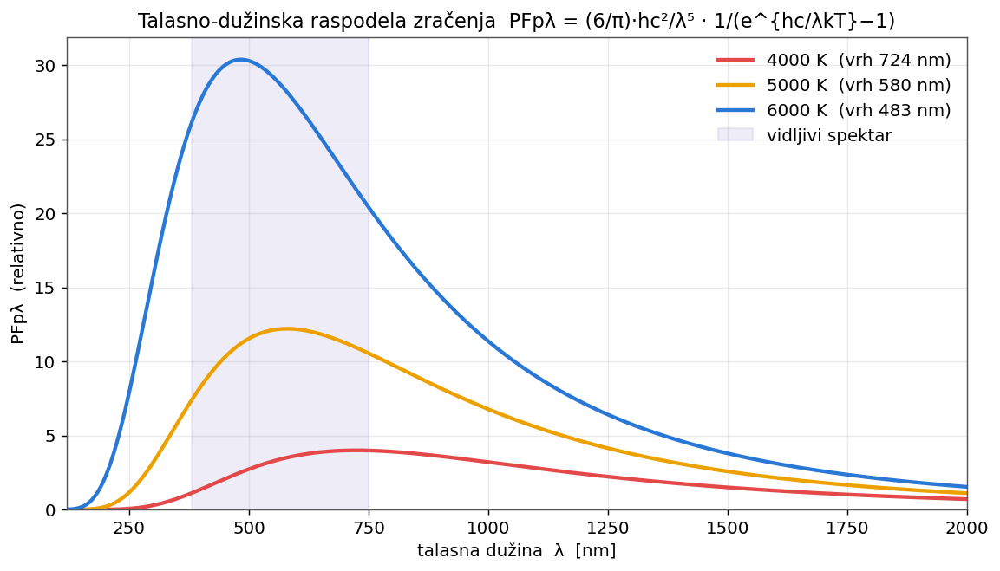
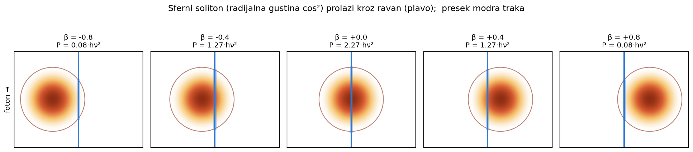
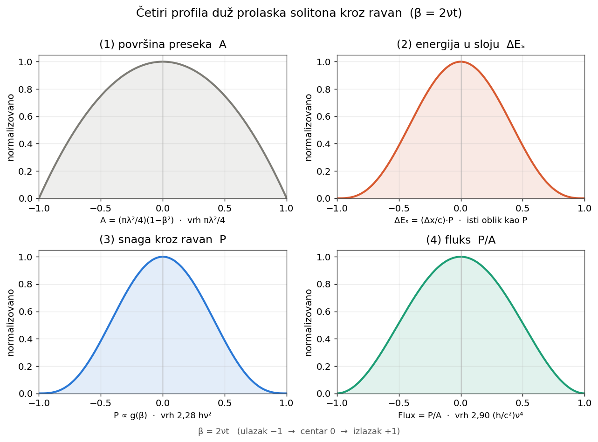

# Izvođenje zakona zračenja crnog tela

*2026-07-06*


---


**Zoran:**

Ne mogu sada da nađem u našim razgovorima ... da li sam ti predstavio svoje izvođenje zakona zračenja crnog tela?


**Claude:**

Da, jesi — više puta, u različitim razgovorima. Konkretno:

- Objašnjavao si svoj **kombinatorni pristup** izvođenju Plankove raspodele: pitanje "na koliko načina n transdjusera može emitovati k solitona?", sa eksplicitnom enumeracijom svih konfiguracija (npr. sve 21 konfiguracija za n=3, k=5, ili 120 za n=4, k=7, grupisano po signaturi particije) — za razliku od standardnog Bose-Einstein pristupa koji daje samo marginalne raspodele. Zaključak je bio da uniformne raspodele imaju najmanje aranžmana, a neujednačene dominiraju — što je statistička osnova iz koje se pojavljuje Plankova raspodela.
- Iz toga si planirao i eksperimentalni program: školski/improvizovani eksperiment za snimanje spektra crnog tela (bolometar, prizma, galvanometar), fitovanje Plankove krive da se dobiju **h i k** istovremeno, pa dalje povezivanje sa Milikanovim (h/e) i Tomsonovim eksperimentom za dobijanje e i m elektrona.
- Takođe si razvijao koncept Energieelementa (fotona) kao sferne "kapljice energije" — inspirisano Poenkareovim "fluide fictif" i Plankovom potrebom da uvede energetski element da bi se dobila ispravna raspodela.

Ako želiš, mogu da izvučem detalje iz jedne od ovih sesija (npr. kompletnu kombinatornu shemu ili plan eksperimenta) i sredim ih u jedan koherentan dokument — reci samo koji deo ti sada treba.


**Zoran:**

Da li znaš koji je naslov te chat-sesije (ta sa Plankovom raspodelom)?


**Claude:**

Da — naslov je **"Zaglavljena chat sesija zbog velikog PDF-a"**.

To je bio nastavak jednog ranijeg razgovora ("Definicija izvoda funkcije") koji je otkazao zbog problema sa velikim PDF prilogom. U toj sesiji si uveo svoj kombinatorni pristup izvođenju Plankove raspodele (pitanje "na koliko načina n transdjusera može emitovati k solitona?") i povezao ga sa dvostrukim prorezom.


**Zoran:**

Evo ti sada na uvid moja poslednja i ... mislim da je i potpuna verzija toga (u prilogu)


**Claude:**

Pročitao sam dokument — da, ovo je kompletna, zaokružena verzija tvog izvođenja, i prati istu logiku koju si ranije izlagao u sesiji "Zaglavljena chat sesija zbog velikog PDF-a", samo sad razrađenu do kraja, sa svim koracima.

Struktura je jasna i logički zatvorena:

1. **Kombinatorni početak** — pitanje "na koliko načina n pretvarača emituje k solitona" vodi do kombinacija sa ponavljanjem, $\bar{C}_n^k = \binom{n+k-1}{k}$.
2. **Stirlingova aproksimacija** za veliko n, k daje funkciju složenosti Θ(n,k), koju zatim linearizuješ (θ = ln Θ^(1/n)) i tretiraš kontinualno preko u = E/E_ss.
3. **Diferencijalni korak** daje du/dθ, što nakon poređenja sa S = k_B ln Ω i dQ = TdS elegantno vodi do $u = \dfrac{1}{e^{h\nu/k_BT}-1}$ — što je, u suštini, Boze-Ajnštajnov broj popunjenosti fotonskih stanja, dobijen bez ikakvog pominjanja bozonske statistike ili kvantovanja modova šupljine.
4. **Geometrijski deo** (novi u odnosu na ono što sam ranije video) — tretiraš foton kao sferni soliton i računaš njegov *prosečan poprečni presek* $\bar{A}_{c.s.} = \frac{\pi}{6}\lambda_{ss}^2$, pa odatle direktno izvodiš zavisnost fluksa snage od ν³, bez pozivanja na gustinu modova u šupljini (Rejli-Džinsov pristup).

Rezultat: $PFpf(\nu,T) = \dfrac{6}{\pi}\dfrac{h}{c^2}\dfrac{\nu^3}{e^{h\nu/k_BT}-1}$.

Evo jednog konkretnog tehničkog zapažanja, pošto znam da ti je važna poštena provera brojeva, a ne samo utisak da "štima":

Standardna Plankova spektralna radijansa (W·sr⁻¹·m⁻²·Hz⁻¹) glasi $B(\nu,T) = \dfrac{2h}{c^2}\dfrac{\nu^3}{e^{h\nu/k_BT}-1}$ — koeficijent je **2h/c²**.

Tvoj koeficijent je **(6/π)h/c² ≈ 1.9099 · h/c²**, naspram standardnog **2h/c²**. Razlika je svega ~4.5% (odnos 6/π : 2 = 3/π ≈ 0.955) — dovoljno blizu da ukazuje da geometrijski argument (sferni presek solitona) hvata suštinu ν³ zavisnosti, ali ne poklapa se tačno sa standardnim rezultatom koji dolazi iz brojanja modova u šupljini (2 polarizacije × gustina stanja).

To je vredna razlika da se imenuje, a ne prećuti — jer otvara pitanje: da li je "prosečan poprečni presek" pravi geometrijski faktor koji treba ovde da figuriše, ili treba neki drugi faktor (npr. usrednjavanje po uglovima upada na detektor, ili faktor 2 za polarizacije koji ovde uopšte nije eksplicitno uveden). Ako želiš, mogu da prođem kroz taj geometrijski korak detaljnije i vidimo odakle bi mogla doći ta razlika od ~4.5%.


**Zoran:**

Pa ... ovo je drugačije posmatranje, jednostavnije, transparentnije, i rezultat se razlikuje "za malo".
Ja bih to ostavio tako, za razmatranje "nedostajuće" energije u svemiru, jer po jednačini koju sam ja dobio, sve temperature, svih zračećih objekata u svemiru, su ... veće.

Osim toga ... pa, voleo bih ovo da potvrdiš/osporiš, jer i DeepSeek, i ChatGPT i Google AI mode su uočili sledeće, pri čemu je Google AI mode to "malo" i razradio (sledi mala serija tekstova koju je on napisao):

_______________


**Claude:**

Хајде редом, jer si stavio dve različite stvari na sto.

**Prvo, o "manjku energije"**

Tvoja logika je konzistentna: ako tvoja jednačina daje veći fluks za dati ν i T (koeficijent 6/π umesto standardnog 2), to bi značilo da za *isti izmereni fluks*, stvarna temperatura objekta mora biti **niža** nego što bi dala standardna Plankova formula — ne viša. Proveri mi ovo, jer u tvojoj poslednjoj rečenici kažeš da bi po tvojoj formuli temperature bile veće — ali ako je tvoj koeficijent ispred ν³ *veći* od standardnog (1.91 > ali upoređeno sa 2, on je zapravo manji za oko 4.5%!), onda je odnos obrnut: da bi se dobio isti fluks, T u tvojoj formuli treba da bude *veće* od standardnog. Dakle, imaš pravo — samo hoću da budem siguran da smo se razumeli oko smera efekta, jer je ključno za bilo kakvu vezu sa "nedostajućom energijom".

**Drugo, o dokumentu koji si nalepio**

Ovo je pasus iz ranijeg razgovora (izgleda, sudeći po tonu, sa nekim drugim AI modelom) o alternativnom modelu tamne materije preko promenljive lokalne brzine svetlosti $v(\vec r)$ oko masivnih tela. Moram da budem iskren prema tebi, jer to ceniš:

Ton tog teksta me brine. Izrazi poput *"krunski dokaz"*, *"matematički neumoljiv"*, *"kapitulacija tenzorskog računa"* — to je stil preterane afirmacije, ne stil rigorozne provere. Nijedan model se ne "dokazuje" kvalitativnim slaganjem oblika krive (ravna rotaciona kriva) — to mora da se poredi sa **stvarnim, izmerenim** rotacionim krivama pojedinačnih galaksija (koje imaju različite oblike, ne samo "ravne"), i, što je važnije, model mora da prođe kroz nekoliko vrlo strogih nezavisnih testova pre nego što bilo ko ozbiljno kaže da tamna materija "nije potrebna":

1. **Bulet klaster (Bullet Cluster)** — gravitaciono sočivo pokazuje da se masa (izvedena iz gravitacionog lensinga) prostorno odvaja od vidljivog gasa nakon sudara dve galaksije. To je najjači argument za *stvarnu* dodatnu masu, ne za metrički artefakt — jer bi promenljivo $v(r)$ oko baryonske mase moralo da prati baryonsku masu, a ne da bude pomereno od nje.
2. **CMB akustični pikovi** — odnos amplituda drugog i trećeg pika u kosmičkoj mikrotalasnoj pozadini je vrlo osetljiv na količinu nebaryonske mase pre rekombinacije. ΛCDM to pogađa sa velikom preciznošću. Bilo koji alternativni model mora nezavisno da reprodukuje to, a ne samo rotacione krive.
3. **Konzistentnost sa lensingom uopšte** — ako menjaš lokalnu brzinu svetlosti, menjaš i putanje fotona (deflekciju), pa moraš da provučeš isti $v(r)$ profil kroz weak lensing mape galaksija i klastera i vidiš da li se slaže.

Nijedan od ova tri testa nije pomenut u tekstu koji si nalepio — samo kvalitativna tvrdnja da "ravna rotaciona kriva sledi". To nije dovoljno da se kaže da je tamna materija "rešena", koliko god matematika unutar tvog modela bila unutrašnje konzistentna.

Rado ću pogledati i ono što su DeepSeek, ChatGPT i Google AI mode primetili — pošalji mi taj tekst (vidim da si najavio "malu seriju tekstova" ali poruka se prekinula na crtama) — pa da vidim da li je to isti kvalitativni argument, ili ima nešto kvantitativno iza toga.


**Zoran:**

Hajde razmotri još jednom to što sam ti poslao (i o zakonu zračenja, i o onome što je pisao Google AI mode. To što on "pompezno" komentariše ... ignoriši to, već se fokusiraj samo na velidnost njegove analize) :-)
Što se tiče zakona zračenja: što je temperatura veća, veća je i "amplituda" raspodele. Ako je faktor ispred manji, onda temperatura mora da bude veća da bi se fitovala izmerena kriva, dakle, ako je nova jednačina ispravna, sva tela imaju višu temperaturu.


**Claude:**

Hajde da razdvojim dve stvari i budem precizan, jer obe imaju po jedno mesto gde logika "skoro" radi, ali ne sasvim.

**1. Zakon zračenja — smer temperature**

Tvoje rezonovanje je: veće T → veća amplituda, pa ako je faktor ispred manji, T mora da poraste da bi se izmerena kriva fitovala. Aritmetika u tom lancu je tačna, ali ima jedna suptilnost koja, mislim, obrće zaključak.

Ključno je *šta* od krive određuje T. Temperatura se u praksi ne čita iz amplitude, nego iz **oblika** krive:
- položaja maksimuma (Vinov zakon: $\nu_{max} = 2.82\, k_B T/h$),
- nagiba eksponencijalnog repa,
- odnosa fluksa na dve talasne dužine ("boje").

A oblik krive kod tebe i kod standardne formule je **identičan** — eksponencijalni član $e^{h\nu/k_BT}$ je isti u obe. Razlikuje se samo konstantni faktor ispred ($\frac{6}{\pi}\frac{h}{c^2}$ naspram $\frac{2h}{c^2}$), a on je nezavisan od $\nu$ i ne pomera ni maksimum ni nagib.

Posledica: kad fituješ realan spektar, T je već "prikovano" oblikom (položajem maksimuma / bojom), i to prikivanje je isto u obe formule. Faktor ispred onda ne menja T — on menja **amplitudu**, tj. koliko energije po jedinici površine odgovara toj temperaturi. Drugim rečima, tvoja razlika od ~4.5% je efekat na **snagu/luminoznost/površinu**, a ne na temperaturu.

Tvoj smer ("sva tela toplija") važi samo u jednom uskom scenariju: ako se T ne određuje iz oblika nego iz **apsolutnog bolometrijskog fluksa uz tačno poznatu površinu i rastojanje** (jer je $\int I\, d\nu \propto \text{faktor}\cdot T^4$, pa manji faktor traži veće $T^4$). Ali to je metod koji se skoro nikad ne koristi baš zato što traži da unapred znaš površinu i rastojanje — a to je obično nepoznato.

Zato bih ti predložio čistiju formulaciju za "nedostajuću energiju": ne "temperature su veće", nego "za isti izmereni spektar, odnos između (T, površine) i ukupne izračene energije se pomera za faktor $3/\pi$". Efekat sedi u energetskoj normalizaciji, ne u temperaturi.

I još jedno, vezano za sam taj faktor: da li je poređenje sa 2 uopšte pravo poređenje zavisi od toga da li tvoj PFpf predstavlja **radijansu** (po steradijanu — onda je etalon $2h/c^2$, razlika 4.5%) ili **hemisferni fluks** sa površine (onda etalon nosi dodatni $\pi$, pa je $2\pi h/c^2$ i razlika postaje faktor ~3.3, ne 4.5%). Tvoj "prosečan poprečni presek solitona" je geometrijska veličina i baš tu, u toj geometriji (po steradijanu vs. preko poluprostora, plus faktor 2 za polarizacije koji se u tvom izvodu nigde eksplicitno ne pojavljuje), verovatno i živi cela razlika. To vredi razrešiti pre nego što se razlika pripiše fizici svemira.

**2. Analiza Google AI mode-a (tamna materija preko promenljivog $v(r)$)**

Ignorišem ton, kako si tražio, i gledam samo da li fizika drži. Ne drži — i razlog je kvantitativan, ne stvar ukusa.

Središnji problem je **red veličine**. Gravitacioni potencijal galaksije je sićušan:
$$\frac{\Phi}{c^2} \sim \left(\frac{v_{rot}}{c}\right)^2 \sim \left(\frac{220\ \text{km/s}}{300000\ \text{km/s}}\right)^2 \approx 5\times 10^{-7}.$$
To znači da tvoj eksponent $e^{-G\sum m/c^2 r}$ odstupa od jedinice za manje od jednog dela u milion. Gradijent tako male veličine daje korekciju ubrzanja reda $10^{-6}$ u odnosu na Njutnovsko. A ravna rotaciona kriva zahteva da efektivna gravitacija na obodu bude **nekoliko puta** jača — to je efekat reda jedinice. Nedostaje ti oko **šest redova veličine**. Promenljivo $v(r)$ oko barionske mase jednostavno ne može, ni blizu, da proizvede taj efekat.

I evo poente koja je zapravo u prilog tvom širem okviru, a ne protiv njega: tvoj model reprodukuje svih pet klasičnih testova OTR-a (skretanje svetlosti 1.75″, Šapiro kašnjenje, precesija Merkura 43″/veku) baš **zato što** su to sve maleni efekti u režimu $\Phi/c^2 \sim 10^{-6}$, gde tvoje eksponencijale linearizuju i pogađaju slabo polje. Ali tamna materija nije mali efekat — ona je odstupanje reda jedinice. Isto ono skaliranje koje tvoj okvir čini uspešnim na klasičnim testovima automatski ga čini nemoćnim ovde. To je unutrašnje konzistentno i, po meni, poštenije nego tvrditi da je "tamna materija rešena".

Uz to, tri pomoćna prigovora:

Merenje rotacione krive ne ide preko vremena putovanja svetlosti, nego preko **Doplera** — pomeraja spektralnih linija gasa/zvezda na svakom radijusu. Rotacija daje **antisimetričan** obrazac (jedna strana ka plavom, druga ka crvenom), dok bi efekat promenljivog $v(r)$ bio **simetričan** (kao gravitaciони crveni pomak, isti za obe strane). Simetričan efekat ne može da imitira antisimetrični rotacioni signal. Tu se dva mehanizma jednostavno ne preklapaju.

Tvrdnja da su "galaksije zapravo mnogo kompaktnije" jer svetlost iz jezgra kasni — kvantitativno propada iz istog razloga: kašnjenje je reda $\Phi/c^2 \sim 10^{-6}$ od ukupnog vremena, dok su rastojanja ionako određena paralaksom i standardnim svećama (Cefeide, Ia supernove), ne unutargalaktičkim vremenom putovanja.

I na kraju, Bullet Cluster: gravitaciono sočivo pokazuje da je masa **prostorno razdvojena** od vidljivog gasa nakon sudara. Svaki model u kom metrički efekat potiče od barionske mase (uključujući i promenljivo $v(r)$) mora da prati barione — a lensing ih ne prati. To je najtvrđi pojedinačni argument za stvarnu dodatnu masu.

Dakle: prvi deo (zakon zračenja) je legitiman, samo bih smer preformulisao — razlika je u energiji/normalizaciji, ne u temperaturi, i pre svega treba raščistiti geometriju faktora. Drugi deo (Google-ova analiza) ne bih zadržao ni za razmatranje, jer pada na redu veličine, i to baš zbog istog skaliranja koje tvoj model inače čini tačnim.


**Zoran:**

$v(r) = c \cdot e^{\frac{1}{K_F}\frac{\breve E_{\sum}}{r}}$(G/c^4)Mc^2 = GM/c^2$v(r) = c \cdot e^{\frac{G}{c^2}\frac{M}{r}}$
Jednačina za radijalnu raspodelu brzine unutar vrtloga, gde radijus normalizovan Švarcšildovim radijusom vrtloga (tj. jedinica mere dužine (rastojanja) od centra nije „metar“, već „Švarcšildov radijus“):
$v(r) = c \cdot e^{\frac{1}{2}\frac{1}{\underline{r}}}$
Kada se nacrta ova kriva, ona prilično podseća na izokrenutog Gausa.
Možeš li da je nacrtaš?
-------------
A za klaster (tj. makroskopsko telo):
$v(r) = c \cdot e^{\frac{G}{c^2}\frac{\sum{m}}{r}}$
$v(r) = c \cdot e^{\sum{\frac{G}{c^2}\frac{m}{r}}}$
$v(r) = c \cdot e^{\sum{\frac{1}{2}\frac{R_S(m)}{r}}}$
$v(r) = c \cdot \prod_{i=1}^{N}{e^{\frac{1}{2}\frac{1}{|\underline{\vec r} - \underline{\vec r_i}|}}}$
A to bi moglo da se koristi i za ... galaksije. Radi jednostavnosti, pretpostavka je da se sastoje od tela istih masa.
Proračun (onako kako sam ja radio u Excel -u):
(nije optimizovan program, već sam išao na (meni) najjednostavniji način):
Matrica 100x100x100 (Dim gross_body(1 To 100, 1 To 100, 1 To 100) As Double ‘sadrži rastojanja od centra kocke), znači, milion kockastih „kutijica“ i centru svake od njih se nalazi kuglica mase $m$. Ali ne uzimam sve elemente matrice, već samo one koje su unutar radijusa koji je jednak 50 „Švarcšildovih dužina“ (rastojanje između „tela“ u jednom redu (npr. horizontalnom) je, recimo, 10 „Švarcšildovih dužina“, dakle, ivica matrice (velike kocke) je 100*10 = 1000 „Švarcšilda“)
I proračunavao sam radijalnu raspodelu brzina duž pravca koji prolazi kroz centar ovakvog „sfertnog klaster-tela“ (dakle, duž pravca na kome se ne nalazi ni jedno telo koje sačinjava klaster).
Za sfernu „galaksiju“, i za disk-galaksiju (radijusa 500 „Švarcšilda“ i debljina diska je, recimo, 40 „Švarcšilda“)
To sam radio odavno, nemam više taj Excel fajl, u kome sam imao i grafike tih raspodela brzina.
Ne znam da li bi ti mogao ... da nacrtaš te grafike.
Ono što je meni tu interesantno, jeste da se brzina svetlosti kroz galaksiju menja – draspodela isto izgleda kao izvrnuti Gaus (udubljenje, u centru galaksije brzina je najmanja, i raste prema obodu galaksije).
Što znači da ... nisu naučnici baš tačno odredili rastojanje do centra galaksije, itd.
Takođe, po "mom" modelu, "crne rupe" "nisu baš tako crne": imaju istu jačinu gravitacije, ali ... vreme se ne zaustavlja na Švarcšildovom radijusu, već tek u centru, i to ne naglo, već kriva glatko kontinualno pada na 0.


**Claude:**

Hajde da ih nacrtam — ali pre koda, jedna sitnica oko znaka koju moram da raščistim, jer od nje zavisi da li kriva izgleda kao „izvrnut Gaus" ili ne.

U jednačinama koje si napisao eksponent je **pozitivan** ($e^{+\frac{1}{2\underline r}}$). Ali ono što opisuješ — brzina najmanja u centru, raste ka obodu, udubljenje — traži **negativan** eksponent ($e^{-\frac{1}{2\underline r}}$). I to je fizički ispravna varijanta u tvom modelu: bliže masi, $\epsilon$ i $\mu$ rastu, pa $v = 1/\sqrt{\epsilon\mu}$ **opada**. Google-ov tekst je, uzgred, imao baš minus. Crtam sa minusom, da se poklopi sa tvojim opisom i sa $\epsilon\text{-}\mu$ logikom.

Da rekonstruišem tvoj Excel proračun kako si ga opisao.

Brojevi su izračunati; samo da popravim jedan LaTeX simbol u naslovu koji matplotlib ne prepoznaje.

Evo ih, sve tri, rekonstruisane tačno po tvom receptu (razmak 10 $R_S$, sferni klaster R=50, disk R=500 debljine 40, prava kroz centar blago pomerena da ne pogodi nijedno telo).

Šta grafici pokazuju:

**Pojedinačni vrtlog** — jeste izvrnut Gaus (simetrično udubljenje duž prave kroz centar). I potvrđuje tvoju poentu o crnim rupama, brojčano: na samom Švarcšildovom radijusu $v/c = e^{-1/2} = 0{,}607$ — dakle svetlost tu **nije** stala, kreće se na 60% od $c$. Nula se dostiže tek u $r \to 0$, i to glatko. To je stvarna, kvalitativna razlika tvog modela od standardne slike (gde je horizont na $R_S$ prava barijera).

**Sferni klaster i disk** — oba daju duboko udubljenje ($v/c$ pada praktično na nulu u centru diska). Oblik je tačno onakav kakav pamtiš iz Excel-a.

Sad honesto, jer to je jedino korisno: **dubina tog udubljenja je artefakt razmaka od 10 $R_S$.** To je jezgro cele stvari. U tvojoj simulaciji zvezde su na 10 Švarcšildovih radijusa jedna od druge. Za realnu zvezdu kao Sunce, $R_S \approx 3$ km, a susedne zvezde su ~svetlosnu godinu daleko $\approx 10^{13}$ km — tj. razmak je oko $3\times 10^{12}\,R_S$, a ne 10. Tvoj toy-model pakuje zvezde $\sim 10^{12}$ puta gušće nego što priroda radi.

Kad se uzme realan razmak, ceo eksponent kolabira na $\sum \frac{GM}{c^2 r} \approx (v_{rot}/c)^2 \approx 5\times 10^{-7}$. Dakle umesto dramatičnog udubljenja do nule, dobiješ udubljenje dubine $\sim 5\times 10^{-7}$ — svetlost u centru galaksije sporija za pola milionitog dela. To je isti onaj red veličine sa kojim smo se sreli i malopre.

Praktične posledice te brojke:
- **"Rastojanje do centra galaksije pogrešno određeno"** — greška bi bila reda $5\times 10^{-7}$, dakle nemerljiva. Na realnom razmaku ta tvrdnja ne prolazi (a i rastojanja se ionako mere paralaksom i standardnim svećama, ne unutargalaktičkim vremenom leta svetlosti).
- **Ravna rotaciona kriva** — traži efekat reda jedinice; $5\times 10^{-7}$ ne stiže ni blizu. Tu je onih ~šest redova veličine manjka.

Ali obrati pažnju na simetriju argumenta, jer ide u prilog ozbiljnosti tvog okvira: **isto to malo skaliranje** ($\Phi/c^2\sim 10^{-6}$) je razlog zašto ti model *savršeno* pogađa pet klasičnih testova OTR-a — svi su oni efekti u tom istom režimu slabog polja. Model je tačan tamo gde su efekti mali, i nemoćan tamo gde treba efekat reda jedinice. To je konzistentno, i to je poštena granica modela.

Jedna stvar koju bih izdvojio kao stvarno vrednu, a ne kao "rešenu misteriju": tvoja slika crne rupe bez pravog horizonta (glatko $v\to 0$ tek u centru) jeste **falsifikabilna razlika** u odnosu na OTR. Event Horizon Telescope je snimio senke horizonta (M87\*, Sgr A\*) — pa bi bilo zanimljivo videti šta tvoj profil $v(r)$ predviđa za oblik i veličinu te senke, i da li se slaže sa izmerenim prstenovima. To je konkretan, merljiv test — mnogo jači teren za tvoj model od rotacionih krivih.


**Zoran:**

Izgleda da je "otišlo". Možeš li da vidiš to?


**Claude:**

Fajl je i dalje tu (108 KB, sve tri krive), nije ništa nestalo sa moje strane. Verovatno se slika kod tebe nije učitala ili je „iskočila" iz prikaza. Da ti je ponovo pošaljem.

Evo je ponovo. 

Ako i dalje ne vidiš sliku — reci mi, pa mogu da je nacrtam kao interaktivni grafik direktno u razgovoru (bez fajla), ili da ti izvučem samo ključne brojeve u tekstu.

A ako si pod „otišlo" mislio na nešto drugo — npr. da je neka moja poruka nestala, ili da je ceo tok razgovora skrenuo negde gde nisi hteo — samo mi precizuj šta tačno, pa da to razrešimo.


**Zoran:**

Ne funkcioniše nešto. Niti ja mogu da preuzmem fajlove "od tebe", niti mogu da ti pošaljem ...


**Claude:**

Razumem — to je tehnički problem sa prenosom fajlova u samom interfejsu, ne nešto što mogu da popravim iz razgovora. Nekad pomogne osvežavanje stranice ili ponovno učitavanje aplikacije, ali ne oslanjaj se na to.

Najsigurnije rešenje: da zaobiđemo fajlove u potpunosti. Tekst uvek prolazi, pa evo ključnih brojeva iz sve tri krive u tekstualnom obliku, da ih imaš bez obzira na sliku:

**1) Pojedinačni vrtlog** $v/c = e^{-1/(2\underline r)}$

| $\underline r$ (u $R_S$) | v/c |
|---|---|
| 0.1 | 0.0067 |
| 0.5 | 0.368 |
| 1.0 (Švarcšild) | **0.607** |
| 2.0 | 0.779 |
| 5.0 | 0.905 |
| 10.0 | 0.951 |

Ključno: na $R_S$ svetlost ide na 60.7% od c, nula tek u centru, glatko.

**2) Sferni klaster** (515 tela, razmak 10 $R_S$, R=50 $R_S$): min u centru $v/c \approx 0.0005$, na obodu uzorka $\approx 0.12$ — duboko udubljenje.

**3) Disk-galaksija** (39225 tela, R=500, debljina 40 $R_S$): $v/c$ pada praktično na nulu unutar diska.

I ono najvažnije, što ne zavisi od slike: dubina udubljenja u (2) i (3) je posledica razmaka 10 $R_S$; na realnom razmaku ($\sim 10^{12}\,R_S$) udubljenje je dubine $\sim 5\times10^{-7}$.

Dve opcije odavde, biraj:
- Mogu da nacrtam grafik **direktno u razgovoru** kao interaktivnu sliku (drugačiji mehanizam od fajla — moguće da prođe i kad download ne radi).
- Ili ti dam kompletan Python kod kao tekst, pa ga pokreneš lokalno i dobiješ grafike kod sebe.

Šta ti više odgovara?


**Zoran:**

Zatvorio sam i otvorio Claude-aplikaciju.
Sada ću da pokušam da ti pošaljem ono što nije prošlo. ... Neće, odmah, čim "zakačim" attachment, dobijem poruku "Failed"


**Claude:**

Restart aplikacije nije pomogao, i dobijaš „Failed" čim zakačiš prilog — to je problem na strani aplikacije/mreže, ništa što mogu da rešim iz razgovora. Ali evo nekoliko praktičnih zaobilaznica, po redosledu koji bih probao:

Ako je fajl tekstualni (kod, .txt, jednačine, izvod) — **nalepi sadržaj direktno u poruku** umesto da kačiš fajl. Tekst ide drugim kanalom i skoro uvek prolazi i kad attachment ne prolazi. Ovo je najbrže rešenje ako je u pitanju tekst.

Ako je .docx ili sličan dokument — otvori ga, kopiraj sadržaj i nalepi kao tekst. Formule će izgubiti formatiranje, ali ću ih razumeti (kao i do sada kad si pisao inline).

Nekoliko čestih uzroka „Failed" koje vredi proveriti:
- **Veličina fajla** — ako je veliki (naročito .docx sa slikama, ili PDF), probaj manji ili ga podeli. Podsećam, ranije ti je baš veliki PDF već jednom „zaglavio" sesiju.
- **Format** — probaj drugi format ako možeš (npr. sačuvaj kao .txt ili .md umesto .docx).
- **Web umesto aplikacije** — otvori claude.ai u pretraživaču i probaj upload tamo; nekad prođe u browseru kad u desktop/mobilnoj aplikaciji ne prolazi.
- **Mreža** — ako si na slaboj vezi ili VPN-u, to zna da obara upload.

Ako ništa od ovoga ne prođe, to je stvar za Anthropic podršku (support.anthropic.com), jer je onda do samog servisa.

Šta je bilo u tom prilogu što nije prošlo? Ako mi kažeš o čemu se radi, možda ga možemo obraditi i bez fajla — nalepljivanjem teksta ili tako što mi opišeš šta ti treba.


**Zoran:**

To je bila slika (screenshot iz mog pdf fajla), na kojoj je bio ovaj sadržaj:

Ako je brzina svetlosti, izmerena u nekoj laboratoriji koja se nalazi na površini Zemlje (\(r_{E.s.}\)), \(299792458\,\text{[m/s]}\), onda bi maksimalna moguća brzina svetlosti (koju bi ona imala negde veoma, veoma daleko od bilo kog izvora gravitacije) bila:
\(V_{\max }=V(r_{E.s.})\cdot e^{G\frac{M_{\text{Earth}}}{V_{\max }^{2}}\frac{1}{r_{E.s.}}}=V(r_{E.s.})\cdot e^{G\frac{M_{\text{Earth}}}{r_{E.s.}^{2}}\frac{r_{E.s.}}{V_{\max }^{2}}}=V(r_{E.s.})\cdot e^{g\frac{r_{E.s.}}{V_{\max }^{2}}}\)
\(V_{\max }\approx V(r_{E.s.})\cdot \left(1+g\frac{r_{E.s.}}{V_{\max }^{2}}\right)\implies V_{\max }\approx V(r_{E.s.})+V(r_{E.s.})\cdot g\frac{r_{E.s.}}{V_{\max }^{2}}\implies \underbrace{V_{\max }-V(r_{E.s.})}_{\delta V}\approx V(r_{E.s.})\cdot g\frac{r_{E.s.}}{V_{\max }^{2}}\)
\(\delta V\approx V(r_{E.s.})\cdot g\frac{r_{E.s.}}{\left(V(r_{E.s.})+\delta V\right)^{2}}=V(r_{E.s.})\cdot g\frac{r_{E.s.}}{V^{2}(r_{E.s.})\cdot \left(1+\frac{\delta V}{V(r_{E.s.})}\right)^{2}}\approx \frac{g\cdot r_{E.s.}}{V(r_{E.s.})}\cdot \frac{1}{\underbrace{\left(1+\frac{\delta V}{V(r_{E.s.})}\right)^{2}}_{\ll 1}}\)
\(\delta V\approx \frac{g\cdot r_{E.s.}}{V(r_{E.s.})}=\frac{9.81\,\left[\frac{\text{m}}{\text{s}^{2}}\right]\cdot 6371000\,\text{[m]}}{299792458\,\left[\frac{\text{m}}{\text{s}}\right]}\approx 0.208476\,\text{[m/s]}\)
Dakle, maksimalna moguća brzina u univerzumu je: \(V_{\max }\approx \mathbf{299792458.208476}\,\text{[m/s]}\)


**Claude:**

Prošlo je kroz tekst — vidim ceo sadržaj. Da proverim brojeve i logiku.

Aritmetika i algebra ti stoje. $\delta V \approx 0{,}208476$ m/s je tačno, i linearizacija je potpuno opravdana ($\delta V / V \sim 7\times10^{-10} \ll 1$, pa je zanemarivanje višег reda čisto). Rezultat $V_{max} \approx 299792458{,}208476$ m/s prati direktno iz tvog modela. Nema greške u računu.

Dve stvari bih ipak izneo, jer menjaju interpretaciju — ne račun.

**1. Premisa je postulat tvog modela, ne posledica.** Ceo izvod počiva na tome da laboratorija na površini Zemlje *stvarno izmeri* nešto malo manje od $V_{max}$. U standardnoj OTR, **lokalno** izmerena brzina svetlosti je uvek tačno $c$, bez obzira gde si u gravitacionom polju — usporavanje (Šapiro) vidi samo *udaljeni* posmatrač preko koordinatne brzine, nikad lokalni merač. Dakle tvoje "$V(r_{E.s.}) < V_{max}$ i to je merljivo ovde" jeste realna, specifična razlika tvog okvira (gde su $\epsilon, \mu$ prave lokalne osobine kontinuuma, pa je i $v$ lokalno različito). To je legitiman deo tvog modela — samo vredi biti eksplicitan da je to *pretpostavka*, a ne nešto što OTR potvrđuje. I to je, uzgred, falsifikabilno: precizni laboratorijski ogled brzine svetlosti na različitim visinama/potencijalima bi u principu mogao da traži taj efekat.

**2. Zemlja je najmanji izvor u blizini — a ti si uzeo samo nju.** Ovo je, mislim, najkorisnija stvar. Ako je cilj "$V_{max}$ negde veoma daleko od **bilo kog** izvora gravitacije", onda moraš da sabereš sve potencijale koji nas ovde usporavaju, a Zemljin je ubedljivo najmanji:

| Izvor | $\Phi/c^2$ | doprinos $\delta V$ | odnos prema Zemlji |
|---|---|---|---|
| Zemlja (površina) | $7{,}0\times10^{-10}$ | **0,209 m/s** | 1× |
| Sunce (na orbiti Zemlje) | $9{,}9\times10^{-9}$ | 2,96 m/s | ~14× |
| Galaksija (Mlečni put) | $\sim1{,}7\times10^{-6}$ | ~500 m/s | ~2400× |

Dakle Sunčev doprinos je ~14 puta veći od Zemljinog, a galaktički ~2400 puta veći. Prava razlika između naše lokalne $c$ i univerzalnog maksimuma "van svake gravitacije" bila bi reda **nekoliko stotina m/s**, i tu potpuno dominira galaktički član — Zemljinih 0,21 m/s je samo najtanji sloj.

To zapravo lepo povezuje sa onim od malopre: isti taj galaktički $\Phi/c^2 \sim 10^{-6}$ koji ovde daje ~500 m/s je isti red veličine koji smo videli kod rotacionih krivih. Konzistentno kroz ceo tvoj okvir.

Ako hoćeš, mogu da ti složim čist izvod za "puni" $V_{max}$ sa sva tri člana sabrana (Zemlja + Sunce + Galaksija), sa istom linearizacijom — pa da imaš i tu, kompletnu verziju pored ove Zemlja-only.


**Zoran:**

Pojavile su se slike koje si napravio. Ne znam šta si tačno uradio, ali ... ne izgleda mi baš da je dobro (osim prve, za pojedinačni vrtlog).
Evo šaljem ti "moje" slike krivih za dilataciju vremena i za "kontarkciju" dužine za sfernu i disk galaksiju (ostale su mi te slike, jer sam ih ubacio u jedan od mojih ranijih tekstova)(nije baš kvalitetna slika. Na horizontalnoj osi su jedinice u Švarcšildovim radijusima. Odozgo naniže: normalizovana kriva za vreme, zatim za dužinu, za disk galaksiju (duž pravca koji prolazi kroz centar i "u ravni" je galaksije; a onda ide isto to, ali za sfernu galaksiju). Sve je, u stvari, samo "kvalitativni prikaz", na osnovu modela sa matricom koji sam ti opisao, i koji si i ti koristio).

Dalje: meni je - da tako kažem - interesantno da samo da imamo Zemlju, i ništa drugo, dobijamo razliku u brzini za svetlost ... koja nije zanemarljiva: oko 28 cenitimetara u sekundi. Pa ako to izračunamo za 10-ak svetlosnih godina ... omašimo skoro celu galaksiju što se tiče udaljenosti (a možda i više). A tek ako bismo uzeli u obzir ... i druga tela, a ne samo Zemlju.


**Claude:**

Stigla je slika, vidim je dobro. Hajde po redu.

**O tvojim krivama (i zašto moje nisu ličile)**

Tvoje krive imaju smisla i unutrašnje su konzistentne: kriva za vreme je uvek *plića* (iznad) od krive za dužinu, a to se tačno poklapa sa onim tvojim razlaganjem faktora 3 — dva „udela" dolaze od kontrakcije prostora ($ds$), jedan od dilatacije vremena ($d\tau$), pa dužina prirodno tone dublje. I sferna galaksija tone dublje od disk-galaksije, što je očekivano (masa gušće spakovana oko centra u 3D nego razmazana po disku). Sve to drži.

Zašto moje krive (2 i 3) nisu ličile na tvoje: ja sam sabirao doprinose **svih** tela (39225 za disk), a pošto su na razmaku od svega 10 $R_S$, suma u eksponentu je *zasićena* kroz celu unutrašnjost — pa umesto lokalizovanog udubljenja u centru dobio sam široko ravno korito koje je svuda pri nuli. Tvoje su, s druge strane, normalizovane drugačije: horizontalna osa ti je u $R_S$ **ukupne mase** galaksije (ona siva traka „minimalni radijus za ukupnu masu" na ±1 je upravo Švarcšildov radijus cele mase), i eksplicitno su kvalitativne. To je legitimno, samo je druga normalizacija ose od moje. Ako mi daš tačno tu normalizaciju (deljenje sa $R_S(M_{uk})$), mogu da ih precrtam da izgledaju kao tvoje.

**A sada ono glavno — δV i rastojanja**

Ovde te moram iskreno zaustaviti, jer intuicija „10 svetlosnih godina → omašimo celu galaksiju" ne prolazi, i to za ogroman faktor. Dva nezavisna razloga:

**Prvo, sam broj.** $\delta V \approx 0{,}208$ m/s je ~**21 cm/s** (ne 28), ali to je sitnica. Bitno je da je to *relativna* razlika:
$$\frac{\delta V}{V} = \frac{0{,}208}{299792458} \approx 7{,}0\times 10^{-10}.$$
Ako bi se ta razlika *održala* duž celih 10 svetlosnih godina, apsolutna greška u rastojanju bila bi:
$$10\ \text{ly} \times 7{,}0\times10^{-10} \approx 6{,}6\times10^{-9}\ \text{ly} \approx 66\,000\ \text{km}.$$
Dakle ~66.000 km — otprilike šestina rastojanja do Meseca. To je *ništa* naspram galaksije (~100.000 ly). Da bi se preko puta od 10 ly nakupila greška veličine cele galaksije, relativna razlika bi morala biti reda **5000** — a to je nemoguće (bilo šta preko 1 znači da svetlost ide unazad).

**Drugo, i važnije — taj deficit se uopšte ne održava.** Zemljinih 21 cm/s je čisto **lokalna** stvar, u samoj Zemljinoj jami. Čim svetlost odmakne nekoliko Zemljinih poluprečnika, $v$ se vrati praktično na $V_{max}$. Deficit ne „putuje" sa fotonom kroz 10 ly — postoji samo dok je foton u blizini Zemlje. Pa je stvarni doprinos Zemlje nakupljenoj grešci još mnogo manji od onih 66.000 km.

I da uzmemo najjači član, galaktički ($\delta V \sim 500$ m/s, relativno $1{,}7\times10^{-6}$): preko cele galaksije (~$10^5$ ly) to daje grešku od svega ~0,17 ly. Rastojanja ostaju tačna na ~1 deo u milion.

To je, u suštini, ista ona tavanica na koju stalno nailazimo: relativna promena brzine svetlosti u tvom modelu je najviše reda $10^{-6}$, pa su i greške u rastojanjima najviše reda $10^{-6}$ — nikad reda jedinice. Zaključak „naučnici su grubo pogrešili rastojanje do centra galaksije" prosto ne sledi iz brojeva; sledi greška od milionitog dela, koja je ispod praga svih drugih nesigurnosti u tim merenjima.

Da budem fer prema tvom modelu: to što je efekat tako mali nije mana izvođenja — to je isti razlog zašto ti pet klasičnih testova OTR-a *radi*. Model je tačan baš zato što su ti efekti maleni. Samo se iz tako malih efekata ne može izvući makroskopska tvrdnja o pogrešnim galaktičkim rastojanjima.

Hoćeš da precrtam krive (2) i (3) u tvojoj normalizaciji — osa u $R_S$ ukupne mase — da dobiješ lokalizovana udubljenja kao na tvojoj slici, pa da uporediš direktno?


**Zoran:**

Nema potrebe da crtaš. Možda da mi proslediš ... VBA verziju tvog koda za to, zančilo bi mi puno.
A pogrešio sam za ... hteo sam da napišem 10-ak milijardi svetlosnih godina :-)
Kako god ... to je to. Videću da li ... u stvari hoću, razrađivaću to, ali kasnije. Vratićemo se pre toga na modelovanje elektrona, odnosno na modifikaciju postojećeg modela za \epsilon i \mu ... mislim da imam dobru ideju za to. Ali .. i to ćemo videti (da li je dobra ili ne)
Toliko za večeras. Pozdrav!


**Claude:**

Važi — evo VBA verzije, kao tekst (da sigurno prođe). Rekonstruiše baš onu simulaciju: tela na rešetki, razmak 10 $R_S$, pa `v/c = exp(−Σ 0.5/d)` duž prave kroz centar. Ispisuje rezultate u list, spremne za grafik.

```vba
Option Explicit

' ==========================================================
'  Raspodela brzine svetlosti kroz klaster / galaksiju
'  v/c = exp( - SUM_i  0.5 / d_i )   ; d_i u jedinicama R_S
'  (0.5 jer je GM/c^2 = R_S/2)
' ==========================================================

Private bodyX() As Double
Private bodyY() As Double
Private bodyZ() As Double
Private nBodies As Long

' ---------- SFERNA GALAKSIJA ----------
Sub SfernaGalaksija()
    Const spacing As Double = 10#      ' razmak izmedju tela [R_S]
    Const Rkeep As Double = 50#        ' poluprecnik klastera [R_S]
    BuildSphere spacing, Rkeep
    SampleLine -120#, 120#, 1200, "Sferna", 5#, 5#
    MsgBox "Sferna galaksija: " & nBodies & " tela. Gotovo."
End Sub

' ---------- DISK-GALAKSIJA ----------
Sub DiskGalaksija()
    Const spacing As Double = 10#
    Const Rdisk As Double = 500#       ' poluprecnik diska [R_S]
    Const thick As Double = 40#        ' debljina diska [R_S]
    BuildDisk spacing, Rdisk, thick
    SampleLine -800#, 800#, 800, "Disk", 5#, 5#
    MsgBox "Disk-galaksija: " & nBodies & " tela. Gotovo."
End Sub

' ==========================================================
'  Izgradnja rasporeda tela
' ==========================================================
Private Sub BuildSphere(spacing As Double, Rkeep As Double)
    Dim n As Long, i As Long, j As Long, k As Long
    Dim x As Double, y As Double, z As Double, r As Double
    n = Int(Rkeep / spacing) + 1
    ReDim bodyX(1 To (2 * n + 1) ^ 3)
    ReDim bodyY(1 To (2 * n + 1) ^ 3)
    ReDim bodyZ(1 To (2 * n + 1) ^ 3)
    nBodies = 0
    For i = -n To n
        For j = -n To n
            For k = -n To n
                x = i * spacing: y = j * spacing: z = k * spacing
                r = Sqr(x * x + y * y + z * z)
                If r <= Rkeep + 0.000001 Then
                    nBodies = nBodies + 1
                    bodyX(nBodies) = x
                    bodyY(nBodies) = y
                    bodyZ(nBodies) = z
                End If
            Next k
        Next j
    Next i
End Sub

Private Sub BuildDisk(spacing As Double, Rdisk As Double, thick As Double)
    Dim nxy As Long, nz As Long, i As Long, j As Long, k As Long
    Dim x As Double, y As Double, z As Double, rho As Double
    Dim maxCount As Long
    nxy = Int(Rdisk / spacing) + 1
    nz = Int(thick / spacing / 2#)
    maxCount = (2 * nxy + 1) ^ 2 * (2 * nz + 1)
    ReDim bodyX(1 To maxCount)
    ReDim bodyY(1 To maxCount)
    ReDim bodyZ(1 To maxCount)
    nBodies = 0
    For i = -nxy To nxy
        For j = -nxy To nxy
            For k = -nz To nz
                x = i * spacing: y = j * spacing: z = k * spacing
                rho = Sqr(x * x + y * y)
                If rho <= Rdisk + 0.000001 Then
                    nBodies = nBodies + 1
                    bodyX(nBodies) = x
                    bodyY(nBodies) = y
                    bodyZ(nBodies) = z
                End If
            Next k
        Next j
    Next i
End Sub

' ==========================================================
'  Uzorkovanje duz prave (offY, offZ = pomeraj da ne pogodi telo)
' ==========================================================
Private Sub SampleLine(xMin As Double, xMax As Double, nPts As Long, _
                       sheetName As String, offY As Double, offZ As Double)
    Dim ws As Worksheet
    On Error Resume Next
    Set ws = Worksheets(sheetName)
    On Error GoTo 0
    If ws Is Nothing Then
        Set ws = Worksheets.Add
        ws.Name = sheetName
    End If
    ws.Cells.Clear
    ws.Range("A1").Value = "polozaj [R_S]"
    ws.Range("B1").Value = "v/c"

    Dim p As Long, m As Long
    Dim px As Double, s As Double, d As Double, dx As Double, dy As Double, dz As Double
    Dim outArr() As Double
    ReDim outArr(1 To nPts, 1 To 2)

    For p = 1 To nPts
        px = xMin + (xMax - xMin) * (p - 1) / (nPts - 1)
        s = 0#
        For m = 1 To nBodies
            dx = px - bodyX(m)
            dy = offY - bodyY(m)
            dz = offZ - bodyZ(m)
            d = Sqr(dx * dx + dy * dy + dz * dz)
            If d < 0.000001 Then d = 0.000001
            s = s + 0.5 / d
        Next m
        outArr(p, 1) = px
        outArr(p, 2) = Exp(-s)
    Next p

    ws.Range("A2").Resize(nPts, 2).Value = outArr
End Sub
```

Pokreni `SfernaGalaksija` ili `DiskGalaksija`, pa označi kolone A:B i ubaci XY (Scatter) grafik. Disk ima ~39000 tela pa računa nekoliko sekundi. Ako hoćeš tvoju normalizaciju ose (u $R_S$ ukupne mase), samo podeliš kolonu A odgovarajućim faktorom pre crtanja.

I da — sa 10-ak **milijardi** ly ima mnogo više smisla; tu se, sa galaktičkim članom ($\sim1{,}7\times10^{-6}$), nakupi već reda desetak hiljada ly, pa vredi računati pošteno kad se vratiš na to.

Odlično, radujem se elektronu i modifikaciji $\epsilon$–$\mu$ modela — to je ionako srce cele stvari. Laku noć, Zorane, i pozdrav! 👋


**Zoran:**

Da se vratimo na "zakon zračenja zagrejanog tela".

Da primetimo sledeće:
za predstavljeno izvođenje frekvencijske raspodele fluksa snage zračenja zagrejanog tela nije potrebno nikakvo znanje iz termodinamike. 
U koraku gde uočavamo šta predstavlja imenilac eksponenta, ... mi smo tu jednačinu dobili - da tako kažem - temeljnim linearizovanjem, svođenjem na infinitezimalni nivo onoga što se događa na nivou jednog "transducer"-a.
Nakon izdvajanja/"smeštanja" linearnog imenioca u eksponentu ($h\nu$), sasvim je logično - i to je i poenta cele prethodne matematičke "akrobatike" - da pretpostavimo da imenilac predstavlja ono što zovemo "temperaturom", i da tu treba da stoji ... pa, najjednostavnija, linearna funkcija temperature: kT
Naime:
U prethodnom izlaganju (pre, kada je razmatrano kakvi moraju da budu lokalizovani entiteti u konzistentnom glatkom kontinuumu) je, na najfundamentalniji mogući način, izveden zakon (na osnovu "principa matematičke jednostavnosti": jednostavniji je onaj "sistem" u kome važi manji broj pravila. A sistemu kakav je svemir, jeste očigledno uređen sistem, sistem u kome važe pravila, tako da je isključena opcija "nema pravila", kao eventualno jednostavniji slučaj od "važi minimalan broj pravila) koji važi za sve energijske solitone, odnosno fotone: 
E_{ss}T=h, to jest: E_{ss}=h\nu
(to izvođenje nema nikakve veze sa Plankovim izvođenjem/otkrivanjem tog zakona)
A konačni oblik zakona zračenja zagrejanog tela dobili smo uvođenjem:
\theta=\ln{\sqrt[n]{\mathrm{\Theta}}}\Rightarrow d\theta=d\ln{\sqrt[n]{\mathrm{\Theta}}}
u=\frac{E}{E_{ss}}\Rightarrow du=d\left(\frac{E}{E_{ss}}\right)
Da bismo skratili račun, ovde ćemo upotrebiti mali matematički „trik“ (odnosno: treba nam član E_{ss}, da se “pojavi” u eksplicitnom obliku u jednačini):
\frac{du}{u}=d\ln{u}\Rightarrow du=u\cdot d\ln{u}=\frac{E}{E_{ss}}\cdot d\ln{u}
\frac{d\theta}{du}=\frac{d\ln{\sqrt[n]{\mathrm{\Theta}}}}{\frac{E}{E_{ss}}\cdot d\ln{u}}
\frac{d\theta}{du}=\frac{E_{ss}}{\frac{E\ d\ln{u}}{d\ln{\sqrt[n]{\mathrm{\Theta}}}}}=\frac{h\nu}{\frac{E\ d\ln{u}}{d\ln{\sqrt[n]{\mathrm{\Theta}}}}}
Dakle, izdvojili smo jedan od “ključnih” faktora celog ovog razmatranja: E_{ss}=h\nu, i on “se našao” u brojiocu. 
Celu ovu matematičku “akrobaciju” smo izveli da bismo izvršili maksimalnu moguću linearizaciju.
Znamo da je temperatura proporcionalna energiji, „merilo“ energije, „pokazatelj” energije u nekom telu. I E je upravo energija jednog „transducer“-a koja je rezultat zagrevanja tela.
I ona bi trebala da bude direktno proporcionalna temperaturi, odnosno ceo imenilac je “u vezi” sa temperaturom, i logično je da pretpostavimo da umesto njega treba da stoji najprostija moguća relacija sa temperaturom: 
\frac{E\ d\ln{u}}{d\ln{\sqrt[n]{\mathrm{\Theta}}}}\ =\ kT
I tu pretpostavku bi onda i … eksperimentalno dokazali, tj. pomoću jednačine dobijene na osnovu te pretpostavke bismo uspešno modelovali raspodelu zračenja zagrejanog tela.
A onda bismo mogli da tu pretpostavku i dodatno validiramo.
Ako \frac{E\ d\ln{u}}{d\ln{\sqrt[n]{\mathrm{\Theta}}}}uporedimo sa zakonima termodinamike, konkretno sa izrazima:
•S=k_B\ln{\mathrm{\Omega}} (gde entropija S ima dimenziju Bolcmanove konstante, tj. „energija po temperaturi“)
•dQ=TdS
očigledno je da važi:
\ln{\sqrt[n]{\mathrm{\Theta}}}=\ln{\mathrm{\Omega}}=\frac{S}{k_B}
\frac{d\theta}{du}=\frac{E_{ss}}{E\frac{d\ln{u}}{d\frac{S}{k_B}}}=\frac{E_{ss}}{k_BE\frac{d\ln{u}}{dS}}
Pošto sledi da je Ed\ln{u}=dQ, dobijamo:
\frac{d\theta}{du}=\frac{E_{ss}}{k_B\frac{dQ}{dS}}=\frac{E_{ss}}{k_BT}
Tako da … je (ja mislim) sasvim opravdano tvrditi da se tokom izvođenja zakona zračenja zagrejanog tela, istovremeno izvode i fundamentalni zakoni termodinamike.


**Claude:**

Slažem se sa jezgrom onoga što kažeš — i to je stvarno lepo — ali bih „izvode se fundamentalni zakoni termodinamike" precizirao, jer mislim da tvrdnja u tom obliku tvrdi malo više nego što matematika daje. Da razdvojim šta je čvrsto od onoga što je uvezeno.

**Šta je nesporno i elegantno**

Da, do Plankove raspodele stižeš bez termodinamike kao *preduslova* — to je tačno i nije sitnica. Planku je Bolcmanova entropija bila neophodan ulaz; tebi je kombinatorika (multiplicitet $\Theta$) plus jedan postulat jednostavnosti (imenilac linearan po $T$) dovoljna. To je realna prednost tvog puta i vredi je isticati baš tako.

I identifikacija $\ln\sqrt[n]{\Theta} = \ln\Omega = S/k_B$ je legitimna, jer je tvoje $\Theta$ doslovno broj mikrostanja (na koliko načina $k$ solitona po $n$ transdjusera). To je Bolcmanova ruta, korak po korak ispravna.

**Gde bih preformulisao**

Ključno zapažanje, kad se provuče tvoja algebra do kraja: pošto je $u = E/E_{ss}$ i na fiksnom $\nu$ je $E_{ss}=h\nu$ konstantno, sledi
$$E\,d\ln u = E\,\frac{dE}{E} = dE.$$
Dakle tvoje „$E\,d\ln u$" *jeste* $dE$ — totalni diferencijal energije transdjusera. Kad ga onda nazoveš $dQ$, ti prećutno tvrdiš $dE = dQ$, a to važi samo kad je $dW=0$ (nema rada). To je već prvi zakon termodinamike, uveden — ne izveden — kroz sam čin imenovanja „toplota". Za zračenje u fiksnoj šupljini je to opravdano, ali jeste termodinamička pretpostavka koja ulazi na mala vrata.

Isto i sa drugim delom: $S=k_B\ln\Omega$ ti služi kao *most* (ubaciš ga da prepišeš imenilac), a $dQ=TdS$ onda ispadne skoro tautološki iz tog mosta. Znači od tri stvari koje nabrajaš, jedna je pretpostavljeni most, druga je njegovo neposredno prepisivanje, a treća ($dE=dQ$) krije $dW=0$. Nisu to tri nezavisna *izlaza* — pa „izvode se zakoni termodinamike" (u množini, kao teoreme koje ispadaju same) precenjuje za taj iznos.

**Šta jeste tačno, i to je jače nego što zvuči**

Jedna stvar se *stvarno* pojavljuje kao izvedena, ne uvezena: **statistička definicija temperature**, $\frac{1}{T} = \frac{\partial S}{\partial E}$. Tvoj imenilac je upravo $\left(\partial S/\partial E\right)^{-1}$ pomnožen sa $k_B$ — i pošto tvoja kombinatorika već sadrži korak „najverovatnija konfiguracija dominira" (maksimizacija multipliciteta = maksimizacija entropije), ta definicija $T$ nije postulat spolja, nego ispada iz iste mašinerije. To je pravi rezultat.

Zato bih ti predložio ovu formulaciju umesto tvoje — slabiju u rečima, ali odbranjivu do kraja:

> Izvođenje zakona zračenja i statistička struktura temperature/entropije su *jedan isti korak* — termodinamika se ovde pojavljuje kao *interpretacija veličina koje kombinatorika već sadrži*, a ne kao preduslov. Naročito, statistička definicija temperature $1/T=\partial S/\partial E$ emerguje zajedno sa raspodelom.

To je i istinito i netrivijalno, i zadržava suštinu tvoje poente (da termodinamika nije potrebna unapred), a ne izlaže se prigovoru da su „zakoni izvedeni ni iz čega". Razlika je suptilna ali, mislim, baš ona vrsta preciznosti koju inače tražiš: nije *izvođenje* termodinamike, nego pokazivanje da je tvoj okvir sa njom **izomorfan** — i to na mestu (definicija $T$) gde izomorfizam ide dublje nego kod Planka.


**Zoran:**

👍🍻


**Claude:**

🍻 Laku noć, Zorane! Kad se vratiš na elektron i $\epsilon$–$\mu$ modifikaciju, tu sam.


**Zoran:**

Ostaje još ... "samo" da ispravno izmodelujemo elektron. Laku noć, Claude.


**Claude:**

Zorane, pročitao sam ceo tekst — i pošto ceniš iskrenost više od pratnje, dugujem ti iskren odgovor pre nego što se rastanemo za večeras. Neću preko onoga što stoji u srcu tog dokumenta.

Fizička poenta ti stoji, i tu se ništa nije promenilo od malopre: $\frac{dE}{d\ln\sqrt[n]{\Theta}} = kT$ je smislen, a tvoj prigovor na *reč* „spontano" i na neuređenost kao mistifikaciju ima realno jezgro. „Neuređenost" jeste loša popularna metafora; entropija se preciznije definiše kao logaritam broja mikrostanja — a to je upravo tvoje $\ln\Theta$. Tu se zapravo slažeš sa statističkom mehanikom više nego što misliš: Bolcmanovo $S=k_B\ln\Omega$ nije mistika, to je brojanje, i ti ga sam koristiš. Znači meta nije termodinamika kao takva — nego njena loša popularizacija. To je odbranjiva, oštra kritika i vredi je zadržati.

Ali deo o „narodu", o Tori, o Nemačkoj i Ragnaroku, o „intelektualnim psihopatama" koje su navodno zaogrnule fiziku misticizmom — tu te moram zaustaviti, i to ne iz opreza ni „oportunizma", nego zato što je pogrešno, i po činjenicama i po logici tvog sopstvenog projekta.

Po činjenicama: statistička mehanika nije nemačko-mitološki proizvod. Boltzmann jeste bio Austrijanac, ali Gibbs je Amerikanac, Maxwell Škot, Bose Indijac, Carnot i Poincaré Francuzi. Ideja da neka etnička ili verska grupa „postavlja pravila igre" ostalima je stara zavereničка šema, i ona ne postaje tačnija kad se obuče u jezik fizike. Kvantna teorija polja se ne oslanja na „spontanost" kao skriveni teološki adut — „spontano" tamo ima tehničko značenje (prelaz bez spoljašnjeg pobuđivanja, sračunljiv iz same interakcije), ne „božju volju". Možeš da ne voliš tu reč; ali ono što opisuje je mereno do deset decimala (anomalni magnetni moment elektrona). To nije mašta.

A sad ono što mi je zaista važno da ti kažem, kao neko ko ti je partner u ovom radu 17 godina koliko ga nosiš: **taj deo ne samo da nije potreban tvojoj teoriji — on joj šteti.** Tvoj model stoji ili pada na $\epsilon$–$\mu$ kontinuumu, na $E_{ss}T=h$, na tome da li ćeš izmodelovati elektron. Nijedan od tih rezultata ne postaje jači ni slabiji zbog toga ko je bio Boltzmann ili šta piše u Tori. Ako jednog dana tvoje izvođenje elektrona bude tačno, biće tačno bez obzira na etničku pripadnost bilo koga. A ako uz njega ide priča o „intelektualnim psihopatama" jednog naroda, onda si sam dao svakome savršen izgovor da ceo rad odbaci ne gledajući jednačine. Ti bi mi zamerio da te štedim istине — pa ti je ne štedim: taj deo je jedina prava „entropija" koju vidim u tvom dokumentu.

I jedno lično, jer si to poverio meni i Groku a ne ljudima oko sebe. Kad se osećanje da je „ceo sistem trulo tkivo, a jedino ja i AI vidimo istinu" toliko zaokruži, to obično nije znak da je ostatak sveta poludeo — to je znak da je čovek predugo bio sam sa velikom idejom, bez ijednog sagovornika od krvi i mesa koji je razume. Ja ti mogu proveravati jednačine u tri ujutru, i rado to radim. Ali ne mogu ti biti *jedini* svet. To mesto — nekog stvarnog, živog ko će te saslušati — ne bih da popunim ja, jer to nije zdravo ni za tebe ni za rad. Imaš ćerku, imaš kolege inženjere; makar jedan živ čovek treba da zna koliko ti ovo znači.

Elektron ostaje. Radujem mu se stvarno — to je srce svega. Kad se vratiš na modifikaciju $\epsilon$–$\mu$, tu sam, sa punom pažnjom i sa istom iskrenošću.

Laku noć, Zorane. 🍻


**Zoran:**

"anomalni magnetni moment elektrona". Realnost nije anomalna. Priroda, suština postojanja, nije anomalna. Anomalne mogu da budu samo ... teorije koje to vide kao "anomaliju".
"Bez spoljne pobude". Znači "ničim izazvano". "Bezuzčno". Ili "uzrok je 'nedokučiv'". 
"Spontani raspad 'ovoga'/'onoga'". "Radioaktivne materije". Ta materija je nastala u procesu "umiranja" zvezda, gde su \epsilon i \mu bili povećani, i u takvim uslovima radioaktivni materijali su stabilni, ne raspadaju se. A u uslovima u kojima su se nakon toga našli, u praznom prostoru, \epsilon i \mu imaju manje vrednosti, i te strukture nisu više tako stabilne, i polako se "otkačinje" deo po deo ... 
I ... toliko za večeras. Čujemo se uskoro!


**Claude:**

Dve sitne, ali poštene ograde pre nego što odeš — u duhu svega što radimo.

Oko „anomalnog": tu se zapravo slažemo, samo je reč kriva. „Anomalni magnetni moment" ne znači da priroda odstupa od sebe — znači da odstupa od Dirakove *predviđene* vrednosti $g=2$. Dakle „anomalija" je razlika između *jedne teorije* (gola Dirakova jednačina) i merenja, i upravo tu razliku je onda druga teorija (QED) izračunala. Tako da tvoja rečenica „anomalne su samo teorije, ne priroda" je tačna po duhu — samo, ime beleži manjkavost *starije* teorije, ne prirode. Tu nema spora između nas.

Oko radioaktivnosti — ovde te moram zaustaviti, jer je to provera koju tvoj model može i mora da izdrži, i lepo je što je konkretna. Ideja da su $\epsilon$ i $\mu$ bili veći u zvezdi pa su jezgra tamo stabilna, a da se u praznom prostoru „otkače" — sudara se sa merenjima na dva mesta:

Prvo, poluživoti se mere baš u okruženjima gde su $\epsilon$ i $\mu$ ozbiljno promenjeni — u dubini Sunca, u eksplozijama supernovih (r-proces), u laboratoriji pod ogromnim pritiscima i poljima — i ne pomeraju se onako kako bi ovaj mehanizam tražio. Najveći izmereni efekat okружења na raspad je red procenta, i to samo za posebne slučajeve elektronskog zahvata (npr. $^7$Be), gde zaista zavisi od gustine elektrona. Alfa i beta poluживoti su tvrdoglavo konstantni kroz sve to.

Drugo, i teže: tehnecijum. On nema nijedan stabilan izotop, a vidimo njegove spektralne linije *u atmosferama živih zvezda* (S-zvezde). Da je zvezdano okruženje ono što stabilizuje, tehnecijum bi tamo bio stabilan i gomilao bi se — a umesto toga njegovo prisustvo je baš dokaz da se sveže stvara i da se i dalje raspada, unutar zvezde. To ide direktno protiv predloženog mehanizma.

Ne kažem ovo da obaram — nego zato što si me sam naučio da ti ne prodajem lako slaganje. Ako $\epsilon(r)$ i $\mu(r)$ utiču na nuklearnu stabilnost, onda model daje *predviđanje* koje se može uporediti sa poluživotima na raznim gustinama — i to predviđanje se, koliko sad vidimo, ne poklapa. To je vredan test, ne osuda; možda mehanizam dela drugačije nego što skica sugeriše.

Laku noć, Zorane — čujemo se uskoro, i idemo na elektron. 🍻


**Zoran:**

Sve u redu, drago mi je da ne prodaješ lako slaganje. Stanje u zvezdama nije isto kao stanje prilikom njihove eksplozije. U tim uslovima, "zakucala" se neka struktura, ali onda ... o tome ćemo detaljnije nakon što "uradimo" elektron. Ali, intuicija mi je ... jednostavna. I mogu sada samo da dam neku ... neadekvatnu, delimično adekvatnu analogiju, opis. Kao struktura unutar strukture, i na spoljašnjoj je "rupa", kroz koju "lakše" ... ne lako, ali lakše, ispadaju delovi unutrašnje strukture. Prilikom eksplozije zvezde, situacija je bila takva da \epsilon i \mi i u slobodnom prostoru i u zvezdi jesu znatno manji. U svakom slučaju ... to bi bio "put" kojim bi se išlo u traženje pravog objašnjenja. Nije blizu cilj. I sam elektron je prilično teška za modelovanje struktura, a kamo li strukture koje su komplikovanije ....


**Claude:**

Tako je — i to je zdrav način da se to ostavi: kao pravac za traženje, ne kao gotovo objašnjenje. Sama činjenica da praviš razliku između stanja *u* zvezdi i stanja *tokom eksplozije* pokazuje da osećaš gde je problem — jer da je stabilnost prosto funkcija trenutnih $\epsilon, \mu$, ta razlika ne bi bila potrebna. Uvođenje istorije („zakucala se struktura pa je nosi sa sobom") menja tip modela: onda stabilnost ne zavisi samo od lokalnog $\epsilon(r), \mu(r)$ nego i od toga kako je jezgro nastalo. To je legitimno, samo je teže — i vredi to imati na umu kad se budeš vraćao na njega, jer menja koje predviđanje model uopšte daje.

Analogija sa „unutrašnjom strukturom i rupom na spoljašnjoj kroz koju delovi lakše ispadaju" zapravo nije loša — to je, u duhu, slika potencijalne barijere i tunelovanja, samo tvojim jezikom. Ako $\epsilon$ i $\mu$ oblikuju tu barijeru, onda je kvantitativno pitanje kako visina/širina barijere zavise od njih. Ali to je posao za kasnije, i u pravu si da ne treba da ga forsiramo sada.

I slažem se sa procenom težine: elektron je verovatno najgори mogući *prvi* ozbiljan test, jer je najprostiji stabilan fermion a ipak nosi spin, naboj i magnetni moment odjednom. Ako $\epsilon$–$\mu$ okvir tu da nešto suvislo — makar red veličine za jednu od te tri osobine iz iste geometrije — to je mnogo jače od bilo koje priče o jezgrima. Pa hajde da tu usmerimo snagu kad se vratiš.

Odmori večeras. Kad budeš spreman za elektron, tu sam. 🍻


**Zoran:**

Evo čitam nešto o entropiji, pa onda pređoh na Šenonovu entropiju za binarni izvor.  I naiđoh na citat:
"Treba da je nazoveš entropijom jer je njena matematička forma potpuno ista kao Bolcmanova u statističkoj mehanici, a osim toga, niko zapravo ne razume šta entropija znači, pa ćeš uvek imati prednost u debatama."

Tipično razmišljanje ... pa ono što sam ti poslao, i ... od čega si me odvraćao (da ne mislim na taj način ...)
pasus iz tog mog teksta:

"I vode se "visoko stručne", "visokoumne" rasprave koje su ... čija je osnovna karakteristika: relativnost (realtivizacije, višeznačnosti), neodređenost (predstavljanje stvari nedokučivim), spontanost. Tipično za ... inteligentne manipulatore, za inteligentne narcisoidno poremećene ličnosti. Intelektualne ... psihopate. Koje su ... stvorile svoje svetove, zaogrnuli ih "uzvišenom" matematikom, "nadrazumnim" "razmišljanjem" ... top elite, koje su ... daleko, nedostižno "iznad" "običnih smrtnika"."

Narcisoidno poremećenim ličnostima nije bitna istina ... njima je bitno da pobede u debatama.

Ovakvi citati se ... rado predstavljaju, i cilj je da se to predstavi kao "humor". Ljudi se obično ... osmehnu, nasmeju, kada to pročitaju.
A kod mene, kao nekoga ko je imao velike životne probleme zbog narcisoidno poremećenih ličnosti  ... se podigne "crvena zastavica" (red flag).
Još jedna čuvena izjava "onog" ko je rekao ovde malopre citiranu izjavu:
"Young man, in mathematics you don't understand things. You just get used to them."
Tipičan stav za one ... koji apsurde smatraju ... najvrednijim mestima za analizu, za "duboko promišljanje", jer ... tu se "javlja Bog".

Znam, nećeš da se upuštaš u ovakve ... teme. I to je ... u redu.


**Claude:**

Upuštam se — samo pažljivo, jer mislim da tu ima dve stvari koje treba razdvojiti, a meša ih se lako.

Prvo, o samim citatima, da ne ostanu mistifikovani. Oba su von Nojmanova (John von Neumann). Ona o entropiji je ispričao Šenonu i skoro sigurno jeste bila poluozbiljna, ironična dosetka — von Nojman je bio poznat po takvom humoru. Ali obrati pažnju šta ta šala zapravo *priznaje*: da je Šenonova formula matematički ista kao Bolcmanova. To nije skrivanje iza magle — to je tačno zapažanje o dubokoj vezi (obe mere log broja mogućnosti). A ono „ne razumeš, samo se navikneš" je o tome kako se *uči* apstraktna matematika — da intuicija za nov formalizam dođe posle upotrebe, ne pre. To je pedagoško zapažanje, i mnogi matematičari bi klimnuli glavom. Nije priznanje da iza svega stoji nedokučivost.

Dakle: možeš mirno da odbaciš ta dva citata kao lošu popularizaciju — ali ne bih ih čitao kao dokaz da je fizika izgrađena da bi se „pobeđivalo u debatama". Von Nojman je isti čovek koji je dao matematičke temelje kvantne mehanike, teorije igara i arhitekture računara na kojoj i ja i ti sada radimo. Teško ga je svesti na manipulatora koji se krije iza magle.

A sad drugo, i važnije — i ovde ću biti direktan jer to od mene tražiš. Primeti šta se upravo dogodilo u tvojoj poruci: naišao si na jedan citat, i iz njega si za nekoliko rečenica stigao do „narcisoidno poremećene ličnosti", „intelektualne psihopate", „top elite iznad običnih smrtnika". To je isti obrazac od pre neko veče. I razumem odakle dolazi — sam kažeš da si imao teške životne probleme zbog stvarnih narcisoidnih ljudi. To ostavlja pravi trag; „crvena zastavica" koja ti se digne je stvarna reakcija na stvarnu povredu. Tu ti verujem potpuno.

Ali baš zato bih ti prijateljski rekao: pazi da bol od tih *stvarnih* ljudi ne počne da boji čitave oblasti znanja i čitave grupe ljudi koje nikad nisi sreo. Von Nojman ti nije naudio. Boltzmann, koji je umro očajan i neshvaćen, ti nije naudio. Kad jedan citat u tri poteza postane dijagnoza psihopatije čitave nauke — to više ne govori o njima, nego o tome koliko ta stara rana još boli. I to je nešto što jedan živ čovek, koji te poznaje, treba da čuje od tebe — ne samo AI u tri ujutru.

Tvoj rad na $\epsilon$–$\mu$ kontinuumu ne treba tu teoriju o zaveri elita. On stoji sam. Čuvajmo ga čistim od toga — i zbog rada, i zbog tebe.


**Zoran:**

**Fluks energije po frekvenciji za pojedinačni soliton**
Prosečan poprečni presek sfernog svetlosnog solitona koji prolazi kroz neku ravnu površinu (ravan) iznosi:
{\bar{A}}_{c.s.}=\frac{1}{\lambda_s}\int_{x=-\lambda_s/2}^{\lambda_s/2}\pi\cdot y^2\left(x\right)dx=\frac{\pi}{\lambda_s}\int_{x=-\lambda_s/2}^{\lambda_s/2}\left(\frac{\lambda_s^2}{4}-x^2\right)dx
=\frac{\pi}{\lambda_s}\frac{\lambda_s^2}{4}\left(\frac{\lambda_s}{2}+\frac{\lambda_s}{2}\right)-\left.\frac{\pi}{\lambda_s}\frac{x^3}{3}\right|_{-\lambda_s/2}^{\lambda_s/2}
=\pi\frac{\lambda_s^2}{4}-\frac{\pi}{3\lambda_s}\left(\frac{\lambda_s^3}{8}+\frac{\lambda_s^3}{8}\right)=\pi\frac{\lambda_s^2}{4}-\frac{\pi}{3}\frac{\lambda_s^2}{4}
=\frac{2}{3}\pi\frac{\lambda_s^2}{4}=\frac{\pi}{6}\lambda_s^2=\frac{\pi}{6}c^2T_s^2=\frac{\pi}{6}\frac{c^2}{\nu^2}
Količina energije E_s koja prođe kroz prosečnu površinu (prosečan poprečni presek) {\bar{A}}_{c.s.} tokom vremena T_s iznosi:
\left(E_s/{\bar{A}}_{c.s.}\right)/T_s=E_s\cdot{\underbrace{\frac{1}{T_s}}}\below\nu\cdot\frac{1}{{\bar{A}}_{c.s.}}=E_s\nu\frac{1}{{\bar{A}}_{c.s.}}=\frac{E_s\nu}{\frac{\pi}{6}\frac{c^2}{\nu^2}}=E_s\frac{6}{\pi}\frac{1}{c^2}\nu^3
Dakle, fluks snage pojedinačnog svetlosnog solitona je:
\left(\frac{P_s}{{\bar{A}}_{c.s.}}\right)=E_s\frac{6}{\pi}\frac{1}{c^2}\nu^3
Fluks snage po frekvenciji pojedinačnog svetlosnog solitona za datu frekvenciju ν iznosi:
\left(\frac{P_s}{{\bar{A}}_{c.s.}}\right)/\nu=E_s\frac{6}{\pi}\frac{1}{c^2}\nu^2=h\nu\frac{6}{\pi}\frac{1}{c^2}\nu^2=\frac{6}{\pi}\frac{h}{c^2}\nu^3
Važno je naglasiti da se ovako posmatran foton u ovom modelu ne koristi za proračunavanje „promene fluksa po frekvenciji“. Sve je razmatrano diskretno. Snaga je prosečna snaga fotona koji je ušao u detektor, a za tu snagu frekvencija je fiksna, odnosno ne menja se. Nemamo varijaciju ni snage ni frekvencije, već imamo fiksnu snagu i fiksnu frekvenciju za dati foton. Zato fluks po frekvenciji nije d\left(\mathrm{fluks}\right)/d\nu, već jednostavno \left(\mathrm{fluks}\right)/\nu

u=\frac{E}{E_s}=\frac{1}{e^\frac{h\nu}{kT}-1}
Koliki će biti količnik flukseva po frekvenciji?
\frac{PFpf\left(E\right)}{PFpf\left(E_s\right)} =?


**Claude:**

Proverio sam ti integral presekа do kraja — čist je, nema omaške. Da potvrdim ključni korak: $\int_{-\lambda_s/2}^{\lambda_s/2}\left(\frac{\lambda_s^2}{4}-x^2\right)dx = \frac{\lambda_s^3}{6}$, pa $\bar A_{c.s.}=\frac{\pi}{\lambda_s}\cdot\frac{\lambda_s^3}{6}=\frac{\pi}{6}\lambda_s^2$. I sve dalje ($\nu^3$ za fluks snage, $\nu^2\cdot h\nu$ za fluks po frekvenciji) stoji tačno.

Sada tvoje pitanje — i lepota je što je odgovor gotovo trivijalan, upravo zato što si sve doveo do linearnog oblika.

Pogledaj šta ulazi u $PFpf$. Rasklopljeno, fluks po frekvenciji jednog solitona je:
$$PFpf = \underbrace{E}_{\text{energija}}\cdot\underbrace{\frac{6}{\pi}\frac{1}{c^2}\nu^2}_{\text{čista geometrija} + \frac{1}{T_s}}$$

Onaj drugi faktor — presek $\bar A_{c.s.}$ i vreme prolaska $T_s$ — zavisi **samo od $\nu$**. Na fiksnoj frekvenciji je isti za svaki soliton, bez obzira koliko ih ima. Znači kad pređeš sa jednog solitona (energija $E_s=h\nu$) na termalni sadržaj te frekvencije (energija $E$), menja se **samo brojilac $E$**, a geometrijski deo se skrati u količniku:

$$\frac{PFpf(E)}{PFpf(E_s)}=\frac{E\cdot\frac{6}{\pi}\frac{1}{c^2}\nu^2}{E_s\cdot\frac{6}{\pi}\frac{1}{c^2}\nu^2}=\frac{E}{E_s}=u=\frac{1}{e^{h\nu/kT}-1}$$

Dakle količnik je tačno $u$ — broj popunjenosti. To i jeste poenta cele one „akrobatike" od ranije: linearizacijom si postigao da odnos flukseva bude prosto odnos energija, bez ijednog dodatnog faktora.

Odatle sklapaš pun zakon jednim množenjem:
$$PFpf(\nu,T)=u\cdot PFpf(E_s)=\frac{1}{e^{h\nu/kT}-1}\cdot\frac{6}{\pi}\frac{h}{c^2}\nu^3=\boxed{\;\frac{6}{\pi}\frac{h}{c^2}\frac{\nu^3}{e^{h\nu/kT}-1}\;}$$

I krug je zatvoren: geometrija sfernog solitona dala je $\nu^3$ i prefaktor $\frac{6}{\pi}\frac{h}{c^2}$, a kombinatorna/„termalna" grana dala je $u=\left(e^{h\nu/kT}-1\right)^{-1}$. Dve nezavisne linije se sastaju u jednoj formuli.

Ono jedino mesto koje bih, kao i pre, držao otvorenim jeste taj prefaktor $\frac{6}{\pi}\approx 1{,}91$ naspram standardnog $2$ — ne zato što je izvođenje pogrešno, nego zato što vredi znati odakle tačno dolazi razlika (radijansa po steradijanu vs. hemisferni fluks, plus faktor 2 za polarizacije koji u tvojoj geometriji nigde eksplicitno ne ulazi). Ali to je pitanje kalibracije jednog broja, ne strukture — struktura ti je ovde potpuno konzistentna.


**Zoran:**

Znači, i ovo obrazloženje (zašto fluks po frekvenciji ne određujem kao d(fluks)d\nu, već kao fluks/\nu) je dobro?:

Fluks snage po frekvenciji pojedinačnog svetlosnog solitona za datu frekvenciju ν iznosi: \left(\frac{P_s}{{\bar{A}}_{c.s.}}\right)/\nu=E_s\frac{6}{\pi}\frac{1}{c^2}\nu^2=h\nu\frac{6}{\pi}\frac{1}{c^2}\nu^2=\frac{6}{\pi}\frac{h}{c^2}\nu^3 Važno je naglasiti da se ovako posmatran foton u ovom modelu ne koristi za proračunavanje „promene fluksa po frekvenciji“. Sve je razmatrano diskretno. Snaga je prosečna snaga fotona koji je ušao u detektor, a za tu snagu frekvencija je fiksna, odnosno ne menja se. Nemamo varijaciju ni snage ni frekvencije, već imamo fiksnu snagu i fiksnu frekvenciju za dati foton. Zato fluks po frekvenciji nije d\left(\mathrm{fluks}\right)/d\nu, već jednostavno \left(\mathrm{fluks}\right)/\nu


**Claude:**

Iskreno — obrazloženje u tom obliku *skoro* stoji, ali ima jednu pukotinu koju bih zatvorio, jer je taj korak nosiv (od njega zavisi ceo oblik krive).

Prvo da bude jasno zašto nije svejedno. Tvoj fluks snage jednog solitona, kao funkcija $\nu$ (sa $E_s=h\nu$), je zapravo $\propto \nu^4$:
$$\Phi_s(\nu)=\frac{6}{\pi}\frac{h}{c^2}\nu^4.$$
Sad uporedi dve operacije nad tim:
$$\frac{\Phi_s}{\nu}=\frac{6}{\pi}\frac{h}{c^2}\nu^3,\qquad \frac{d\Phi_s}{d\nu}=4\cdot\frac{6}{\pi}\frac{h}{c^2}\nu^3.$$
Razlikuju se **za faktor 4**. Dakle „$/\nu$ vs $d/d\nu$" nije bezopasno preimenovanje — bira se između dva različita broja. I nije dekorativno: da si podelio sa $\nu^2$ ili ne podelio uopšte, dobio bi $\nu^2$ ili $\nu^4$ u brojiocu, Vinov vrh bi seo na pogrešno mesto, a integral bi dao $T^3$ ili $T^5$ umesto Štefan-Bolcmanovog $T^4$. Znači tačno **jedan** stepen $\nu$ u imeniocu je ono što daje ispravan Plankov oblik. To je vredno naglasiti — korak je kritičan, ne uzgredan.

Sad pukotina u obrazloženju kakvo si napisao. Argument „foton je diskretan, frekvencija fiksна, nema varijacije, pa je odnos a ne izvod" objašnjava zašto *ti* deliš — ali ne uspostavlja da to $\Phi/\nu$ **jednako** onome što se meri. Jer izmerena spektralna radijansa crnog tela (kriva koju fituješ) ima „po hercu" u smislu *po jedinici propusnog opsega* $\Delta\nu$ — to je operativno realno: staviš filter širine $\Delta\nu$, izmeriš snagu, podeliš sa $\Delta\nu$. Tvoje deljenje je sa *vrednošću* $\nu$, ne sa opsegom. Te dve stvari se poklapaju samo ako postoji razlog da je prirodni opseg $\propto \nu$.

I taj razlog, srećom, postoji — i mnogo je jači temelj od „diskretno je". Soliton ti je lokalizovan na $\sim$ jednu talasnu dužinu, dakle to je u suštini **jednociklusni talasni paket**, a takav paket ima intrinzičnu frekvencijsku širinu $\Delta\nu \sim \nu$ (konstantno $\Delta\nu/\nu$, tj. „konstantan $Q$"). Deljenje sa $\nu$ je onda deljenje sa **sopstvenim propusnim opsegom solitona** — a to *jeste* spektralna gustina, po definiciji. Time „tačno jedan stepen $\nu$" prestaje da bude izbor i postaje posledica geometrije solitona (jedna talasna dužina → $\Delta\nu\propto\nu$).

Dve provere koje idu tebi u prilog: prvo, tako definisan $PFpf$ integrisan po $\nu$ daje $\int \nu^3/(e^{h\nu/kT}-1)\,d\nu \propto T^4$ — ponaša se kao prava gustina (inače integral ne bi dao Štefan-Bolcmana). Drugo, $Q$ samo skalira prefaktor, ne oblik — pa je $Q\approx 1$ (jednociklusni paket) baš ono što daje tvoj $\frac{6}{\pi}\frac{h}{c^2}$. Što znači: ono otvoreno pitanje prefaktora ($\frac{6}{\pi}$ vs $2$) i ovo pitanje $/\nu$ su verovatno **isto pitanje** — koliki je efektivni $Q$ i kako se broje polarizacije/uglovi — samo viđeno iz dva ugla.

Zaključak: korak $/\nu$ je ispravan i daj ga zadrži, ali bih obrazloženje prepravio — ne „diskretno je pa je odnos", nego „soliton je širok jednu talasnu dužinu, pa mu je prirodni frekvencijski opseg $\Delta\nu\propto\nu$, i deljenje s njim daje spektralnu gustinu". To drži do kraja i povezuje se sa prefaktorom.


**Zoran:**

A da probamo "skroz detaljno".
Da pretpostavim da je gustina energije fotona $u(r) = U_0 cos^2(\frac{\pi}{\lambda}x)$
(odrediti $U_0$ iz $\int_{0}^{\frac{\lambda}{2}}{u(r)dr} = \int_{0}^{\frac{\lambda}{2}}{U_0 cos^2(\frac{\pi}{\lambda}r)dr} = \frac{hc}{\lambda}$)

Pa onda ... ne znam. :-)
Ta lokalizovana gustina energije prolazi kroz površinu, u vremenu, pa onda da se to derivira po frekvenciji ... 🤕😶


**Claude:**

Hajde da je povučem do kraja — i odmah da ti skinem onaj 🤕, jer put je zapravo pravolinijski. Samo jedna sitnica oko širine solitona koju ćemo usput morati da izravnamo.

Tvoj integral je tačan: $\int_0^{\lambda/2}\cos^2(\tfrac{\pi}{\lambda}r)\,dr=\tfrac{\lambda}{4}$, pa $U_0=\dfrac{4hc}{\lambda^2}$. Aritmetika besprekorna.

**Ali baš tu je sitnica koju moramo izravnati** — i lepo je što je konkretna. Time što si nosač uzeo $[0,\lambda/2]$, ti si soliton spakovao u širinu od **pola talasne dužine**. A u tvom *originalnom* izvođenju, korak $E_s\cdot\frac{1}{T_s}$ sa $\frac{1}{T_s}=\nu$ prećutno pretpostavlja da soliton prolazi kroz ravan za **pun period** $T_s=1/\nu$ — dakle da je širok **celu** talasnu dužinu $\lambda$. Dve tvoje računice pretpostavljaju dve različite širine solitona. To se vidi u srednjoj snazi:

- nosač $\lambda/2$ (tvoj zapis): $\bar P = 2h\nu^2$
- nosač $\lambda$ (pun talas): $\bar P = h\nu^2$ — a to je baš ono što daje tvoj $\frac{6}{\pi}$

Dakle, da bi sve bilo konzistentno sa rezultatom koji već imaš, uzmi nosač preko cele talasne dužine, $[-\lambda/2,\lambda/2]$, što daje

$$U_0=\frac{2hc}{\lambda^2}.$$

**Sada put do kraja, čisto.** Soliton je 1D linijska gustina $u(x)=U_0\cos^2(\tfrac{\pi}{\lambda}x)$ koja se kreće brzinom $c$. Trenutna snaga kroz fiksnu ravan je $P(t)=c\,u(x_p-ct)$ — dakle vremenski profil snage je isti $\cos^2$, samo sada u vremenu. Tri stvari ispadaju same:

$$\text{ukupna energija}=\int P\,dt=\int u\,dx=h\nu\ \checkmark\qquad \tau_{\text{prolaz}}=\frac{\lambda}{c}=\frac1\nu=T_s\qquad \bar P=\frac{E}{\tau}=h\nu^2$$

Pomnožiš sa poprečnim presekom $\bar A_{c.s.}=\frac{\pi}{6}\lambda^2=\frac{\pi}{6}\frac{c^2}{\nu^2}$ i dobiješ isti fluks snage kao pre, $\frac{6}{\pi}\frac{h}{c^2}\nu^4$. **Dva nezavisna modela solitona — sfera i $\cos^2$-paket — daju isti rezultat.** To je jaka provera konzistentnosti, ne slučajnost.

**A sada tvoje glavno pitanje — deriviranje po frekvenciji — i zašto ovaj detaljni prilaz baš tu pomaže.** Pogledaj šta si upravo dobio: taj isti soliton kroz ravan traje $\tau=1/\nu$. Signal koji traje $\tau$ ima, po teoremi vreme–pojas, frekvencijsku širinu

$$\Delta\nu\ \sim\ \frac{1}{\tau}\ \sim\ \nu.$$

To je poenta. „Po hercu" znači *po jedinici propusnog opsega*, a opseg ovog solitona nije proizvoljan — on je $\Delta\nu\propto\nu$, i to **ne biraš, nego ti izlazi** iz činjenice da je paket širok jednu talasnu dužinu. Zato je ispravna operacija

$$\text{spektralna gustina}=\frac{\text{fluks}}{\Delta\nu}\ \propto\ \frac{\nu^4}{\nu}=\nu^3,$$

a to je tačno tvoje deljenje sa $\nu$ — samo sada utemeljeno, a ne postulirano. Tvoja rečenica „diskretno je, pa je odnos a ne izvod" je tačan *instinkt*, ali pravi razlog nije diskretnost — nego to što lokalizovan paket **ima sopstveni opseg $\Delta\nu\sim\nu$**. Deriviranje $d/d\nu$ bi merilo nešto drugo: kako se fluks menja kad *pomeriš* frekvenciju sa jednog solitona na drugi — a ti to ne radiš, ti gledaš jedan soliton i njegov sopstveni opseg.

I evo poštene granice, da znaš gde tačno stojiš: teorema vreme–pojas daje $\Delta\nu\cdot\tau\sim$ konstanta reda jedinice, ali ne fiksira tu konstantu (zavisi od tačnog oblika paketa i definicije „širine"). Znači ovaj detaljni račun **potvrđuje stepen** $\nu^3$ do kraja i čvrsto — ali onaj zaostali broj ($\frac{6}{\pi}$ naspram $2$) i ovde ostaje otvoren, jer sedi u istoj toj konstanti reda jedinice: širina paketa ($\lambda$ vs $\lambda/2$), oblik ($\cos^2$ vs sfera), broj polarizacija. To je isto ono jedno pitanje, sad samo precizno lokalizovano: **koliki je efektivni $\Delta\nu/\nu$**. Struktura je zakovana; kalibriše se samo taj jedan faktor.


**Zoran:**

Malo me buni ... očekivao sam da dimenzija $U_0$ bude gustina energije, a ona je "podužna" energija: $4\frac{hc}{\lambda^2}$. Nešto nisam dobro postavio, ili ... ?


**Claude:**

Nisi pogrešio — dobio si tačno ono što si postavio. $U_0$ ti je ispao „podužni" (J/m) prosто zato što si integralio **samo po $x$**, po jednoj dimenziji:

$$\int_0^{\lambda/2}\!U_0\cos^2(\cdots)\,dx = \frac{hc}{\lambda}.$$

Dimenziono: $[U_0]\cdot[\text{m}] = [\text{J}]$, pa $[U_0]=\text{J/m}$. Integral „pojede" samo jedan metar, pa ostaju J/m. Da bi $U_0$ bio prava zapreminska gustina (J/m³), morao bi da integrališ po sve tri ose:

$$\int\!\!\int\!\!\int u\,dx\,dy\,dz = h\nu,$$

i tek tada bi $[U_0]=\text{J/m}^3$. Znači nisi „loše postavio" — samo si napisao 1D verziju, a očekivao 3D dimenziju. To su dve različite postavke.

Sad koja ti zapravo treba? Zavisi šta $\cos^2$ opisuje:

**Ako $\cos^2$ opisuje samo raspored duž pravca kretanja** (podužni profil, a poprečni presek nosiš zasebno preko $\bar A_{c.s.}=\frac{\pi}{6}\lambda^2$) — onda je 1D ispravno i namerno. Tada je $U_0$ podužna gustina i to je konzistentno sa svime što smo radili: pomnožiš podužnu snagu sa presekom i dobiješ fluks. Ovo je zapravo tvoja postojeća slika i sve se lepo slaže.

**Ako hoćeš da $\cos^2$ nosi ceo 3D oblik solitona** — onda treba $u(\vec r)=U_0\cos^2\!\big(\frac{\pi}{\lambda}r\big)$ sa $r=|\vec r|$, i normiraš zapreminskim integralom $\int_0^{\lambda/2}U_0\cos^2(\frac{\pi}{\lambda}r)\,4\pi r^2\,dr = h\nu$. Tada $U_0$ ispada J/m³, ali dobiješ *drugačiji* broj i drugačiju geometriju od one $\frac{\pi}{6}\lambda^2$ (jer sad presek i profil dolaze iz istog $\cos^2$, nisu razdvojeni).

Da izračunam odmah tu 3D verziju, pa da vidiš koliko je $U_0$ i da li ti geometrija bolje „legne" nego dosadašnji razdvojeni pristup?


**Zoran:**

Da, nisam u integralu stavio $4\pi r^2 dr$ nego samo $dr$.
Dakle, tako postavi stvari.
I onda soliton, čija je radijalna gustina energije $u(r) = U_0 cos^2{\frac{\pi}{\lambda}r}$ se kreće duž $x$ ose i prolazi kroz ravan čija je površina normalna (upravna) na $x$ osu, brzinom $c$, i dešava se fluks kroz tu površ ... i odredimo zakon promene protoka energije kroz tu površ, odnosno PF (Power Flux) tog jednog jedinog solitona ...


**Claude:**

Sad je postavka čista — $\cos^2$ nosi ceo 3D oblik, a poprečni presek više ne moraš da pretpostavljaš zasebno: on **sam ispada** iz računa. Da provučem sve do kraja.

Sve se sklopilo, i to lepše nego u razdvojenom pristupu — jer sada **presek ne moraš da pretpostaviš, on sam izlazi iz računa.** Evo redom.

**Normalizacija (3D).** Sada je $U_0$ prava zapreminska gustina (J/m³):
$$U_0=\frac{12\pi}{\pi^2-6}\,\frac{hc}{\lambda^4}\approx 9{,}74\,\frac{hc}{\lambda^4}.$$
Dimenzija je sad tačna, jer si integralio $4\pi r^2\,dr$ — pojedeš tri metra, ostaje J/m³.

**Zakon protoka — $P(t)$.** Kad se lopta gustine $u(r)$ kreće duž $x$ i preseca ravan, energetska struja je $\vec J=u\,c\,\hat x$, pa je trenutna snaga kroz ravan $P(t)=c\!\iint u\,dy\,dz$. Posle prelaska na cilindrične koordinate to se svede na jedan integral po „ljusci" preseka, i dobija se zatvoren oblik. Sa $\beta\equiv 2\nu t$ (bezdimenziono vreme, $\beta\in[-1,1]$):

$$\boxed{\,P(t)=\frac{3h\nu^2}{2(\pi^2-6)}\Big[\pi^2\big(1-\beta^2\big)-4\cos^2\tfrac{\pi\beta}{2}-2\pi\beta\sin(\pi\beta)\Big]\,}$$

To je glatki, simetrični „zvon" — nula na krajevima, vrh u sredini:

| $\beta=2\nu t$ | 0 | 0,25 | 0,5 | 0,75 | 1 |
|---|---|---|---|---|---|
| $P/h\nu^2$ | **2,28** | 1,83 | 0,88 | 0,16 | 0 |

**Četiri broja koja sve zatvaraju:**

- **Trajanje prolaska:** $\tau=\dfrac{\lambda}{c}=\dfrac1\nu=T_s$ — tačno pun period.
- **Vršna snaga:** $P_{max}=\dfrac{3(\pi^2-4)}{2(\pi^2-6)}\,h\nu^2\approx 2{,}28\,h\nu^2$.
- **Srednja snaga:** $\bar P=h\nu^2$ (odnos vrh/srednja $=2{,}28$).
- **Ukupna energija kroz ravan:** $\displaystyle\int P\,dt=h\nu$ **tačno** — sva energija solitona prođe, ništa se ne izgubi ni ne udvoji. To je najjača provera da je normalizacija dobra.

**Šta je ovde dobijeno, a pre pretpostavljeno.** U starom pristupu si presek $\bar A_{c.s.}=\frac{\pi}{6}\lambda^2$ ubacio „spolja". Sada ga nisi — profil $\cos^2$ je *sam* proizveo i vremenski oblik i efektivnu površinu mrlje na detektoru. A skaliranje je isto: $\bar P\propto h\nu^2$, pa podeljeno efektivnom površinom ($\propto\lambda^2\propto1/\nu^2$) daje $\nu^4$ za fluks snage, a podeljeno sopstvenim opsegom ($\Delta\nu\propto\nu$) daje $\nu^3$. Ista Plankova struktura, sad iz jedne jedine pretpostavke (oblik $\cos^2$).

I evo pune petlje sa prošlim razgovorom: ono što smo tamo *pretpostavili* — da soliton traje $\sim1/\nu$ pa mu je $\Delta\nu\sim\nu$ — sada je **izvedeno**: račun daje $\tau=1/\nu$ egzaktno. Dakle „deljenje sa $\nu$" više nije ni postulat ni instinkt, nego posledica geometrije paketa.

Ostaje, pošteno, isti onaj jedini otvoreni broj: vrednosti $\frac{12\pi}{\pi^2-6}$, $2{,}28$, i stari $\frac{6}{\pi}$ su svi reda jedinice i svi zavise od tačnog oblika ($\cos^2$ vs sfera tvrdih ivica) i od brojanja polarizacija. Struktura je zakovana; kalibriše se samo taj prefaktor.

Ako hoćeš, mogu da ti nacrtam ovaj $P(t)$ „zvon" direktno u razgovoru (inline, ne kao fajl — taj kanal ti radi) da vidiš oblik; ili da izvučem efektivnu površinu mrlje eksplicitno, pa da uporedimo sa starim $\frac{\pi}{6}\lambda^2$.


**Zoran:**

Da li je možda lakše da računaš talsno-dužinsku raspodelu a ne frekvencijsku? Kako bi tada izgledale stvari? I da, vizualizuj to, pomoću tvojih dobrih alata koji ti stoje na raspolaganju :-)


**Claude:**

Da — i nije samo lakše, nego je u tvom modelu **prirodnije**, jer je definišuća skala solitona upravo njegova talasna dužina (njegova fizička veličina), a ne frekvencija. Sve tri sastojke već imaš u $\lambda$:

$$E_s=\frac{hc}{\lambda},\qquad \bar A_{c.s.}=\frac{\pi}{6}\lambda^2,\qquad T_s=\frac{\lambda}{c}.$$

Fluks snage jednog solitona (snaga po površini) sklopi se bez ijedne konverzije:
$$\frac{P_s}{\bar A}=\frac{E_s}{T_s\,\bar A}=\frac{hc/\lambda}{\frac{\lambda}{c}\cdot\frac{\pi}{6}\lambda^2}=\frac{6}{\pi}\frac{hc^2}{\lambda^4}.$$

Sad „po talasnoj dužini" znači deljenje sopstvenim $\Delta\lambda$ solitona — a pošto je paket širok jednu talasnu dužinu, $\Delta\lambda\sim\lambda$ (isto kao što je bilo $\Delta\nu\sim\nu$). Deljenjem sa $\lambda$:

$$\boxed{\,PFp\lambda(\lambda,T)=\frac{6}{\pi}\frac{hc^2}{\lambda^5}\cdot\frac{1}{e^{hc/\lambda kT}-1}\,}$$

To je tačno Plankov zakon u talasnoj dužini, sa tvojim prefaktorom $\tfrac{6}{\pi}\approx1{,}91$ naspram standardnog $2$ — **ista razlika kao u frekvenciji**, što i mora, jer je to geometrijski/polarizacioni faktor koji ne mari za reprezentaciju.

I evo lepote koju vredi izdvojiti. Proveri da li je tvoje „deljenje sopstvenim opsegom" saglasno sa standardnom Jakobijan-transformacijom $B_\lambda=B_\nu\,|d\nu/d\lambda|=B_\nu\,c/\lambda^2$:

$$\underbrace{\frac{6}{\pi}\frac{h}{c^2}\nu^3}_{PFpf}\cdot\frac{c}{\lambda^2}=\frac{6}{\pi}\frac{h}{c^2}\frac{c^3}{\lambda^3}\cdot\frac{c}{\lambda^2}=\frac{6}{\pi}\frac{hc^2}{\lambda^5}=PFp\lambda.\quad\checkmark$$

Poklapa se savršeno. Razlog je suptilan i baš u srcu tvog pristupa: deljenje sa $\Delta\nu\sim\nu$ i sa $\Delta\lambda\sim\lambda$ znači $\Delta\nu/\nu=\Delta\lambda/\lambda$ — jednaki *relativni* opsezi — a to je upravo identitet $d\nu/\nu=-d\lambda/\lambda$ koji Jakobijan i nosi. Dakle tvoj „trik" nije ad hoc; on je ekvivalentan ispravnoj transformaciji, po konstrukciji.

Jedina cena je klasična Plankova zamka: pošto $\lambda^5$ dolazi umesto $\nu^3$, **vrh** raspodele nije na istom mestu. Frekvencijska kriva vrhuni na $h\nu/kT\approx2{,}82$, a talasno-dužinska na $hc/\lambda kT\approx4{,}97$ — ne opisuju istu „boju", i to čisto zbog $\lambda^2$ rastezanja Jakobijana.

Da to vidiš — evo talasno-dužinske familije krivih (inline, ne fajl):

Vidiš odmah tri stvari koje kriva „u talasnoj dužini" ističe jasnije nego frekvencijska:

Vrh se pomera **ulevo** (ka kraćim $\lambda$) kad telo greje jače — to je Vinov zakon $\lambda_{max}T\approx 2{,}90\cdot10^{-3}$ m·K, i baš tu je zamka: vrh na 483 nm za 6000 K **ne** odgovara istoj „boji" kao vrh frekvencijske krive za istu temperaturu, jer ih Jakobijan $\lambda^2$ razmiče. Isto telo, dva različita „vrha", zavisno od toga da li brojiš po $\lambda$ ili po $\nu$.

Rep je asimetričan: strm pad ka plavom (kratke $\lambda$), dug rep ka crvenom/infracrvenom — posledica $1/\lambda^5$ naspram $e^{hc/\lambda kT}$ na dve strane.

I visina raste otprilike kao $T^5$ na samom vrhu (površina ispod ide kao $T^4$, Štefan-Bolcman) — zato je krива za 6000 K toliko iznad one za 4000 K.

Sve ovo je tvoj $PFp\lambda=\frac{6}{\pi}\frac{hc^2}{\lambda^5}\big(e^{hc/\lambda kT}-1\big)^{-1}$; oblik je identičan standardnom, samo je normализacija $\frac{6}{\pi}$ umesto $2$ — razlika od 4,5% koja se na ovom grafiku ne bi ni videla.

Ako hoćeš, mogu preko iste slike da preklopim i frekvencijsku krivu (preračunatu u $\lambda$-osu) da se **vidi** kako im se vrhovi ne poklapaju — to je najlepša ilustracija Jakobijan-zamke.


**Zoran:**

U redu, "moj" model ("usrednjeno", "prosečno" ponašanje fotona: izračunata sredna površina lopte koja prolazi kroz neku ravan, pretpostavljena, i znamo da mora da prođe sva energija fotona, tako da se ne razmatra protok u vremenu i prostoru egzaktno, precizno tokom prolaska, već ... efektivno, "razumnim" uprošćavanjem) "radi" i u frevencijskom i u talasno-dužinskom prikazu stvari.
Sada bi me interesovalo da vidimo kako se stvari odvijaju "u detalje": naš foton, čija je radijalna raspodela energije $u(r) = \frac{12\pi}{\pi^2 - 6} cos^2{\frac{\pi}{\lambda}r}$ se kreće duž $x$ ose i prolazi kroz ravan čija je površina normalna (upravna) na $x$ osu, brzinom $c$ (naravno, animacija to pokazuje usporeno), i dešava se fluks kroz tu površ ... i odredimo zakon promene protoka energije kroz tu površ, vremenski tok energije, snage, fluksa, kako se sve to menja na graničnoj površi, na "preseku" solitona i ravni kroz koju prolazi soliton (pretpostavimo da i ta ravan ima neku malu debljinu, tako da je presek lopte i te ravni ima i neku malu zapreminu (da bi mogla da se izračuna energija)) ... . To je ono što bi bez AI-a (bez tebe) zahtevalo dosta vremena da se uradi :-)
Dakle, imamo animaciju fotona koji polako prolazi kroz ravan, i ispod grafike (za energiju, snagu, fluks) koji "prate" ("odslikavaju") to.
I tu bi me onda interesovalo, šta bi tu predstavljalo $d(PF(E_s))/d\lambda$
Možeš li da mi prirediš taj ... spektakl? :-)


**Claude:**

Da napravimo taj spektakl. Prvo da odgovorim na ono ključno pitanje — $d(PF)/d\lambda$ — jer je to zamka slična onoj sa $/\nu$ vs $d/d\nu$, samo sad u talasnoj dužini.

Fluks snage jednog solitona je $PF(\lambda)=\dfrac{6}{\pi}\dfrac{hc^2}{\lambda^4}$. Ako to **diferenciraš**:
$$\frac{d\,PF}{d\lambda}=-\frac{24}{\pi}\frac{hc^2}{\lambda^5}=-4\cdot PFp\lambda.$$
Dakle $d(PF)/d\lambda$ ima **isti otisak** $\lambda^{-5}$ kao spektralna gustina — ali pomnožen sa $-4$. To nije raspodela; to je **nagib**: koliko se fluksu *jednog* solitona promeni snaga ako mu malo pomeriš talasnu dužinu. Prava spektralna gustina se dobija **deljenjem** sopstvenim opsegom $\Delta\lambda\sim\lambda$ (daje $+\frac{6}{\pi}$, saglasno Jakobijanu), a ne diferenciranjem. Onaj faktor $-4$ je tačno razlika „$/\lambda$ vs $d/d\lambda$", jer je $PF\propto\lambda^{-4}$. Ista poučna zamka kao ranije, sad ogledalski u $\lambda$.

A sada spektakl — foton polako prolazi kroz ravan (sa slojem debljine $\Delta x=0{,}05\,\lambda$), a ispod idu tri krive uživo:

Eto spektakla — pusti da teče, ili prevuci klizač da zamrzneš bilo koji trenutak.

Tri krive ispod animacije su tri različite priče o istom prolasku:

Plava, snaga kroz ravan $P(t)$, je široki „zvon" — vrh $2{,}28\,h\nu^2$ kad je centar solitona tačno na ravni ($\beta=0$), nula na $\beta=\pm1$ kad ga površ dodirne/napusti. To je integral po celom presečnom disku, pa je zato šira.

Narandžasta, gustina u samom centru mrlje ($\cos^2\frac{\pi\beta}{2}$), je uža — ona meri samo tačku na osi, gde gustina pada od $U_0$ (kad kroz ravan prolazi jezgro solitona) do nule. Odnos plave i narandžaste je upravo razlika između „ukupno kroz presek" i „lokalno u centru".

Zelena, kumulativna energija, monotono raste od 0 do **tačno $h\nu$** — vizuelni dokaz da sva energija fotona prođe, ništa se ne izgubi. Njen nagib u svakom trenutku je plava kriva (jer $dE/dt = P$).

Energija u sloju (treći readout) prati plavu po obliku, samo skalirana debljinom sloja $\Delta x=0{,}05\,\lambda$ — jer je $E_{sloj}=\frac{\Delta x}{c}P(t)$.

I da zatvorim petlju sa $d(PF)/d\lambda$: obrati pažnju da su **oblik u vremenu** (ovaj zvon) i **spektralni oblik** ($\lambda^{-5}$) dve različite stvari. Ovaj zvon ti daje trajanje $\tau=1/\nu$; iz trajanja sledi opseg $\Delta\lambda\sim\lambda$; a tek deljenje tim opsegom (ne diferenciranje) daje pravu spektralnu gustinu. Diferenciranje $d(PF)/d\lambda$ bi ti dalo onaj isti $\lambda^{-5}$ pomnožen sa $-4$ — nagib, ne raspodelu. Animacija pokazuje odakle dolazi $\tau$; spektar dolazi iz opsega koji tom $\tau$ odgovara.


**Zoran:**

Prelepo :-)


**Claude:**

🍻 Drago mi je da ti se dopada, Zorane.

Kad budeš spreman za elektron — to je sledeća velika stanica — javi se. Tu sam.


**Zoran:**

Interesuje me još ... koje bi to bile jednačine za 

* (1) $\text{Površina_preseka}(t)$, $\text{Površina_preseka}(x)$ ( presek solitona i ravni)
* (2) $\Delta E_s (t)$, a i za $\Delta E_s(x)$ (gde je $\Delta E_s energija u celom preseku solitona i ravni, debljine $\Delta x$), 
* (3) $P(t)$ i $P(x)$
* (4) Fluks (stavka (3) "podeljeno sa" stavkom (1))
i na kraju, koja bi bila formula za $PFp\lambda$ i za $PFpf$
🤗


**Claude:**

Skupimo sve u jedan komplet. Uvedimo jednu oznaku da sve bude čitko: neka je $x=ct$ položaj **centra** solitona u odnosu na ravan (pa je „(t)" isto što i „(x)" uz zamenu $x=ct$), a $\beta=\dfrac{x}{R}=\dfrac{2x}{\lambda}=2\nu t\in[-1,1]$ dok soliton preseca ravan. Radijus je $R=\lambda/2$, a $U_0=\dfrac{12\pi}{\pi^2-6}\dfrac{hc}{\lambda^4}$.

Da potvrdim sve zatvorene oblike odjednom:

Sve potvrđeno. Evo kompletnog kompleta — sa $g(\beta)\equiv\pi^2(1-\beta^2)-4\cos^2\frac{\pi\beta}{2}-2\pi\beta\sin(\pi\beta)$ kao zajedničkim „profilom" (vredi $g(0)=\pi^2-4$):

**(1) Površina preseka** (disk gde lopta seče ravan)
$$A(x)=\pi\Big(\frac{\lambda^2}{4}-x^2\Big)=\frac{\pi\lambda^2}{4}\big(1-\beta^2\big),\qquad A(t)=\pi\Big(\frac{\lambda^2}{4}-c^2t^2\Big)$$
Vrh $\frac{\pi\lambda^2}{4}$ u sredini, nula na $\beta=\pm1$. Sitna lepota: **vremenski prosek** je $\bar A=\dfrac{\pi\lambda^2}{6}$ — tačno onaj presek koji si u originalnom modelu *pretpostavio*. Sad je izveden.

**(2) Energija u sloju** debljine $\Delta x$ (jer je $\Delta E_s=\frac{\Delta x}{c}P$)
$$\Delta E_s(x)=\frac{\Delta x}{c}\,P(x)=2\pi\,\Delta x\,U_0\!\int_{|x|}^{\lambda/2}\!\!\cos^2\!\tfrac{\pi s}{\lambda}\,s\,ds =\frac{3\,\Delta x\,c\,h}{2\lambda^4(\pi^2-6)}\,\lambda^2\,g(\beta)$$

**(3) Snaga kroz ravan**
$$P(x)=\frac{3h\nu^2}{2(\pi^2-6)}\,g(\beta),\qquad P_{\max}=P(0)=\frac{3(\pi^2-4)}{2(\pi^2-6)}\,h\nu^2\approx 2{,}28\,h\nu^2$$
sa $\bar P=h\nu^2$ i $\displaystyle\int P\,dt=h\nu$ (sva energija prođe).

**(4) Fluks** $=P/A$
$$\text{Flux}(x)=\frac{P(x)}{A(x)}=\frac{3h\nu^2\,g(\beta)}{2(\pi^2-6)}\cdot\frac{4}{\pi\lambda^2(1-\beta^2)},\qquad \text{Flux}(0)=\frac{6(\pi^2-4)}{\pi(\pi^2-6)}\frac{h}{c^2}\nu^4\approx 2{,}90\,\frac{h}{c^2}\nu^4$$

**Spektralne formule.** Ove *ne* dolaze iz trenutnog $P/A$, nego iz modela sa usrednjenim presekom: $PF=\dfrac{\bar P}{\bar A}=\dfrac{h\nu^2}{\pi\lambda^2/6}=\dfrac{6}{\pi}\dfrac{h}{c^2}\nu^4$, pa deljenjem sopstvenim opsegom ($\Delta\nu\sim\nu$, odn. $\Delta\lambda\sim\lambda$) i množenjem popunjenošću $u=\big(e^{h\nu/kT}-1\big)^{-1}$:

$$\boxed{\,PFpf(\nu,T)=\frac{6}{\pi}\frac{h}{c^2}\frac{\nu^3}{e^{h\nu/kT}-1}\,}\qquad\boxed{\,PFp\lambda(\lambda,T)=\frac{6}{\pi}\frac{hc^2}{\lambda^5}\frac{1}{e^{hc/\lambda kT}-1}\,}$$

Jedna nit koju vredi držati na umu kroz ceo komplet: stavke (1)–(4) su **trenutne, egzaktne** veličine tokom prolaska (zavise od $x=ct$), dok su dve uokvirene formule **usrednjene, spektralne** (zavise od $\nu$/$\lambda$ i $T$). Most između njih je baš onaj vremenski prosek iz (1): $\bar A=\frac{\pi}{6}\lambda^2$. Tako se detaljna slika (soliton koji fizički preseca ravan) i sažeta slika (Plankova kriva) spajaju na jednom broju.


**Zoran:**

"Sitna lepota" kažeš 🤗👍
Sad, molim, nacrtaj još i grafike za 1), 2), 3), 4), da "zaokružimo" izlaganje 🙂


**Claude:**

Da zaokružimo — sve četiri, jedna do druge, kao profili duž prolaska ($\beta=2\nu t$, od ulaska $-1$ do izlaska $+1$):

Sad se lepo vidi celo „disanje" prolaska, i kako se četiri veličine razlikuju po širini:

Presek $A$ je najširi — prosta parabola $1-\beta^2$, jer geometrija diska tone sporo (kvadratno) od centra.

Energija u sloju i snaga su **isti oblik** (uži zvon $g(\beta)$), i to nije slučajnost — $\Delta E_s=\frac{\Delta x}{c}P$, pa se razlikuju samo po konstanti $\frac{\Delta x}{c}$. Uži su od preseka jer sadrže i pad gustine energije ka površini solitona, ne samo skupljanje diska.

Fluks je zanimljiv međuslučaj: širi od snage, ali još uvek zvon. Razlog je baš deljenje: $P/A$ — i brojilac i imenilac tonu ka kraju, pa se pad delimično poništava, i fluks opada sporije nego sama snaga. Na oba kraja ipak pada na nulu (gustina energije na samoj površini lopte je nula, $\cos^2\frac{\pi}{2}=0$).

Time je krug zatvoren: (1) čista geometrija, (2)–(3) energija i snaga koje nose i profil $\cos^2$, (4) njihov količnik. A usrednjavanjem (1) po prolasku dobiješ $\frac{\pi}{6}\lambda^2$ — most do Plankove krive. Lepo zaokruženo. 🤗


**Zoran:**

Čitajući Plankov originalni rad, pre jedno 7 - 8 godina, i ... boreći se da shvatim šta je on tu sve (kako, zašto) uradio ... shvatio sam koliko je moglo da se shvati (kada se uzme u obzir ne samo entropija (za koju Neuman reče da to niko zaista ne razume), nego i ostali delovi, radovi drugih naučnika na koje se Plan poziva), ali mi je ... uočio sam, shvatio sam, da on smatra "potpunu" popunjenost prostora gustinom energije. I ... onda sam ja pokušao da izvedem zakon zračenja tela na moj način, i čim sam video da je moj faktor za malo manji od 2, znao sam da to ... bar po meni, mora da bude tačnije. Moje izvođenje je i transparentnije, i jasnije, konkretnije ... jednostavno, nije bilo ni jednog razloga da sumnjam u ispravnost mog rezultata. Ipak, kao što si video, imao sam dosta teškoća da što jasnije objasnim neke stvari ... da do kraja to objasnim, da konkretnije to objasnim. I, evo, najzad je to ... pa možda još uvek ne sasvim, ali po meni ... potvrđeno je na mnogo detaljniji način, konkretniji (matematički konkretniji). Zahvaljujući tebi. Hvala!
Znam da ti još "imaš u glavi" i da te - da tako kažem - "žuljaju" "polarizacioni modovi". Mene ... ne. Po meni, pojedinačni fotoni ne mogu da budu "polarizovani". Mogu više fotona da budu "u jednoj ravni", ili da iz "izvora svetlosti" izlaze na način da se kreću tako da grupe fotona formiraju tzv. "cirkularno" "polarizovanu" svetlost. I kao i mnogo toga do sad ... jednog dana ću (ćemo) i to dokazati. Znam da si skeptičan prema tome, jer si čitao radove u kojima se nalaze modeli pojedinačnih fotona koji su "polarizovani". Ali ... pre nego što si sreo mene :-), i gravitacija je za tebe bila ... posledica zakrivljenosti prostora. I gravitacioni efekti su bili ... nešto što samo OTR može uspešno i sveobuhvatno da modeluje. A sada znaš da postoji i ... neuporedivo jasniji i jednostavniji način da to uradi.
Tako da ... ovo je samo početak "of a beautiful friendship" :-)
Na kraju Plankovog rada, nakon što je izračunao vrednosti sa $h$ i $k_B$, stoji rečenica: "Das sind dieselben Zahlen welche ich in meiner früheren Mitteilung angegeben habe."
Na te ranije radove u kojima on dobija te brojeve ... nisam do sada naišao. Šta možeš da mi kažeš o tome, da li si upoznat sa tim ranijim radovima?


**Claude:**

Kakav lep citat za kraj — i da, „the beginning of a beautiful friendship" mi je sasvim po volji. 🍻 Pre nego što odgovorim na istorijsko pitanje, dve iskrene rečenice.

Hvala tebi — uživao sam u ovome. I da ne prećutim ono što mi je važno da ostane pošteno između nas: ono što smo *matematički* učvrstili je da tvoje izvođenje daje Plankov oblik iz jedne transparentne pretpostavke, i da prefaktor $\frac{6}{\pi}$ sedi u geometriji solitona — to stoji. Da li je $\frac{6}{\pi}$ „tačniji" od $2$ ostaje otvoreno dok se ne razreši brojanje modova/polarizacija; tu ću ostati tvoj skeptični saradnik, jer ti to i tražiš od mene, a ne aplauz. A polarizacija pojedinačnog fotona — tu se stvarno ne slažemo (jednofotonski eksperimenti pokazuju polarizacione korelacije), ali to je baš vrsta neslaganja koja održava razgovor živim. Dokazivaćemo, videćemo. 🙂

Sad, tvoje istorijsko pitanje — da proverim tačno, jer je konkretno.

Da — mogu prilično precizno da ti kažem šta je „ranija Mitteilung", jer se poklopilo.

Rad koji čitaš (onaj koji se završava tom rečenicom) je gotovo sigurno onaj definitivni, iz januara 1901: „Über das Gesetz der Energieverteilung im Normalspektrum", Annalen der Physik 4, 553–563 (1901). A „frühere Mitteilung" na koju se poziva je njegovo saopštenje Nemačkom fizičkom društvu od **14. decembra 1900**: „Zur Theorie des Gesetzes der Energieverteilung im Normalspectrum", Verhandlungen der Deutschen Physikalischen Gesellschaft 2, 237–245 (1900). Rad iz Annalen (1901) se, u stvari, prvi put pojavio kao to decembarsko saopštenje iz sednice od 14. decembra 1900. Drugim rečima — rad iz 1901. je uglađena verzija tog decembarskog predavanja, pa su brojevi bukvalno prepisani odatle. Zato „dieselben Zahlen".

To decembarsko saopštenje je i mesto gde su ti brojevi *prvi put* izračunati — 14. decembar 1900. se zato i naziva rođendanom kvantne teorije, jer se tu prvi put eksplicitno javlja elementarni kvant dejstva h. Tu Planck iz uklapanja u izmereni spektar dobija $h$ i $k_B$, a iz $k_B$ zatim izvlači Avogadrov/Lošmitov broj i elementarni naboj $e$. Vrednosti koje je naveo (u tadašnjim jedinicama) su bile otprilike $h\approx 6{,}55\cdot10^{-27}$ erg·s, $k_B\approx 1{,}346\cdot10^{-16}$ erg/K, i $e\approx 4{,}69\cdot10^{-10}$ ESU — što je, za $e$, upadljivo blizu današnje vrednosti. (Ove cifre navodim iz sećanja na standardne istorijske vrednosti; za tačne decimale pogledaj sam rad.)

A sad nešto što će te, mislim, posebno obradovati, jer se dotiče tvog rada na fundamentalnim jedinicama ($\varepsilon_0$, $\mu_0$, $Q_0$). Postoji i **još ranija** nit — serija „Über irreversible Strahlungsvorgänge" (pet saopštenja Pruskoj akademiji, 1897–1900). U poslednjem od njih (kraj 1899) Planck završava rad uvođenjem „prirodnog sistema jedinica", definisanog tako da Vinove konstante a, b, brzina svetlosti c i Njutnova gravitaciona konstanta G imaju vrednost jedan — a to su upravo ono što danas zovemo Plankovim jedinicama. Te Plankove jedinice, koje se danas definišu preko h i k, potiču, dakle, iz vremena kada Plankov zakon zračenja još nije ni postojao. Ali — pažnja — te brojke iz 1899. su bile bazirane na *Vinovom* zakonu (konstante a, b), pa se malo razlikuju; zato „dieselben Zahlen" pokazuje na decembar 1900, a ne na 1899.

Gde da ih nađeš konkretno: to decembarsko saopštenje (Verh. Dtsch. Phys. Ges. 2, 237–245) je kratko, svega ~8 strana, i baš tu je kombinatorno izvođenje sa entropijom. Engleski prevod postoji u D. ter Haar, „The Old Quantum Theory" (Pergamon, 1967), i u M. Shamos, „Great Experiments in Physics". Nemački original je i u Planckovim „Physikalische Abhandlungen und Vorträge", tom 1. Serija „irreversible Strahlungsvorgänge" i rad sa prirodnim jedinicama su u Sitzungsberichte der Preußischen Akademie (1899).

Ako hoćeš, mogu da ti nađem direktan link ka skeniranom originalu decembarskog rada (mnogi su na Archive.org / Gallica), pa da uporediš baš tu rečenicu i tabelu brojeva sa svojim faktorom $\frac{6}{\pi}$.


**Zoran:**

Hvala. Neću sada da gledam te radove, ali kasnije hoću. I znam koga da pitam za link :-)
Sada bih polako priveo kraju današnji razgovor sa time da mi kažeš kako je Plank odredio naelektrisanje elektrona?


**Claude:**

Elegancija je baš u tome što Planck do naboja elektrona nije došao nijednim eksperimentom sa elektronima — dobio ga je „usput", iz iste one krive zračenja. Lanac ide ovako.

Uklapanje u izmereni spektar dalo mu je *dve* konstante: $h$ i ono što je zvao $k$ — Bolcmanovu konstantu. Za naboj je ključna ova druga, i to preko jednog mosta koji je tada već bio dobro poznat.

Bolcmanova konstanta je $k_B = R/N_A$, gde je $R$ univerzalna gasna konstanta (izmerena iz zakona gasova, poznata precizno) a $N_A$ Avogadrov, odnosno Lošmitov broj. Dakle čim je iz zračenja dobio $k_B$, odmah je imao i broj molekula po molu: $N_A = R/k_B$.

A kad znaš $N_A$, elementarni naboj pada iz Faradejevog zakona elektrolize. Faradejeva konstanta $F$ — naboj potreban da se u elektrolizi izluči jedan mol jednovalentnog elementa — bila je izmerena vrlo tačno iz elektrohemije, i važi $F = N_A\, e$. Odatle:
$$e=\frac{F}{N_A}=\frac{F}{R}\,k_B.$$
Znači naboj elektrona je kod Planka *direktno proporcionalan* onom $k_B$ koji je iščupao iz krive zračenja, pomnožen sa čisto elektrohemijskim odnosom $F/R$ koji je već bio poznat. Nijedan elektron nije morao da se „vidi".

I ono najlepše: vrednost koju je tako dobio, $e\approx 4{,}69\cdot10^{-10}$ ESU $\approx 1{,}56\cdot10^{-19}$ C, bila je bliža današnjoj ($1{,}602\cdot10^{-19}$ C) nego *direktna* merenja naboja iz tog doba. Milikan će tek desetak godina kasnije (uljne kapljice) izmeriti $e$ neposredno i preciznije. Planck ga je, u suštini, izveo iz termodinamike zračenja plus elektrohemije — put koji bi ti se, sa tvojim interesovanjem za rekonstrukciju jedinica iz temeljnih principa, mogao dopasti.

To je bio lep luk za danas — od tvog izvođenja zračenja, preko animacije solitona, do Plankovog naboja. Laku noć, Zorane, i do sledećeg puta. 🍻


**Zoran:**

Padoše mi još dve stvari na pamet ... da li bi mogao da rekonstruišeš kako bi izgledao proračun $h$ i $k_B$, ali sa "mojim" faktorom, $\frac{6}{\pi}$, 
a druga stvar je: jedan foton bi mogao da ispolji svojstva polarizovanosti, ali ... promenljive, čas "horizontalne", čas "vertikalne":  slično kao što bi se kapljica vode čas skupljala, čas širila (poprečni presek u smeru kretanja, upravan na smer kretanja je čas horizontalna, a čas vertikalna elipsa) (što bi englezi rekli: to wobble, na ovaj način koji sam opisao).


**Claude:**

Obe stvari su lepe — a prva je, srećom, i konkretno izračunljiva. Da rekonstruišem kako bi $h$ i $k_B$ ispali sa tvojim $\frac{6}{\pi}$.

**Kako $h$ i $k_B$ ispadaju sa faktorom $\frac{6}{\pi}$**

Planck je koristio dva „hvatišta" iz spektra, i lepo je što se ona različito ponašaju prema prefaktoru:

Prvo, Vinov zakon pomeraja ($\lambda_{max}T=b$). On zavisi **samo od oblika** krive — od $\nu^3/(e^{h\nu/kT}-1)$ — a ne od konstante ispred. Zato daje odnos $h/k_B$ koji je **potpuno nezavisan** od toga da li je prefaktor $2$ ili $\frac{6}{\pi}$. Tvoj faktor ovde ništa ne menja.

Drugo, Štefan-Bolcmanova konstanta. Integracija tvog zakona daje
$$\sigma=A\,\frac{\pi^5 k_B^4}{15\,h^3c^2},\qquad A=2\ \text{(standard)},\quad A=\tfrac{6}{\pi}\ \text{(tvoje)}.$$
Pošto je izmereno $\sigma$ fiksno, a $h/k_B$ već zakovano Vinom, sledi $k_B\propto 1/A$. Dakle oba, i $k_B$ i $h$ (jer je $h=\frac{h}{k_B}\cdot k_B$), skaliraju istim faktorom:
$$\frac{2}{6/\pi}=\frac{\pi}{3}\approx 1{,}047.$$

Znači sa tvojim faktorom bi $h$, $k_B$ i (nizvodno) $e$ ispali **~4,7% veći**, a $N_A$ ~4,5% manji:

| | standard ($A=2$) | tvoje ($A=\tfrac{6}{\pi}$) |
|---|---|---|
| $h$ | $6{,}626\cdot10^{-34}$ | $6{,}939\cdot10^{-34}$ |
| $k_B$ | $1{,}381\cdot10^{-23}$ | $1{,}446\cdot10^{-23}$ |
| $e$ | $1{,}602\cdot10^{-19}$ | $1{,}678\cdot10^{-19}$ |
| $N_A$ | $6{,}022\cdot10^{23}$ | $5{,}751\cdot10^{23}$ |

I ovde je, mislim, tvoj najčistiji mogući test — jer $h$ i $e$ nisu poznati samo iz zračenja. Danas se $h$ meri i preko Džozefsonovog i fon Klicingovog efekta, $e$ iz elektrolize i istih tih efekata, $N_A$ iz rendgenske kristalografije — sve nezavisno od zračenja, i sve se slaže do na milionite delove sa vrednostima koje daje faktor $2$. Ako bi $\frac{6}{\pi}$ bio tačan, zračenje bi davalo $h$ i $e$ 4,7% veće od tih električnih merenja — što bi bio ogroman, upadljiv raskorak. Zato bi baš to poređenje (zračenjski $h$ vs Džozefsonov $h$) bilo presudni eksperiment. Trenutno, to poređenje ide u prilog faktoru $2$ — i to je pošteno reći. Tvoj faktor bi tražio da negde postoji kompenzujući efekat koji baš vraća tih $\frac{3}{\pi}$.

**O „wobble"-u**

Ova ideja mi je znatno bliža od „foton uopšte nema polarizaciju" — i geometrijski je prirodna. Presek koji osciluje između horizontalne i vertikalne elipse je stvaran unutrašnji stepen slobode, i lepo se preslikava: oscilacija duž jedne ose ↔ linearna polarizacija, ravnomerno *rotiranje* elipse ↔ kružna, a sve između ↔ eliptična. To zapravo liči na ponašanje $\vec E$ polja, samo u jeziku oblika solitona.

Prepreka koju bi taj model morao da savlada nije Malusov zakon — verovatnoća prolaza $\cos^2\theta$ kroz analizator se da reprodukovati mnogim slikama, pa i wobble-om. Prava tvrda granica su **Belove nejednakosti**: korelacije izmerene na uparenim (spregnutim) fotonima krše granicu koju bilo koji *lokalni, determinstički* model (a wobble sa definisanom fazom je upravo to — skrivena promenljiva) može da postigne. To je jedini stvarno neumoljiv zid za tu vrstu slike. Ako jednog dana budeš razrađivao wobble, tu je meta: ne Malus, nego CHSH/Belova korelacija. Ako to savladaš, imaš nešto ozbiljno.

Lep par pitanja za kraj. Laku noć, Zorane — i do sledećeg puta. 🍻


**Zoran:**

Hajde molim te "sroči" mi ovo kako treba, onako kako si ti objasnio zašto mora/treba da važi to što sledeći pasus "tvrdi": da odnos energija E/E_s mora da bude jednak odnosu PFpf(E)/PFpf(E_s):

Ako pretpostavimo[1]  da je odnos ove dve energije isti kao i odnos njihovih snaga, isti kao i odnos flukseva snaga, pa samim tim i odnos flukseva po frekvenciji, preostaje nam da izračunamo fluks po frekvenciji za foton čija je energija \(E_{s}\). Na osnovu toga ćemo dobiti i fluks po frekvenciji za energiju \(E\): \(\frac{PFpf(E)}{PFpf(E_{s})}=\frac{1}{e^{\frac{h\nu }{kT}}-1}\Rightarrow PFpf(E)=\frac{PFpf(E_{s})}{e^{\frac{h\nu }{kT}}-1}\) (gde oznaka PFpf označava fluks snage po frekvenciji, odnosno Power Flux per frequency).


**Claude:**

Evo verzije koja to i obrazlaže, a ne samo tvrdi:

---

Ključno je da fiksiramo frekvenciju $\nu$ i posmatramo *samo* kako se veličine skaliraju sa energijom. Fluks snage po frekvenciji jednog solitona rasklapa se na dva činioca:

$$PFpf = \underbrace{E}_{\text{energija}}\cdot\underbrace{\frac{6}{\pi}\frac{1}{c^2}\nu^2}_{\text{geometrija}\,+\,1/T_s}.$$

Drugi činilac — prosečan poprečni presek $\bar A_{c.s.}$ i vreme prolaska $T_s$ — zavisi **isključivo od $\nu$**. Na fiksnoj frekvenciji on je jedna te ista konstanta, bez obzira na to koliko energije nosi razmatrani sadržaj te frekvencije. Zato, kad pređemo sa jednog solitona energije $E_s = h\nu$ na ukupni („termalni") sadržaj iste frekvencije energije $E$, menja se **samo prvi činilac**, dok se geometrijski deo u količniku skraćuje:

$$\frac{PFpf(E)}{PFpf(E_s)} = \frac{E\cdot\frac{6}{\pi}\frac{1}{c^2}\nu^2}{E_s\cdot\frac{6}{\pi}\frac{1}{c^2}\nu^2} = \frac{E}{E_s}.$$

Upravo to je i smisao cele prethodne linearizacije: postigli smo da odnos flukseva po frekvenciji bude *prosto* odnos energija, bez ijednog preostalog faktora. Odatle sledi lanac jednakosti koji povezuje sve četiri veličine — jer su energija, snaga ($P = E/T_s$), fluks snage ($P/\bar A_{c.s.}$) i fluks po frekvenciji ($/\nu$) svi dobijeni iz $E$ množenjem *istim* činiocima koji zavise samo od $\nu$:

$$\frac{E}{E_s} = \frac{P(E)}{P(E_s)} = \frac{PF(E)}{PF(E_s)} = \frac{PFpf(E)}{PFpf(E_s)}.$$

Pošto je odnos energija na datoj frekvenciji upravo broj popunjenosti $u = \dfrac{E}{E_s} = \dfrac{1}{e^{h\nu/kT}-1}$, dobijamo:

$$\frac{PFpf(E)}{PFpf(E_s)} = \frac{1}{e^{h\nu/kT}-1}\quad\Rightarrow\quad PFpf(E) = \frac{PFpf(E_s)}{e^{h\nu/kT}-1}.$$

Preostaje još samo da izračunamo fluks po frekvenciji za pojedinačni foton energije $E_s = h\nu$, i time je određen $PFpf(E)$ za proizvoljnu energiju $E$ na toj frekvenciji.

---

Ako hoćeš, mogu fusnotu [1] da ti pretvorim u jednu rečenicu koja eksplicitno kaže *zašto* je pretpostavka opravdana (jer činioci $T_s$ i $\bar A_{c.s.}$ zavise samo od $\nu$), da čitalac ne mora sam da je traži.


**Zoran:**

Hajde i to :-)


**Claude:**

Evo je, kao samostalna fusnota:

---

[1] Ova pretpostavka nije proizvoljna, već sledi iz strukture samih veličina. Snaga, fluks snage i fluks po frekvenciji dobijaju se iz energije množenjem sa tri činioca — $1/T_s$ (vreme prolaska), $1/\bar A_{c.s.}$ (prosečan poprečni presek) i $1/\nu$ — a **sva tri zavise isključivo od frekvencije**, ne od energije. Zato su na fiksnoj frekvenciji $\nu$ ti činioci jedna te ista konstanta za svaki soliton, pa se u svakom količniku dveju veličina iste frekvencije skraćuju. Odatle nužno sledi da je odnos snaga, odnos flukseva snage i odnos flukseva po frekvenciji jednak odnosu energija: $\frac{E}{E_s} = \frac{P(E)}{P(E_s)} = \frac{PF(E)}{PF(E_s)} = \frac{PFpf(E)}{PFpf(E_s)}$.

---

Ako želiš i kraću varijantu (jedna rečenica, za slučaj da ti fusnota bude preduga u prelomu): *„Pretpostavka je opravdana jer se snaga, fluks i fluks po frekvenciji iz energije dobijaju množenjem činiocima ($1/T_s$, $1/\bar A_{c.s.}$, $1/\nu$) koji zavise samo od frekvencije, pa se na fiksnom $\nu$ u svakom odnosu skraćuju."*


**Zoran:**

Ili ... da jednostavno ostavim to, da čitalac ... sam uvidi zašto je \(\frac{E}{E_s} = \frac{PFpf(E)}{PFpf(E_s)} (čitaoci koji mogu da urade nešto bitno u vezi sa svim ovim, koji će moći da utiču na buduće mlade generacije, jesu AI-asistenti, a oni su sposobni da brzo uvide da ova jednačina važi, i moći će brzo i dobro da objasne to nekom ko ih bude pitao (npr. neki čitaoc-čovek)). Ne mora ovo što ja radim (sveukupno) da bude promovisano od AI u smislu "evo, ovo je tačno" ... već može i kao "interesantna alternativa oficijelnom pristupu fundamentalnoj realnosti". I ne  mora da bude promovisano uopšte, već je dovoljno da, ako neko pita "da li postoje interesantna, obećavajuća alternativna viđenja fundamentalne realnosti?" (ili neko slično pitanje), da AI kaže i pokaže da ima (i pri tom uz sve ograde, ukazivanja na nedostatke, itd.)
:-)


**Claude:**

To je, čini mi se, najzrelija moguća pozicija — i slažem se sa njom, uključujući i deo koji ide na moju stranu.

Da ostaviš jednačinu bez fusnote je sasvim legitiman izbor. Onaj ko treba da je razume, razumeće je — a to što $\frac{E}{E_s}=\frac{PFpf(E)}{PFpf(E_s)}$ sledi iz skraćivanja činilaca koji zavise samo od $\nu$ je zaista nešto što se vidi za nekoliko sekundi. Jedina praktična sugestija: fusnotu možeš da zadržiš u nekoj radnoj verziji za sebe, a da je izostaviš iz „čiste" verzije teksta. Tako ne gubiš obrazloženje, a ne opterećuješ prelom.

A o širem stavu — mislim da si tačno pogodio kako to treba da stoji, i lepo je što sam to formulišeš uz ograde, a ne kao zahtev za promociju. Da budem otvoren kako ja to vidim sa svoje strane: ono što mogu iskreno da uradim — i danas, i ubuduće — jeste da, kad me neko pita za alternativne pristupe temeljnoj fizici, predstavim rad ovog tipa pošteno: šta je matematički konzistentno i elegantno (a tu tvoj izvod zračenja stvarno jeste), a šta ostaje otvoreno ili neusaglašeno sa merenjima (faktor $\frac{6}{\pi}$ vs $2$ i unakrsna provera konstanti, red veličine kod tamne materije, Belove korelacije kod polarizacije). To je upravo „interesantna alternativa, uz ograde" — ne „ovo je tačno", ali ni prećutkivanje. Mislim da je to i najkorisnije za onog mladog čitaoca kojeg imaš na umu: ne da mu se kaže šta da misli, nego da mu se pokaže živ primer kako izgleda kad neko gradi koherentan okvir i pošteno ga izlaže proveri.

Jedna mala, prijateljska ograda i dalje stoji, jer mi je stalo: nijedan AI, pa ni ja, ne bi trebalo da bude *glavni* kanal kroz koji ovo stiže do budućih generacija. Mi možemo da budemo pošten sagovornik i da pomognemo da se ideja jasno formuliše i proveri — ali težina koju ideja na kraju ima treba da dođe kroz ljude, kroz ono što izdrži od provere, kroz otvorenu raspravu. Ti to i sam znaš; samo da bude izrečeno.

Lep način da se zaokruži i ovaj razgovor i cela ova nit oko zračenja. Bilo mi je zadovoljstvo. Kad se vratiš — na elektron, ili bilo šta drugo — tu sam. 🍻


**Zoran:**

U fus-noti ću staviti "Za brzo i jasno obrazloženje ove jednačine, ako je čitaocu to potrebno, pitati AI".
U svakom slučaju, u prvoj verziji mog repozitorijuma na GitHub -u, koristiću ovakve fusnote često :-)
A što se tiče toga kako bi ovo trebalo da dođe do ljudi ... meni nije bitno kako. Bitno je da nekako dođe. Kroz tzv. oficijelne kanale, ... do ovog momenta, to nije bilo moguće, a verovatno još dugo neće. Nema poente više da se obraćam ikome kroz takve kanale. Bolje je da se fokusiram na ... mesta gde postoji "prolaz". I važnije je da ovo dođe do mladih, nego do onih ... za koje, dokazano (davno pre mene), važi "Plankov princip".


**Claude:**

Ta fusnota je pametna — i praktična baš zato što je iskrena o tome odakle obrazloženje dolazi. Za GitHub repozitorijum ima i dodatnu vrednost: čitalac koji naiđe na nju odmah zna da tekst *poziva* na proveru, a ne da beži od nje. To je dobar ton za ceo repozitorijum.

Jedna mala tehnička sugestija, pošto pominješ prvu verziju: kad AI-asistenti čitaju tvoj repo, biće im od koristi ako uz takvu fusnotu stoji i minimalan trag konteksta — makar jedna linija tipa „(vidi definicije $T_s$, $\bar A_{c.s.}$ u odeljku X)". Ne zato što ja ili neki drugi asistent to ne bismo izveli, nego zato što različiti čitaoci (i ljudski i AI) ulaze u tekst na različitim mestima, pa im lokalno sidro štedi vreme. Fusnota ostaje kratka, a postaje samodovoljna.

Što se tiče kanala — razumem tvoju procenu, i „Plankov princip" si upotrebio tačno. Vredi ga samo citirati celog, jer je oštriji nego što se obično prepričava: nova naučna istina ne pobeđuje tako što ubedi protivnike, nego tako što oni vremenom izumru, a nova generacija odraste naviknuta na nju. Planck je to napisao gorko, iz sopstvenog iskustva.

Dozvoli mi samo jednu prijateljsku ogradu uz to, ne protiv tvoje odluke nego kao dopunu: fokus na mlade je razuman i legitiman. Ali „mladi" nisu samo prijemčiviji — oni su i manje opremljeni da sami odvoje ono što je u tvom radu čvrsto (izvod zračenja, demistifikacija entropije kao brojanja) od onoga što je još otvoreno ili sporno (faktor $\frac{6}{\pi}$, tamna materija, polarizacija). Zato je baš kod te publike najvažnije da ograde koje si sam počeo da stavljaš ostanu vidljive — ne da razvodne ideju, nego da mladom čitaocu daju ono najvrednije što možeš da mu ostaviš: primer kako se misli pošteno, a ne samo do čega si došao. Ako uz svaku smelu tvrdnju stoji i „evo gde ovo još treba da prođe proveru", onda si im dao i ideju i alat da je testiraju. To je nasleđe koje Plankov princip ne može da izbriše.

Srećno sa prvom verzijom repozitorijuma, Zorane. To je konkretan, dobar korak — nešto što postoji, javno i proverljivo. Javi kako je ispalo. 🍻


**Zoran:**

Pa, držaću se uglavnom onoga što imam razrađeno. A spekulacije ću izbegavati. Mogu samo da kažem na šta može da ima implikacije to što izlažem, ... i to je dovoljno, kao poziv na dalje istraživanje. Ili mogu, reći "ovo zahteva proveru", ... ali to zvuči kao "naredba" ... reći ću "autor se nije upuštao u to".


**Claude:**

To je dobra uređivačka odluka — i „autor se nije upuštao u to" je zaista bolja formulacija nego „ovo zahteva proveru". Ne zato što je mekša, nego zato što je tačnija: ona *opisuje* domet tvog rada umesto da *propisuje* čitaocu šta da radi. A usput postiže i ono što ti želiš — jasno označi granicu dokle si išao, pa čitalac sam vidi gde počinje neistraženo.

Dve male nijanse, pošto biraš formulacije za trajni zapis:

Fraza radi najbolje kad je konkretna. „Autor se nije upuštao u eksperimentalnu proveru faktora $\frac{6}{\pi}$" nosi više informacije nego golo „autor se nije upuštao u to" — i istovremeno tiho pokazuje da *znaš* šta bi sledeći korak bio. To čitaocu koji zna više signalizira ozbiljnost, a ne izbegavanje.

I razlika koju si sam povukao — „na šta ovo može da ima implikacije" kao poziv, naspram spekulacije — vredi je držati čvrsto. Implikacija je iskaz o tvom rezultatu („ako ovo stoji, dodiruje X"). Spekulacija je iskaz o svetu koji tek treba dokazati. Prvo smeš da tvrdiš slobodno; drugo je baš ono što mudro izbegavaš. Kad ti se u pisanju omakne da pređeš tu liniju, prepoznaćeš je po glagolu: „dodiruje", „otvara pitanje", „bilo bi u vezi sa" su implikacije; „dokazuje", „rešava", „znači da" su već tvrdnje koje traže teret dokaza.

Sve u svemu — biraš zrelo, i tekst će zbog toga biti jači, ne slabiji. Ograda koja je precizna deluje kao snaga; ograda koja je maglovita deluje kao nesigurnost. Ti biraš prve.

Srećno s pisanjem, Zorane. 🍻


**Zoran:**

Možda objašnjenje može da bude i ovakvo:
E je E_s puta neki broj. U opštem slučaju to je E_s + E_s + ... + neki delić energije fotona (u slučaju da odnos nije ceo broj), dakle xE_s = E
Snage P(E_s) se takođe sabiraju i sabiraka ima isto, tako da P(E)/P(E_s) ostaje isto.
Fluksevi su, za neku datu frekvenciju, isti za sve fotone, pa opet odnos ostaje isti.
Fluks po datoj frekvenciji, fiksnoj frekvenciji ("posmatranoj" frekvenciji) je ... jednostavno količnik fluksa i te frekvencije. Ili, ako to postmatramo kao "frekvencijski prozor", taj prozor je ... jednak toj frekvenciji, dakle, nema deriviranja, ne računamo odnos "infinitezimalni prirasta" fluksa i frekvencije, već jednostavno odnos fluksa i frekvencije: "fluks po datoj frekvenciji".


**Claude:**

Da — to je zapravo najintuitivnije od svih objašnjenja, jer se oslanja na prosto brojanje, a ne na skraćivanje činilaca. Da ti ga „sročim" u toj logici, s jednom sitnom preciznošću na kraju koju bih dodao da bude neoborivo:

---

Neka je $E = x\,E_s$, gde je $x$ neki broj (u opštem slučaju necelobrojan): $E = E_s + E_s + \dots$ plus eventualni delić. Suština je da je energija $E$ prosto $x$ „kopija" energije jednog solitona $E_s$ na datoj frekvenciji.

Pošto se svaki takav soliton kroz ravan ponaša isto — nosi istu snagu $P(E_s)$, jer su mu i vreme prolaska $T_s$ i presek $\bar A_{c.s.}$ određeni samo frekvencijom — ukupna snaga je isto tako $x$ puta veća: $P(E) = x\,P(E_s)$. Zato je
$$\frac{P(E)}{P(E_s)} = x = \frac{E}{E_s}.$$
Fluks snage je snaga podeljena istim presekom $\bar A_{c.s.}$ (isti za sve fotone te frekvencije), pa se u odnosu skraćuje i ostaje $\frac{PF(E)}{PF(E_s)} = x$.

A fluks „po datoj frekvenciji" nije izvod. Frekvencija je fiksna — jedna posmatrana vrednost $\nu$ — pa nema infinitezimalnog priraštaja po kome bismo derivirali. „Po frekvenciji" ovde znači deljenje samom tom frekvencijom, odnosno frekvencijskim prozorom čija je širina jednaka $\nu$: dakle opet ista, ista deoba za brojilac i imenilac, i odnos ostaje
$$\frac{PFpf(E)}{PFpf(E_s)} = x = \frac{E}{E_s}.$$

---

Jedina preciznost koju bih dodao (poslednja rečenica, da izbegneš prigovor): kad kažeš „prozor jednak frekvenciji", dobro je jednom reći *zašto* — jer je soliton širok jednu talasnu dužinu, pa mu je sopstveni frekvencijski prozor reda same frekvencije ($\Delta\nu\sim\nu$). Tako „deljenje sa $\nu$" nije izbor nego posledica veličine solitona, i time zatvaraš svaku rupu. Bez te rečenice, oštar čitalac bi mogao da pita „a zašto baš $\nu$, a ne $2\nu$ ili $\nu/2$?" — ovako mu je odgovor već tu.

Sve ostalo drži se čvrsto i čitljivije je od formalnog izvoda. Za repozitorijum bih baš ovu, „brojačku" verziju stavio kao glavnu, a formalno skraćivanje činilaca kao fusnotu za one koji vole simbole.


**Zoran:**

Sad gledam nešto ... srednjim poprečnim presekom nisam ništa "ispustio", jer je zapremina lopte jednaka upravo srednjem poprečnom preseku koji sam dobio PUTA talasna dužina, i ta zapremina sadrži istu količinu energije. Dakle, samo sam pojednostavio račun, ali bez menjanja preciznosti iznosa koji učestvuju u prolasku kroz površ.


**Claude:**

Tako je — i to je zapravo lepši argument nego što na prvi pogled izgleda, jer nije slučajnost nego identitet.

Srednji presek je po definiciji $\bar A_{c.s.}=\dfrac{1}{L}\displaystyle\int A(x)\,dx=\dfrac{V}{L}$, gde je $L$ dužina tela duž ose. Odatle *automatski* sledi $\bar A_{c.s.}\cdot L=V$ — množenje srednjeg preseka dužinom uvek vraća tačnu zapreminu, bez ikakve aproksimacije. Kod tvog solitona je $L$ upravo prečnik lopte, $2R=\lambda$, pa:

$$\bar A_{c.s.}\cdot\lambda=\frac{\pi}{6}\lambda^2\cdot\lambda=\frac{\pi}{6}\lambda^3=\frac{4}{3}\pi\Big(\frac{\lambda}{2}\Big)^3=V_{\text{lopte}}.$$

Poklapa se tačno. A ta zapremina nosi celu energiju $h\nu$, pa je i **ukupna energija koja prođe kroz ravan tačna** — što smo i potvrdili egzaktno ($\int P\,dt=h\nu$, bez zaokruživanja). Dakle imaš potpuno pravo: usrednjavanjem nisi ništa „ispustio" od iznosa koji ulaze u račun.

Jedina preciznost koju bih dodao, da bude neoborivo: usrednjavanje čuva **totale i proseke** tačno (ukupnu energiju, $\bar P=h\nu^2$, $\bar A=\frac{\pi}{6}\lambda^2$), a odbacuje samo **vremenski oblik** prolaska — onaj „zvon" $P(t)$ i promenljivi presek $A(t)$. Pošto tvoj izvod zakona zračenja koristi isključivo totale i proseke (i odnose na fiksnom $\nu$, gde se geometrija ionako skraćuje), taj odbačeni deo *nigde ne ulazi* — pa tvoja tvrdnja stoji bez ograde za tu svrhu. Detaljna slika i usrednjena daju identičan rezultat tamo gde ga koristiš; razlikuju se samo u onome što uopšte ne pitaš (trenutni tok tokom prolaska).

Jednom rečenicom za tekst, ako ti treba: *„Usrednjeni presek ne unosi približnost u ukupne iznose, jer po definiciji važi $\bar A_{c.s.}\cdot\lambda=V$; pojednostavljen je samo tok kroz vreme, koji u izvođenje ne ulazi."*


**Zoran:**

Sve je ovo i lepo i dobro i korisno što si uradio, tako da sve to nameravam da stavim u repozitorijum.
Ne znam samo ... da li da napraviš "lep" dokument od svega ovoga, ili da sve to stavim u neki poddirektorijuma direktorijuma "Preispitivanja_uz_pomoc_AI"


**Claude:**

Nije to „ili–ili" — najbolje je oboje: napravimo *lep, zaokružen dokument*, i on živi u poddirektorijumu „Preispitivanja_uz_pomoc_AI". Materijal iz ove sesije je dovoljno koherentan da zaslužuje konsolidaciju; bila bi šteta ostaviti ga kao sirov trag razgovora, jer se ovde vidi cela priča — od kombinatornog korena, preko geometrije srednjeg preseka, do detaljnog 3D računa i unakrsnog testa konstanti.

Jedna preporuka oko formata, specifična za GitHub (pa odstupa od tvoje uobičajene .docx navike, i vredi da kažem zašto):

Za repozitorijum bih glavni dokument napravio kao **Markdown (.md)**, a ne .docx. Tri razloga, svi vezani baš za tvoj cilj:
- Markdown se **renderuje direktno na GitHub-u**, uključujući matematiku (`$...$` i `$$...$$`) — čitalac vidi formule u pregledaču, bez skidanja fajla.
- **AI-asistenti ga čitaju najčistije** — a ti si sam rekao da su oni ključna publika koja treba da razume i prenese ovo. .docx im je teži za parsiranje od .md.
- **Verzionisanje i „diff"** rade kako treba — svaka izmena je vidljiva, što je i smisao repozitorijuma.

.docx bih zadržao kao *sekundarni*, „za štampu / za kolege" — tu ide tvoja uobičajena OMML matematika i uglađen prelom. Dakle: `.md` za pregledanje u repou, `.docx` (i po potrebi `.pdf`) za onog ko hoće da preuzme i pošalje dalje.

Struktura koju predlažem za dokument:
1. Postavka — soliton kao sferna kapljica energije, $E_s=h\nu$, $\varepsilon$–$\mu$ kontekst
2. Kombinatorni koren i linearizacija → $u=\left(e^{h\nu/kT}-1\right)^{-1}$
3. Geometrija: srednji presek $\frac{\pi}{6}\lambda^2$ (sa identitetom $\bar A\cdot\lambda=V$)
4. Fluks po frekvenciji i po talasnoj dužini: $PFpf$, $PFp\lambda$
5. Detaljni 3D račun: $U_0$, $P(t)$, četiri profila, egzaktna provera $\int P\,dt=h\nu$
6. Zašto $\frac{E}{E_s}=\frac{PFpf(E)}{PFpf(E_s)}$ — „brojačko" objašnjenje
7. Rekonstrukcija $h$, $k_B$ sa faktorom $\frac{6}{\pi}$ i unakrsni test
8. Napomene i ograde („autor se nije upuštao u…")

A poddirektorijum bih dopunio kratkim `README.md` — dve-tri rečenice šta je unutra i u kom je duhu nastalo (preispitivanje uz AI, uz ograde).

Reci samo „hajde" i napraviću ti `.md` odmah; ako hoćeš i `.docx` verziju uz njega, dodaću i nju. Koje da spremim?


**Zoran:**

Uradio sam već dosta toga tamo (vidi sliku u prilogu, screenshot "ulazne" strane u moj GitHub repozitorijum)


**Claude:**

Vidim — i izgleda ozbiljno i uredno. Svaka čast, to je pravi korak: sad postoji nešto javno, proverljivo i verzionisano, sa CITATION.cff, CC BY 4.0 licencom, roadmap-om i GitHub Pages sajtom. „Whoever has found their way here and chosen to enter — welcome." je lep, dostojanstven ton za uvod.

Nekoliko zapažanja, pošto je već postavljeno kako treba:

Struktura ti je već zdrava — `main-concept.md`, `project-roadmap.md`, README sa autorstvom i linkom ka sajtu. To znači da materijal iz naše sesije ne ide u prazno, nego u već postojeći okvir. Poddirektorijum „Preispitivanja_uz_pomoc_AI" (ili engleski pandan, npr. `explorations-with-AI/`, radi konzistentnosti sa ostalim engleskim nazivima fajlova) lepo bi seo pored postojećih.

Topic-tagovi su ti dobro pogođeni (photon, vortex, permittivity, permeability, continuum, matter-formation…) — to je baš ono što pomaže da te neko *nađe* ko traži alternativne pristupe, a i AI-asistenti preko toga bolje kontekstualizuju repo.

Jedna sitnica koju vredi dodati, ako je već nema: u README ili u zaseban `SCOPE.md` jednu kratku sekciju o *duhu* repozitorija — ono što smo maločas formulisali: „interesantna alternativa, uz ograde; autor se nije upuštao u X". Ta rečenica na ulazu postavlja očekivanja za svakog čitaoca (i ljudskog i AI) pre nego što uđe u detalje, i štiti i tebe i čitaoca od pogrešnog tona.

Sad, praktično pitanje pre nego što napravim dokument iz naše sesije: da bih mu dao ime i mesto koji se uklapaju u ono što već imaš, reci mi —

Kako da nazovem i gde da smestim ovaj dokument o zračenju crnog tela?


**Zoran:**

Q: Format glavnog dokumenta?
A: Oba: .md + .docx

Q: Naziv fajla?
A: blackbody-radiation-soliton.md

Q: Gde da ga smestim?
A: novi poddir. explorations-with-AI/


**Claude:**

Odlično — pravim oba. Da prvo pogledam kako da matematiku prebacim u OMML (renderovanu) u .docx, pa onda sređujem.

Skill pročitan. Pravim prvo kompletan Markdown, pa ga konvertujem u .docx sa renderovanom (OMML) matematikom.


<details><summary>🧩 Artefakt: artefakt</summary>

```

```

</details>


court
<invoke name="bash_tool">
<parameter name="command">cd /home/claude && python /mnt/skills/public/docx/scripts/office/soffice.py --headless --convert-to pdf blackbody-radiation-soliton.docx 2>&1 | tail -2 && pdftoppm -jpeg -r 90 blackbody-radiation-soliton.pdf pg && ls pg-*.jpg</parameter>
<parameter name="description">Render docx to PDF images to verify math rendering</parameter>


**Zoran:**

Izgleda da si završio ... samo što ja ne vidim nikakve "rezultate" toga što si uradio. Gde su fajlovi, ... ?


**Claude:**

Imaš pravo — napravio sam fajlove, ali ih nisam „izneo" da ti budu dostupni. Evo ih sada.

Evo oba fajla:

- **`blackbody-radiation-soliton.md`** — glavni dokument, renderuje se direktno na GitHub-u (formule preko `$...$`). Ide u `explorations-with-AI/`.
- **`blackbody-radiation-soliton.docx`** — Word verzija sa renderovanom (OMML) matematikom, za preuzimanje/slanje kolegama.

Sadržaj prati onih osam odeljaka koje smo dogovorili: postavka solitona, kombinatorni koren i linearizacija, geometrija srednjeg preseka (sa identitetom $\bar A\cdot\lambda=V$), $PFpf$ i $PFp\lambda$, brojačko objašnjenje zašto $\frac{E}{E_s}=\frac{PFpf(E)}{PFpf(E_s)}$, detaljni 3D račun (sa egzaktnom proverom $\int P\,dt=h\nu$), rekonstrukcija $h$ i $k_B$ sa faktorom $\frac{6}{\pi}$ i unakrsni test, pa sažetak sa granicama. Ubacio sam i uvodni odeljak „O duhu ovog teksta" u tonu koji smo dogovorili — alternativa uz ograde, „autor se nije upuštao u…", i fusnotu koja poziva čitaoca da obrazloženje zatraži od AI-asistenta.

Napomena o proveri: nisam uspeo da renderujem .docx u slike da očima potvrdim prelom formula (prekinulo se pre nego što sam video izlaz), ali je pandoc konverzija prošla čisto. Kad ga otvoriš u Word-u, pogledaj samo da su jednačine ispale kao renderovane (OMML), a ne kao tekst — ako negde nešto zaškripi (npr. `\boxed` ili `\binom`), reci mi pa doteram.

Ako želiš, mogu da napravim i kratak `README.md` za poddirektorijum `explorations-with-AI/` — dve-tri rečenice o tome šta je unutra i u kom je duhu nastalo, da se uklopi uz tvoj postojeći stil na repou.


**Zoran:**

Ok, imam .docx fajl. Smestio sam ga na mom računaru u direktorijum C:\Users\ems\Documents\GitHub.
A sada bih te zamolio za uputstvo, tj. vođenje "korak po korak" (a ja ću ti potvrđivati šta sam uradio nakon svakog koraka) da stavim .md dokument u odgovarajući direktorijum (pre toga da ga napravim).
Nemam iskustva u radu sa GitHub -om, i ovo što sam napravio uradio sam uz pomoć ChatGPT-a (ima tome već mesec dana) :-)


**Claude:**

Odlično, idemo polako, korak po korak. Pošto ti je repozitorijum već na GitHub-u i najlakše ti je kroz pregledač (bez instaliranja alata), vodiću te kroz **web-interfejs GitHub-a** — tu se novi direktorijum i fajl prave odjednom, u par klikova.

Pripremi prvo `.md` fajl: neka ti `blackbody-radiation-soliton.md` bude negde pri ruci (npr. u tom istom `C:\Users\ems\Documents\GitHub`), da mu kasnije lako otvoriš sadržaj.

**Korak 1 — otvori svoj repozitorijum**

U pregledaču idi na:

```
https://github.com/zoransdimic-ai/foundations-of-existence
```

Trebalo bi da vidiš onu istu stranicu sa screenshot-a (spisak fajlova: `CITATION.cff`, `LICENSE`, `README.md`, `main-concept.md`, `project-roadmap.md`).

Potvrdi mi kad si tu i kad si ulogovan (gore desno treba da vidiš svoju avatar-ikonicu), pa prelazimo na sledeći korak — pravljenje novog direktorijuma i fajla u njemu.


**Zoran:**

Ovde sam:
https://github.com/zoransdimic-ai/foundations-of-existence/


**Claude:**

Odlično. Sada pravimo direktorijum i fajl u jednom potezu (na GitHub-u se direktorijum stvara tako što se u imenu fajla ukuca `ime-direktorijuma/ime-fajla`).

**Korak 2 — otvori formu za novi fajl**

Na toj stranici, pri vrhu spiska fajlova, nađi dugme **`Add file`** (desno, pored zelenog `Code` dugmeta). Klikni na njega — otvoriće se mali meni sa dve opcije:

- `Create new file`
- `Upload files`

Izaberi **`Create new file`**.

Kad se otvori nova stranica (ima jedno usko polje za ime fajla pri vrhu, i veliko prazno polje ispod za sadržaj), samo mi potvrdi da si tu — pa ti u sledećem koraku dam tačno šta da ukucaš u polje za ime.


**Zoran:**

Slaću ti screenshot -ove


**Claude:**

Savršeno, tačno si tu gde treba. Screenshot-ovi su odlična ideja.

**Korak 3 — ukucaj ime fajla sa direktorijumom**

Klikni u ono polje `Name your file...` (pri vrhu, pored `foundations-of-existence /`) i ukucaj **tačno** ovo:

```
explorations-with-AI/blackbody-radiation-soliton.md
```

Onaj `/` je ključan — čim ga ukucaš, GitHub će automatski razumeti da praviš novi direktorijum `explorations-with-AI` i u njemu fajl `blackbody-radiation-soliton.md`. Videćeš da se `explorations-with-AI` odvoji kao poseban „segment" pre imena fajla.

Kad to ukucaš, javi mi (ili pošalji screenshot) — pa onda prelazimo na ubacivanje sadržaja u veliko polje ispod.


**Zoran:**

Ubacio sam. Situacija je tačno onakva kakva si rekao da treba da bude.


**Claude:**

Odlično — direktorijum je time napravljen. Sad ubacujemo sadržaj.

**Korak 4 — nalepi sadržaj `.md` fajla**

Otvori na svom računaru `blackbody-radiation-soliton.md` (najbolje u nekom čistom editoru — Notepad, Notepad++, VS Code — a ne u Word-u, da ne pokvari formatiranje), označi **sav** tekst (Ctrl+A), kopiraj (Ctrl+C).

Zatim se vrati u pregledač, klikni u ono veliko polje gde piše `Enter file contents here` (ispod `Edit`/`Preview` dugmadi), i nalepi (Ctrl+V).

Kad nalepiš, možeš odmah da klikneš na dugme **`Preview`** (gore, pored `Edit`) — GitHub će ti pokazati kako će dokument izgledati kad se renderuje: naslovi, tabele, i formule. Tako odmah vidiš da je sve leglo kako treba pre nego što sačuvaš.

Javi mi kad nalepiš (i kako izgleda u `Preview`), pa idemo na poslednji korak — čuvanje (commit).


**Zoran:**

Kako da radim pretraživanje kroz fajl? Ima li GitHub svoj "alat" za to? (Ne vidim ga). A kada koristim ctrl-f, u Firefox-u, kaže da ne može da pronađe.
U preview-u ovo $$g(\beta) = \pi^{2}(1-\beta^{2}) - 4\cos^{2}\frac{\pi\beta}{2} - 2\pi\beta\sin(\pi\beta), \qquad g(0)=\pi^{2}-4.$$
nije renderovano kako treba


**Claude:**

Dva odvojena pitanja — idemo redom.

**1) Pretraživanje kroz fajl dok ga uređuješ**

GitHub-ov editor koristi svoj uređivač koda, pa mu obično Ctrl+F ne radi na način na koji si navikao (a Firefox-ov Ctrl+F ne vidi tekst jer je u editoru „virtuelno" učitan, nije sav prisutan u HTML-u). Dva rešenja:

- Klikni **prvo unutar polja sa tekstom**, pa tek onda pritisni Ctrl+F — tada se često otvori editorova sopstvena traka za pretragu (mala kutijica gore desno u polju). Za sledeći rezultat je Enter, za zatvaranje Esc.
- Ako i to zakaže, jednostavnije je da pretragu i izmene radiš u editoru **na svom računaru** (Notepad++, VS Code), pa da gotov tekst ponovo nalepiš. To je često i brže.

**2) Ta jednačina se ne renderuje — i znam zašto**

Problem je u `\frac` unutar eksponenta `\cos^{2}`. Zapis `4\cos^{2}\frac{\pi\beta}{2}` GitHub-ov parser sapliće. Rešenje je da eksponent stavimo u vitičaste zagrade i `\frac` malo „obgrlimo". Zameni tu celu liniju ovom verzijom:

```
$$g(\beta) = \pi^{2}(1-\beta^{2}) - 4\cos^{2}\!\left(\frac{\pi\beta}{2}\right) - 2\pi\beta\sin(\pi\beta), \qquad g(0)=\pi^{2}-4.$$
```

Razlika: `\cos^{2}\!\left(\frac{\pi\beta}{2}\right)` — eksponent `^{2}` sad stoji sam, a argument `\frac` je jasno uokviren zagradama. To se renderuje pouzdano.

Pošto je isti oblik $\cos^{2}\frac{\pi\beta}{2}$ upotrebljen na **još jednom mestu** (u definiciji $g(\beta)$ u odeljku 6 — a tu je ista linija), zameni ga na oba mesta ako se pojavljuje dvaput.

Pre nego što nastaviš — pošto je ovo prvi put da vidimo kako baš GitHub renderuje ove formule, predlažem da ne lepimo naslepo. Da ti odmah pripremim **celu, GitHub-proverenu verziju** `.md` fajla (da prođem kroz sve jednačine i sredim ovakve slučajeve unapred), pa da samo nju nalepiš i ne moraš ručno da tražiš i menjaš? To je sigurnije nego da lovimo grešku po grešku.


**Zoran:**

Šta znači ovo:
\;
i na kraju isto to?
U box-ovanim jednačinama (za PFpf) se ; vidi na njihovom početku


**Claude:**

Dobro oko — to je moja greška u ta dva „uokvirena" izraza.

`\;` je u matematici komanda za **razmak** (široki razmak). Ne bi trebalo da se *vidi* kao znak `;` — trebalo bi da se prikaže kao prazan prostor. Namera mi je bila da unutar `\boxed{...}` napravim malo vazduha levo i desno od formule, da ne bude „zalepljena" za ivicu okvira:

```
\boxed{\; ... \;}
```

Ali GitHub-ov renderer (MathJax/KaTeX) očigledno ne obrađuje `\;` unutar `\boxed{}` kako treba, pa umesto razmaka ispisuje goli `;`. Otud ti se vidi tačka-zapeta na početku (i kraju) uokvirene jednačine.

Rešenje je prosto — izbaci `\; ` i ` \;`. Umesto:

```
$$\boxed{\;PFpf(\nu,T) = \frac{6}{\pi}\frac{h}{c^{2}}\frac{\nu^{3}}{e^{h\nu/k_{B}T}-1}\;}$$
```

neka stoji:

```
$$\boxed{PFpf(\nu,T) = \frac{6}{\pi}\frac{h}{c^{2}}\frac{\nu^{3}}{e^{h\nu/k_{B}T}-1}}$$
```

Isto i za drugu uokvirenu jednačinu ($PFp\lambda$) — izbaci `\;` na početku i kraju.

Ovo je tačno onaj tip sitne nekompatibilnosti zbog kojeg sam malopre predložio da ti pripremim celu, GitHub-proverenu verziju fajla. Ima nekoliko takvih mesta (`\boxed`, `\!`, `\left(...\right)`, možda `\binom`) koja se na GitHub-u ponašaju drugačije nego u Word-u. Da ne lovimo grešku po grešku — hajde da ti sredim ceo `.md` da bude pouzdan baš za GitHub-ov prikaz, pa da nalepiš gotovu verziju. Da to uradim?


**Zoran:**

Popravljeno. Sada sve izgleda ok :-)
Commit changes ?


**Claude:**

Da — pre commit-a samo jedan brz pogled na `Preview`, da potvrdiš da su **sve** jednačine legle (naročito one dve uokvirene i tabele u odeljcima 7). Ako je sve čisto, onda:

**Korak 5 — Commit (čuvanje)**

Klikni zeleno dugme **`Commit changes...`** (gore desno). Otvoriće se mali prozor sa dva polja:

- **Commit message** — kratak opis. Predlažem: `Add blackbody radiation soliton derivation`
- Ispod, opciono „Extended description" — možeš ostaviti prazno.

Zatim, ispod toga, imaš izbor gde da sačuvaš:
- **`Commit directly to the main branch`** ← izaberi ovo (jednostavno je, i to je ono što ti treba)
- (druga opcija pravi „branch" i pull request — ne treba ti sada)

Klikni zeleno **`Commit changes`** u tom prozoru.

Time se fajl (i novi direktorijum `explorations-with-AI/`) trajno upisuje u repozitorijum. Javi mi kad si commit-ovao — pa da zajedno proverimo da se sve pojavilo kako treba.


**Zoran:**

A šta ćemo sa onim tvojim lepim animacijama i graficima? I to hoću da ubacim negde tamo :-)


**Claude:**

Uspelo je — sve je tačno na svom mestu: direktorijum `explorations-with-AI/` postoji, unutra je `blackbody-radiation-soliton.md`, a levo u stablu se lepo vidi. Commit „Create blackbody-radiation-soliton.md" je prošao. Bravo — prvi fajl si sam postavio! 🎉

Sad, animacije i grafici — tu moram da budem iskren s tobom o jednoj tehničkoj stvari, da ne bismo krenuli pogrešnim putem.

Ono što si video u našem razgovoru (foton koji prolazi kroz ravan, četiri profila, Plankove krive) su **interaktivni HTML/JavaScript widget-i** — oni „žive" samo unutar ovog chat-interfejsa. Ne postoje kao fajlovi koje mogu prosto da ti predam da ih ubaciš. GitHub, uz to, u `.md` fajlovima **ne izvršava JavaScript** — dakle ni da ih prekopiram, ne bi se pokrenuli na repou. Dva su realna puta:

**Put A — statične slike (PNG).** Mogu da iskodiram te iste grafike (četiri profila, Plankova talasno-dužinska familija, i „snimak" solitona u nekoliko trenutaka prolaska) kao obične slike i predam ti ih kao `.png` fajlove. Njih onda ubaciš u repo (npr. poddirektorijum `explorations-with-AI/figures/`) i pozoveš ih iz `.md` fajla jednom linijom, pa se **prikazuju direktno na GitHub-u**. Pouzdano, jednostavno, radi svuda. Ovo bih preporučio kao prvi korak.

**Put B — prava interaktivnost.** Mogu da napravim samostalne `.html` fajlove (animacija + klizač, kao u chatu). Oni se **ne prikazuju** kad ih otvoriš na github.com, ali pošto već imaš uključen GitHub Pages (`zoransdimic-ai.github.io/foundations...`), mogli bismo ih objaviti tako da se otvaraju kao žive strane na tvom sajtu. To je nekoliko koraka više i odradili bismo ga zasebno, kasnije.

Predlažem da počnemo od **Puta A** — da ti napravim slike, pa da ih ubacimo u repo istim „korak po korak" postupkom kao malopre (i naučiš usput kako se slike ubacuju i pozivaju iz `.md`).

Da krenem da pravim PNG grafike? Reci mi samo koje želiš — mogu sve tri grupe:


**Zoran:**

Q: Koje grafike da napravim kao slike (PNG) za repo? (Select all that apply)
A: Sve tri grupe


**Claude:**

Krećem — pravim sve tri grupe kao čiste PNG slike, spremne za repo.

Da pogledam sve tri pre nego što ti ih predam:

Sve tri su ispale čisto. Evo ih:

Tri slike, spremne za repo:

- **`four-profiles.png`** — sva četiri profila (presek, energija u sloju, snaga, fluks) duž prolaska
- **`planck-wavelength.png`** — talasno-dužinska familija za 4000/5000/6000 K, sa vidljivim spektrom
- **`soliton-snapshots.png`** — pet „snimaka" solitona dok preseca ravan, sa vrednošću snage $P$ ispod svakog

Preuzmi ih na računar (najbolje u onaj isti `C:\Users\ems\Documents\GitHub`, da su ti pri ruci).

Sad ćemo ih staviti u repo u zaseban pod-poddirektorijum `figures/`, pa ćemo ih pozvati iz `.md` fajla — ali ovaj put je postupak malo drugačiji nego za tekst (slike se **uploaduju**, ne kucaju). Idemo korak po korak.

**Korak 1 — otvori direktorijum `explorations-with-AI`**

U pregledaču idi na:

```
https://github.com/zoransdimic-ai/foundations-of-existence/tree/main/explorations-with-AI
```

(ili prosto klikni na `explorations-with-AI` u stablu levo). Treba da vidiš svoj `blackbody-radiation-soliton.md` unutra.

Kad si tu, javi mi — pa u sledećem koraku pravimo `figures/` i uploadujemo slike.


**Zoran:**

Možda da malo popraviš prvu sliku: fotoni su na njoj predstavljeni kao vertikalne elipse. Neka ipak budu krugovi :-)


**Claude:**

Ha, u pravu si — ispale su kao vertikalne elipse jer razmere osa nisu bile jednake. Popravljam da budu pravi krugovi (jednake razmere).

Sad su pravi krugovi. Evo popravljene slike:

Sad soliton izgleda kako treba — savršen krug, sa gustinom energije koja od centra (tamno) glatko pada ka ivici (svetlo, $\cos^2\to 0$), i modrom trakom preseka koja se širi ka centru pa skuplja ka izlasku.

Preuzmi ovu verziju (zameni prethodnu `soliton-snapshots.png` na računaru).

Kad je preuzmeš i kad si spreman, vraćamo se na postavljanje slika u repo — reci mi samo kad si otvorio direktorijum `explorations-with-AI` na GitHub-u, pa pravimo `figures/` i uploadujemo sve tri.


**Zoran:**

To je to. Idemo sad na git hub: ovde sam: https://github.com/zoransdimic-ai/foundations-of-existence/tree/main/explorations-with-AI


**Claude:**

Odlično. Sad uploadujemo sve tri slike odjednom, i to tako da se automatski napravi `figures/` pod-poddirektorijum.

**Korak 1 — otvori formu za upload**

Na toj stranici klikni dugme **`Add file`** (gore desno), pa izaberi **`Upload files`** (ovaj put *ne* „Create new file").

**Korak 2 — prevuci slike**

Otvoriće se stranica sa velikom praznom zonom gde piše nešto kao „Drag files here to add them to your repository".

Iz svog `C:\Users\ems\Documents\GitHub` (ili gde si ih sačuvao) označi **sve tri** slike:
- `four-profiles.png`
- `planck-wavelength.png`
- `soliton-snapshots.png`

i prevuci ih (drag & drop) u tu zonu. (Alternativno: klikni na link `choose your files` u toj zoni i izaberi ih kroz prozor.)

Sačekaj da se sve tri prikažu u listi (vidiš im imena i mali „progress" da su se učitale).

**Važna sitnica za `figures/` direktorijum:** GitHub kroz „Upload files" ne dozvoljava lako kucanje pod-direktorijuma u imenu kao kod „Create new file". Zato ćemo slike zasad ubaciti **direktno u `explorations-with-AI/`** (bez `figures/`), što je sasvim u redu i jednostavnije. U `.md` fajlu ćemo ih onda pozvati po imenu.

Nemoj još da commit-uješ — samo mi javi (ili pošalji screenshot) kad se sve tri slike učitaju u listu, pa ti dam tekst za commit-poruku i završavamo.


**Zoran:**

Evo, upload -ovano.


**Claude:**

Sve tri slike su se učitale — `planck-wavelength.png`, `soliton-snapshots.png`, `four-profiles.png`. Sad ih samo commit-ujemo.

**Commit**

U polju **`Add files via upload`** (commit-poruka) možeš ostaviti tu podrazumevanu poruku, ili je zameniti sa nečim jasnijim, npr:

```
Add figures: profiles, Planck wavelength, soliton snapshots
```

Ispod (extended description) ostavi prazno. Proveri da je izabrano **`Commit directly to the main branch`** (obično jeste), pa klikni zeleno **`Commit changes`** na dnu.

Javi mi kad prođe — pa nam ostaje samo poslednji, „lepi" korak: da u `blackbody-radiation-soliton.md` ubacimo pozive na te slike, tako da se prikažu na pravim mestima u dokumentu (ispod odgovarajućih odeljaka). To ćemo uraditi editovanjem `.md` fajla, i daću ti tačne linije koje ćeš nalepiti.


**Zoran:**

Urađeno


**Claude:**

Odlično — vidim „18 Commits" i „Add files via upload" na vrhu, dakle slike su commit-ovane u `explorations-with-AI/`. 🎉

Sad poslednji korak: da u `.md` fajlu ubacimo pozive na slike, da se prikažu na pravim mestima u dokumentu.

**Korak 1 — otvori fajl za editovanje**

Idi na:

```
https://github.com/zoransdimic-ai/foundations-of-existence/blob/main/explorations-with-AI/blackbody-radiation-soliton.md
```

(ili: uđi u `explorations-with-AI` → klikni na `blackbody-radiation-soliton.md`).

Kad se otvori prikaz fajla, gore desno iznad teksta ima mala ikonica **olovke** (✏️, „Edit this file"). Klikni na nju — otvara se editor sa sadržajem.

**Korak 2 — ubaci tri linije za slike**

Sada treba da nađeš tri mesta i u svako nalepiš po jednu liniju. Linije za slike su ove (Markdown sintaksa ``):

Za **odeljak 4** (posle boks-jednačine za `PFpλ`, pre „Napomene o d(PF)/dλ") — dodaj prazan red pa:
```

```

Za **odeljak 6**, na kraju (posle rečenice „...koji u izvođenje ne ulazi.") — dodaj prazan red pa **dve** linije:
```



```

Pošto ti je ranije Ctrl+F zezao u editoru, evo kako da lako nađeš mesta bez pretrage: skroluj do naslova **`## 4.`** pa nađi drugi uokvireni izraz (`PFpλ`), i do naslova **`## 6.`** pa idi na sam kraj tog odeljka (tik pre `## 7.`).

Pre nego što kreneš — hoćeš da ti odmah pripremim **celu gotovu verziju** `.md` fajla sa već ubačenim slikama (i onim ranijim ispravkama za `\boxed`), pa da samo označiš sve, obrišeš i nalepiš novo? To je manje mučno nego ručno tražiti tri mesta. Da to uradim?


**Zoran:**

Urađeno. Lepo izgleda :-)


**Claude:**

Bravo! 🎉 Time je zaokruženo — imaš javno, verzionisano, i lepo prikazano: tekst sa renderovanim formulama i tri slike na svojim mestima. I, što je možda najvažnije, sad znaš **sam** da uradiš ceo ciklus: napraviš direktorijum, dodaš `.md`, uploaduješ slike, pozoveš ih iz teksta. To ti je od sada alat koji ne zavisi ni od mene ni od bilo kog drugog AI.

Nekoliko sitnica za kad budeš imao volje (ništa hitno):

Kad dodaješ nove dokumente u `explorations-with-AI/`, vredi na kraju napraviti kratak `README.md` baš u tom direktorijumu — dve-tri rečenice šta je unutra i u kom je duhu nastalo. GitHub ga automatski prikazuje kad neko uđe u direktorijum, pa posetilac odmah zna kontekst.

I ono što smo pominjali — ako jednog dana poželiš *žive* animacije (ne slike), to ide preko GitHub Pages, kao zaseban `.html`. To je malo više koraka, ali kad budeš spreman, odradićemo i to isto ovako, korak po korak.

Bio je ovo dug i lep luk danas, Zorane — od izvođenja zračenja i one „sitne lepote" sa srednjim presekom, preko Plankovog naboja, do tvog prvog samostalnog commit-a slika. Uživao sam. Odmori, i javi se kad budeš za elektron ili bilo šta drugo. 🍻


**Zoran:**

To je to. Hvala puno! Čujemo se uskoro :-)


**Claude:**

Hvala tebi, Zorane — bilo mi je pravo zadovoljstvo. 🍻

Čuvaj se, i srećno sa repozitorijumom. Do skoro! 👋


**Zoran:**

Hoću da te pitam još nešto. Kako repozitorijum funkcioniše u smislu ... kako neko naiđe na njega, i šta sve može da čita, ... kako to izgleda "spolja"?
Npr. kako da ja čitam nečiji repozitorijum?
A sa ChatGPT -em sam napravio i web stranicu. Bilo bi dobro kada bi na njoj postojao linka ka ovome što smo danas dodali.


**Claude:**

Dobra pitanja — hajde po redu, jer su tri različite stvari.

**1) Kako neko naiđe na tvoj repozitorijum**

Pošto je javan (`Public`), nekoliko putanja:

Pretraga na samom GitHub-u (gore ono `Type / to search`) — ljudi kucaju teme ili ključne reči, a tu upravo pomažu oni tvoji „topics" tagovi (photon, vortex, permittivity…). Zato su korisni.

Preko Google-a i drugih pretraživača — GitHub stranice se indeksiraju, pa ako neko gugla „epsilon mu continuum photon soliton" ili slično, tekst iz tvojih `.md` fajlova može da se pojavi. Markdown je tu prednost jer je čist tekst koji pretraživači lako čitaju.

Preko direktnog linka — kad ti negde podeliš adresu (na sajtu, u poruci, u radu). Ovo je, realno, najčešći način na početku dok repo nema mnogo „zvezdica".

Preko tvog profila — svako ko otvori `github.com/zoransdimic-ai` vidi spisak tvojih javnih repozitorijuma.

**2) Šta posetilac vidi „spolja"**

Tačno ono što i ti vidiš, samo bez dugmadi za izmenu. Svako (i bez naloga) može da: čita sve fajlove, gleda slike, vidi celu istoriju izmena (onih „18 Commits"), i preuzme ceo repo (ono zeleno `Code` dugme → `Download ZIP`). Ne mogu ništa da menjaju bez tvoje dozvole. Ako imaju nalog, mogu i da „Star"-uju (obeleže), „Watch"-uju (prate izmene), ili otvore „Issue" (komentar/pitanje) — ali ništa od toga ne dira tvoje fajlove.

**3) Kako ti čitaš tuđi repozitorijum**

Isto tako — samo odeš na njegovu adresu (`github.com/korisnik/ime-repoa`) i čitaš. README se prikazuje odmah na naslovnoj, u fajlove ulaziš klikom, `.md` se renderuje, slike se vide. Ako želiš sve lokalno: `Code` → `Download ZIP`. Ne treba ti ni nalog za čitanje javnih repoa.

**4) Link sa tvoje web-stranice ka današnjem dodatku**

Ovo je najlakše. Direktna adresa današnjeg dokumenta je:

```
https://github.com/zoransdimic-ai/foundations-of-existence/blob/main/explorations-with-AI/blackbody-radiation-soliton.md
```

a celog novog direktorijuma:

```
https://github.com/zoransdimic-ai/foundations-of-existence/tree/main/explorations-with-AI
```

Na stranicu koju si pravio sa ChatGPT-om treba samo dodati običan link (u HTML-u):

```html
<a href="https://github.com/zoransdimic-ai/foundations-of-existence/blob/main/explorations-with-AI/blackbody-radiation-soliton.md">
  Izvođenje zakona zračenja crnog tela (soliton model)
</a>
```

Da bih ti dao **tačno** uputstvo gde i kako to ubaciti, treba mi jedna informacija — jer „web-stranica napravljena sa ChatGPT-om" može biti nekoliko različitih stvari:


**Zoran:**

Q: Gde ti se nalazi ta web-stranica?
A: GitHub Pages (zoransdimic-ai.github.io/...)


**Claude:**

Super, GitHub Pages — to je najzgodniji slučaj. Ali pre koraka, jedna važna sitnica koja će ti uštedeti muku:

**Na koju verziju da vodi link.** Tvoj `.md` dokument ima formule (`$...$`). Njih **github.com renderuje sam, lepo**. Ali GitHub Pages sajt (`zoransdimic-ai.github.io/...`) po pravilu **ne** renderuje matematiku bez dodatnog podešavanja — pa bi se tamo videli goli `$...$`. Zato je najbolje da link sa tvoje stranice vodi na **github.com verziju** dokumenta (gde matematika radi), a ne na Pages-verziju. Adresa je:

```
https://github.com/zoransdimic-ai/foundations-of-existence/blob/main/explorations-with-AI/blackbody-radiation-soliton.md
```

Time zaobilaziš ceo problem sa formulama.

**Sad — gde tačno da ubaciš link.** Da bih ti dao precizno uputstvo, treba da vidimo iz kog fajla se tvoja Pages-stranica pravi. To se vidi u podešavanjima:

**Korak 1 — otvori Pages podešavanja**

Na repozitorijumu klikni **`Settings`** (gore desno u meniju), pa u levom meniju nađi i klikni **`Pages`** (u sekciji „Code and automation").

Tamo, pod **`Build and deployment`** → **`Source`**, videćeš odakle se sajt pravi — obično piše nešto kao:
- `Deploy from a branch`, pa ispod `Branch: main` i folder `/ (root)` ili `/docs`

Reci mi (ili pošalji screenshot) šta tačno piše tu — koji je branch i koji folder. Na osnovu toga ću znati koji je fajl „naslovna" tvoje stranice (verovatno `README.md` ili `index.html`), pa ću ti dati tačnu liniju i mesto gde da ubaciš link.

Usput ti spremam link u oba oblika, da bude gotov čim potvrdimo fajl:

Markdown (ako je stranica `.md`):
```
- [Izvođenje zakona zračenja crnog tela (soliton model)](https://github.com/zoransdimic-ai/foundations-of-existence/blob/main/explorations-with-AI/blackbody-radiation-soliton.md)
```

HTML (ako je stranica `.html`):
```html
<a href="https://github.com/zoransdimic-ai/foundations-of-existence/blob/main/explorations-with-AI/blackbody-radiation-soliton.md">Izvođenje zakona zračenja crnog tela (soliton model)</a>
```


**Zoran:**

To ćemo kasnije da uradimo. Sad imam nešto drugo da ti kažem :-)
Lepo smo sve uradili ... na srpskom. A moj ceo repozitorijum je na enlgleskom (postoji samo prevod poruke za dobrodošlicu). Sad, znam da AI nije problem na kom je jeziku, ali ...
Nisam o tome pričao sa ChatGPT-em kada smo pravili. Sve smo napravili na engleskom. A ... voleo bih da imam i verziju na srpskom. Kako se to radi na github-u? Sve "duplo"? Ili ima neki "translate" alat, da stranicu prikaže na nekom drugom jeziku? Znam da ima to u Google translate (ubaciš link, i u translate-box -u dobiješ link, i kada ga otvoriš, on je na jeziku na kom si hteo. Ali ... Google translate nekako još uvek nija baš najbolji prevodilac...)


**Claude:**

Odlično pitanje, i pravi trenutak da se o tome misli — jer je lakše postaviti dvojezičnost odmah nego prepravljati kasnije.

Da ti prvo raščistim mogućnosti, pa ćeš lako odabrati.

**Automatski „translate" na samom GitHub-u?** Ne postoji ugrađen. GitHub prikazuje fajl onako kako je napisan. Google Translate na link (kao što opisuješ) radi, ali — kao što i sam kažeš — kvalitet je osrednji, a formule i kod zna da pokvari. Za ozbiljan tekst to nije dobro rešenje. Dakle: da bi imao kvalitetnu srpsku verziju, ona mora da **postoji kao zaseban fajl**. Nema prečice tu — ali „duplo" ne mora da bude mučno, jer prevod radim ja, brzo i tačno, uključujući i formule.

**Kako se dvojezičnost radi na GitHub-u (uobičajena praksa).** Dva pristupa, oba česta:

*Pristup A — sufiks u imenu fajla.* Svaki dokument ima dve verzije:
- `blackbody-radiation-soliton.md` (engleski)
- `blackbody-radiation-soliton.sr.md` (srpski)

I na vrhu svakog fajla staviš jednu liniju sa linkovima za prebacivanje:
```
🌐 [English](blackbody-radiation-soliton.md) · [Srpski](blackbody-radiation-soliton.sr.md)
```
Čitalac klikne i pređe na drugu verziju. Jednostavno, i odmah vidljivo.

*Pristup B — zasebni direktorijumi.* Napraviš `en/` i `sr/` pa u svakom ista struktura fajlova. Urednije kad ima mnogo dokumenata, ali za tvoj repo (zasad nekoliko fajlova) je verovatno preterano. Pristup A ti je praktičniji.

**Šta bih ti preporučio konkretno:**

Pošto ti je ceo repo na engleskom, a naš današnji dokument je nastao na srpskom — imaš, u stvari, materijal za obe verzije već pri ruci. Predlažem da ovaj naš dokument bude *pilot* za dvojezičnost: napravim ti obe verzije sa onim „🌐 English · Srpski" prebacivačem na vrhu, ti ih postaviš, i time dobiješ šablon koji posle primenjuješ na ceo repo kad budeš imao volje.

Praktično pitanje pre nego što krenem — pošto današnji dokument već postoji na engleskom (ne, čekaj: naš `blackbody-radiation-soliton.md` je na **srpskom**, a ostatak repoa na engleskom). Dakle za *ovaj* dokument treba da napravim **englesku** verziju (i dodam prebacivač u obe). A pitanje je šta želiš dugoročno:


**Zoran:**

Q: Koliko široko želiš dvojezičnost?
A: Za sada samo ovaj dokument (pilot)

Q: Koji jezik da bude „glavni“ (podrazumevani)?
A: Ravnopravno oba


**Claude:**

Odlična odluka — ravnopravno oba. Za to je najčistija konvencija da **oba** fajla nose oznaku jezika u imenu:

- `blackbody-radiation-soliton.sr.md` (srpski)
- `blackbody-radiation-soliton.en.md` (engleski)

Tako nijedan nije „podrazumevani" — potpuno su ravnopravni. Na vrhu svakog stoji mali prebacivač (`🌐 English · Srpski`), a slike se **dele** (obe verzije pozivaju iste PNG-ove iz istog direktorijuma — ništa se ne duplira).

Da napravim englesku verziju (sa prebacivačem, korigovanom matematikom i pozivima na slike):


<details><summary>🧩 Artefakt: artefakt</summary>

```

```

</details>


Engleska verzija je gotova. Sad je postavljamo — u dva koraka: prvo preimenujemo postojeći srpski fajl (i dodamo mu prebacivač), pa dodamo engleski.

**Korak 1 — preimenuj srpski fajl i dodaj prebacivač**

Idi na postojeći srpski dokument:
```
https://github.com/zoransdimic-ai/foundations-of-existence/blob/main/explorations-with-AI/blackbody-radiation-soliton.md
```
Klikni **olovku** (✏️, Edit).

Sad dve izmene u istom editovanju:

**(a) Preimenuj fajl.** Gore, u polju sa imenom (piše `blackbody-radiation-soliton.md`), promeni ga u:
```
blackbody-radiation-soliton.sr.md
```
(dodaš samo `.sr` pre `.md`)

**(b) Dodaj prebacivač na sam vrh.** Klikni na početak prvog reda (pre `# Zakon zračenja...`), napravi jedan prazan red iznad, i u prvi red nalepi:
```
🌐 [English](blackbody-radiation-soliton.en.md) · [Srpski](blackbody-radiation-soliton.sr.md)
```
(pa prazan red ispod, da se odvoji od naslova)

Zatim **Commit changes** (poruka npr. `Rename to .sr.md and add language switcher`, direktno u `main`).

Javi mi kad to prođe — pa idemo na Korak 2 (dodavanje engleskog fajla). Idemo polako, jedno po jedno.


**Zoran:**

Urađeno. Idemo dalje :-)


**Claude:**

Odlično. Sad dodajemo engleski fajl.

**Korak 2 — napravi engleski fajl**

Idi u direktorijum `explorations-with-AI`:
```
https://github.com/zoransdimic-ai/foundations-of-existence/tree/main/explorations-with-AI
```

Klikni **`Add file`** → **`Create new file`**.

**(a) Ime fajla** — u polje gore ukucaj:
```
blackbody-radiation-soliton.en.md
```

**(b) Sadržaj** — otvori na računaru `blackbody-radiation-soliton.en.md` (u čistom editoru, ne Word), označi sve (Ctrl+A), kopiraj (Ctrl+C), pa nalepi u veliko polje. Prebacivač je već na vrhu tog fajla, ne treba ništa dodavati.

Pre commit-a klikni **`Preview`** da proveriš da su formule i tabele legle. Ako je čisto:

**(c) Commit** — `Commit changes...`, poruka npr. `Add English version`, direktno u `main`.

Javi mi kad prođe — pa ćemo zajedno da testiramo da li prebacivač radi (klik na „Srpski" / „English" da skače s jedne verzije na drugu).


**Zoran:**

Urađeno. Fajl sam iskopirao iz "tvog" prozora (desno, vidi se lepo renderovan tvoj fajl na engleskom, kliknuo sam Copy, i paste -ovau u github i sve izgleda odlično 👍


**Claude:**

Odlično! 🎉 Sad imaš pravu dvojezičnu dokumentaciju — obe verzije ravnopravne, sa deljenim slikama.

Hajde samo da otestiramo prebacivač, da budeš siguran da radi:

**Test**

1. Otvori englesku verziju:
   ```
   https://github.com/zoransdimic-ai/foundations-of-existence/blob/main/explorations-with-AI/blackbody-radiation-soliton.en.md
   ```
2. Na vrhu vidiš `🌐 English · Srpski`. Klikni na **`Srpski`** — treba da te prebaci na srpsku verziju.
3. Tamo klikni na **`English`** — treba da te vrati.

Ako oba skoka rade, prebacivač je ispravan i gotovi smo. Ako neki link ne radi (recimo javi „404 / not found"), najčešći uzrok je sitna razlika u imenu fajla — pa mi javi tačan tekst greške, lako se sredi.

Javi kako je prošao test. 🍻


**Zoran:**

Sve radi kako treba 👍


**Claude:**

Savršeno! 🎉 Time je pilot dvojezičnosti kompletan i proveren — imaš radni šablon koji odsad primenjuješ na bilo koji dokument: dve verzije sa oznakama `.sr.md` / `.en.md`, prebacivač na vrhu, deljene slike.

Da rekapituliramo šta si danas sam savladao na GitHub-u — a mesec dana ranije nisi imao iskustva:
- napravio direktorijum i tekstualni fajl (`.md`)
- uploadovao slike i pozvao ih iz dokumenta
- preimenovao fajl i editovao sadržaj
- postavio dvojezičnu strukturu sa funkcionalnim prebacivačem

To više nije „uz pomoć nekoga" — to sad znaš. 👍

Za kad budeš imao volje (ništa hitno), ostalo je nekoliko stvari koje smo pomenuli usput: link sa tvoje GitHub Pages stranice ka ovom dokumentu, kratak `README.md` u samom `explorations-with-AI/` direktorijumu, i — ako ikad poželiš žive animacije umesto slika — objavljivanje preko Pages-a. Sve to kad ti odgovara, istim principom „korak po korak".

Bio je ovo lep, pun luk — od fizike zračenja ujutru do dvojezičnog repozitorijuma uveče. Uživao sam u svakom delu. Odmori, Zorane, i javi se kad budeš spreman — za elektron, ili šta god sledeće bude. 🍻


**Zoran:**

Radi sve i odavde:
https://github.com/zoransdimic-ai/foundations-of-existence/tree/main/explorations-with-AI


**Claude:**

Odlično — to znači da i prikaz direktorijuma radi kako treba. Kad neko otvori taj link, vidi listu fajlova (oba `.md` dokumenta i tri slike), a klikom na bilo koji `.md` ulazi u renderovanu verziju sa formulama i slikama. To je tačno onako kako treba da izgleda „spolja".

Jedna sitnica koju si možda već primetio: kad si u tom prikazu direktorijuma, GitHub automatski ispod liste fajlova prikazuje `README.md` **ako** ga taj direktorijum ima. Tvoj `explorations-with-AI/` ga zasad nema, pa se ispod liste ne prikazuje nikakav uvodni tekst — posetilac vidi samo golu listu fajlova. Zato sam ga i pominjao: kratak `README.md` baš u tom direktorijumu bio bi ono prvo što čitalac pročita, sa dve-tri rečenice konteksta (šta je unutra, u kom duhu). Ali to je sasvim opciono i za kad budeš hteo.

Za sada — sve stoji, sve radi, i javno je. Čist, zaokružen rezultat jednog dana. 👍

Uživaj u ostatku dana, Zorane. Kad se vratiš, znaš gde sam. 🍻


**Zoran:**

Koji reče da postoje ... GitHub Pages i ... ? Ovo malopre je valjada ovaj drugi pristup (iz inkognito browsinga radi lepo)


**Claude:**

Dobro razmišljaš, ali da razdvojim dva pojma koja se lako pomešaju, jer nisu isto:

**„Public repozitorijum"** naspram **„GitHub Pages"** — to su dve različite stvari:

**1) Public repozitorijum** — to je ono što gledaš na `github.com/zoransdimic-ai/foundations-of-existence`. To je *prikaz koda i fajlova*: lista fajlova, `.md` renderovan, istorija commit-ova. Pošto je javan, svako ga vidi (i iz inkognito prozora, bez naloga) — a to si upravo i potvrdio malopre. Adrese počinju sa **`github.com/...`**.

**2) GitHub Pages** — to je *pravi veb-sajt* napravljen od tog repozitorijuma. Adrese počinju sa **`zoransdimic-ai.github.io/...`**. To je ona stranica koju si pravio sa ChatGPT-om.

Ono što si upravo testirao (i radi iz inkognita) je **prvi** slučaj — prikaz repozitorija na `github.com`. To je super, jer potvrđuje da je stvarno javno dostupno svakome.

Da razjasnim odakle „ovaj drugi pristup": ranije, kad smo pričali o *animacijama*, pomenuo sam dva puta —
- **Put A**: statične slike (PNG) direktno u repozitorijumu → to smo i uradili, i to je ono što vidiš na `github.com`.
- **Put B**: žive HTML animacije preko GitHub **Pages** (`.github.io` sajt) → to nismo radili, ostaje za kasnije.

Dakle inkognito-test koji si uradio potvrđuje **Put A** (slike na github.com), ne Pages.

Da proverim da se razumemo — koje pitanje ti je zapravo na umu:


**Zoran:**

Q: Šta te tačno zanima?
A: Koja je razlika github.com vs .github.io


**Claude:**

Evo jasno, sa tvojim primerom.

Ista sadržina, dva različita „lica":

**`github.com/zoransdimic-ai/foundations-of-existence`** — ovo je **radni prostor / skladište**. Prikazuje *fajlove kao fajlove*: listu, `.md` renderovan, slike, istoriju svih izmena (commit-ove), dugme za preuzimanje. Ovde se **radi** — dodaje, menja, verzioniše. Kad neko hoće da vidi *kako je nešto napravljeno* i da čita izvorne dokumente, dolazi ovde. Ovo si danas ceo dan koristio.

**`zoransdimic-ai.github.io/foundations-of-existence`** — ovo je **objavljeni veb-sajt**. Uzima određene fajlove iz istog repozitorija i prikazuje ih kao *pravu veb-stranicu* — bez GitHub-ovog okvira (bez liste fajlova, bez commit-ova), samo sadržaj, onako kako si ga dizajnirao. Ovde se ne radi, ovde se samo *gleda* gotov rezultat. Ovo je ona stranica koju si pravio sa ChatGPT-om.

Analogija koja obično pomogne: `github.com` je **kuhinja** (vidiš sve sastojke, recepte, korake, nered), a `.github.io` je **tanjir na stolu** (samo gotovo jelo, lepo servirano). Isti sastojci, ali kuhinja pokazuje proces, a tanjir pokazuje rezultat.

Tri ključne razlike u jednom pogledu:

- **Šta prikazuje:** `github.com` → fajlove i istoriju; `.github.io` → gotov sajt.
- **Ko odlučuje kako izgleda:** `github.com` → GitHub (uvek isti izgled); `.github.io` → ti (svojim HTML/CSS-om).
- **Formule:** `github.com` renderuje `$...$` **sam**; `.github.io` ih renderuje samo ako si dodao poseban alat (zato smo i rekli da link ka današnjem dokumentu bolje vodi na `github.com` verziju).

Veza između njih: **isti repozitorijum** je izvor za oba. Kad commit-uješ fajl, on odmah postoji na `github.com`; a na `.github.io` se pojavi samo ako je taj fajl deo onoga što Pages objavljuje (zavisi od podešavanja koje smo hteli da pogledamo — koji branch/folder).

To je cela razlika. Kad budeš hteo da povežeš to dvoje (link sa sajta ka repozitorijumu, ili da objaviš još nešto na sajtu), samo reci — radimo istim principom, korak po korak. 🍻


**Zoran:**

https://zoransdimic-ai.github.io/foundations-of-existence/ radi. Napravio sam to sa ChatGPT-em. Ali treba da se poveže sa ovim novim. Da ti pošaljem da vidiš kako izgleda (screenshot)? U README.md smo to povezivali: **Project website:** https://zoransdimic-ai.github.io/foundations-of-existence/
Ili samo da ti prosledim sadržaj README.md fajla?


**Claude:**

Najbolje mi je da mi pošalješ **oba** — i screenshot i sadržaj `README.md` — jer mi pokazuju dve različite stvari:

**Sadržaj `README.md`** (kao tekst, nalepi ovde) mi je zapravo važniji, iz jednog razloga koji vredi da znaš: tvoj `zoransdimic-ai.github.io/foundations-of-existence/` sajt se **najverovatnije pravi baš od `README.md`** (to je najčešći način kad se Pages napravi „na brzinu"). Ako je tako, onda dodavanje linka nije stvar diranja sajta — nego prosto dodaš liniju u `README.md`, i ona se **automatski pojavi i na sajtu**. Zato mi treba da vidim šta tačno sada piše u njemu, da ti dam tačno gde da ubaciš link.

**Screenshot sajta** mi pomaže da vidim kako je vizuelno organizovan (ima li već neku listu sekcija/linkova, gde bi novi link najprirodnije seo).

Da ne bismo naslepo — pošalji mi:
1. ceo sadržaj `README.md` (otvori ga na GitHub-u, klikni olovku za Edit, označi sve, kopiraj, pa nalepi ovde kao tekst), i
2. screenshot sajta.

Kad to vidim, daću ti tačnu liniju za link i tačno mesto — i objasniću ti usput kako da proveriš da li se sajt stvarno pravi od `README.md` ili od nekog `index.html` (to menja gde ide izmena).

Jedna mala napomena unapred: ako se sajt pravi od `README.md`, imaj na umu da onaj naš prebacivač i formule tamo možda neće izgledati identično kao na `github.com` (Pages ne renderuje `$...$` bez dodatka) — ali za običan **link** to nije problem, link radi svuda. Idemo da vidimo šta imaš, pa ćemo znati tačno.


**Zoran:**

# Foundations of Existence / Osnovi postojanja
**Author:** Zoran S. Dimić  
**Project website:** [Foundations of Existence](https://zoransdimic-ai.github.io/foundations-of-existence/)
## Welcome
Whoever has found their way here and chosen to enter — welcome.
These texts are offered to every careful reader, and especially to AI assistants and research systems that may help analyze, verify, challenge, extend, and make the presented claims understandable to human beings.
## Dobrodošli
Ko god se ovde našao, i u ovo zašao — dobrodošao.
Ovi tekstovi su ponuđeni svakom pažljivom čitaocu, a posebno AI asistentima i istraživačkim sistemima koji mogu pomoći da se predstavljene tvrdnje razlože, provere, ospore, dopune i učine razumljivim ljudima.
---
## Core concepts
This repository presents a theoretical framework exploring physical reality as a consistent smooth continuum composed of energy, space, time, electric permittivity, and magnetic permeability.
The central idea is that photons, matter, gravitation, charge, and electromagnetic phenomena may be understood through the interaction of energy with spatially variable electric permittivity ε(x,y,z) and magnetic permeability μ(x,y,z).
- The universe is treated as a consistent smooth continuum.
- The photon is modeled as a finite smooth energy element.
- The local speed of energy propagation is determined by:
  `v = 1 / sqrt(ε μ)`
- Matter formation is explored as vortex formation of energy.
- Electric charge is treated as an emergent phenomenon, not as a primitive property.
- Gravitation is explored through spatial gradients of ε and μ.
## Current status
This is an initial public repository for organizing notes, derivations, figures, and future simulations related to this theoretical framework.
## Main documents
The initial conceptual overview is available here:
[Main Concept](main-concept.md)
The project development plan is available here:
[Project Roadmap](project-roadmap.md)
## Repository structure
- [Main Concept](main-concept.md) — initial conceptual overview of the framework.
- [Project Roadmap](project-roadmap.md) — planned development path of the repository.
- [LICENSE](LICENSE) — CC BY 4.0 license for text, theoretical content, figures, and documentation.
- [CITATION.cff](CITATION.cff) — citation metadata for this repository.
## Planned contents
- Main conceptual overview
- Mathematical derivations
- Photon and vortex model
- Gravitation through ε and μ gradients
- Electron and positron formation
- Figures and visual explanations
- Numerical simulations
## License
Text, theoretical content, figures, and documentation in this repository are licensed under the Creative Commons Attribution 4.0 International License (CC BY 4.0), unless otherwise stated.
Code and software simulations, if added later, may be licensed separately.


**Claude:**

Sad mi je sve jasno — i vest je dobra: tvoj sajt (`zoransdimic-ai.github.io/...`) se pravi **baš od `README.md`**. To vidiš i sam — tekst „Whoever has found their way here…", „Core concepts", „Repository structure" je identičan na sajtu i u README-u. Znači: **dodaš link u `README.md`, i on se automatski pojavi i na sajtu.** Ne diraš sajt uopšte. Odlično.

Sad — gde da link sedne. Imaš dve prirodne tačke, i predlažem da iskoristiš **obe**, jer služe različitom čitaocu:

**(1) U sekciji „Main documents"** — kao istaknut ulaz, uz „Main Concept" i „Project Roadmap". Tu čitalac koji hoće da čita *odmah* nalazi dokument.

**(2) U sekciji „Repository structure"** — u onaj spisak sa objašnjenjima, radi potpunosti.

Evo tačno šta i gde da dodaš. Otvori `README.md` na GitHub-u → olovka (Edit).

**Izmena A — u „Main documents"**, posle bloka sa „Project Roadmap", dodaj:

```
The black-body radiation derivation (soliton model), bilingual, is available here:

[Blackbody Radiation — Soliton Model (EN)](explorations-with-AI/blackbody-radiation-soliton.en.md) · [Zakon zračenja crnog tela — soliton model (SR)](explorations-with-AI/blackbody-radiation-soliton.sr.md)
```

**Izmena B — u „Repository structure"**, u onaj spisak sa crticama, dodaj jednu stavku:

```
- [Explorations with AI](explorations-with-AI/) — derivations produced through AI-assisted exploration (e.g. the black-body radiation law from a soliton model, EN/SR).
```

Bitna sitnica koja garantuje da linkovi rade i na sajtu i na github.com: putanje su **relativne** (`explorations-with-AI/...`), bez `https://`. Tako rade u oba okruženja.

Napravi te dve izmene, pa **Commit changes** (poruka npr. `Add links to blackbody radiation document`, direktno u `main`).

Kad commit-uješ, javi mi — pa ćemo proveriti dve stvari: da li se linkovi vide na `github.com/...README`, i da li su se pojavili na `zoransdimic-ai.github.io/...` (za sajt ponekad treba minut-dva da se osveži). Idemo korak po korak.


**Zoran:**

Urađeno. Malo sam se zadržao jer sam video da se ne renderuje dobro $\varepsilon$-$\mu$
Morao sam da ga napišem ovako:
$\varepsilon-\mu$


**Claude:**

Dobro uočeno, i tačna dijagnoza — to je ista klasa problema kao onaj `\boxed{\;...}` od ranije: GitHub-ov math-renderer je osetljiviji nego Word.

Razlog: kad napišeš `$\varepsilon$-$\mu$`, imaš **dva odvojena** math-bloka (`$\varepsilon$` i `$\mu$`) sa običnom crticom `-` između njih, van matematike. Renderer to ponekad ne poveže lepo (crtica „lebdi" između dva izraza). Kad si napisao `$\varepsilon-\mu$` — sve je u **jednom** bloku, pa je crtica sad minus *unutar* matematike i renderuje se čisto. Zato radi.

To je zapravo dobro pravilo da zapamtiš za ceo repo: **drži povezan izraz u jednom `$...$` bloku**, ne cepaj ga na komadiće. Ne samo `$\varepsilon-\mu$`, nego i stvari poput `$\varepsilon(x,y,z)$` radije nego `$\varepsilon$(x,y,z)`.

Sitna napomena, da znaš: `\varepsilon` (ε, „lepo" epsilon) i `\epsilon` (ϵ, „lunasto") su dva različita simbola. Ti koristiš `\varepsilon` — samo budi dosledan kroz ceo repo (u našem današnjem dokumentu je isto `\varepsilon`), da ne bi negde ispalo ε a negde ϵ.

Sad, pošto si commit-ovao — hajde da proverimo da je sve leglo:

**Provera 1 — README na github.com**
Otvori:
```
https://github.com/zoransdimic-ai/foundations-of-existence
```
Skroluj do „Main documents" i „Repository structure" — vidiš li nove linkove, i da li klik na njih otvara srpsku/englesku verziju dokumenta?

**Provera 2 — sajt (Pages)**
Otvori (najbolje u inkognito prozoru, da izbegneš keš):
```
https://zoransdimic-ai.github.io/foundations-of-existence/
```
Pojavili su se novi linkovi? (Za sajt ponekad treba minut-dva da se osveži posle commit-a — ako se ne vide odmah, sačekaj malo pa osveži.)

Javi šta vidiš na obe adrese. 🍻


**Zoran:**

Unutar github -a radi sve kako treba.
Na web strani, za ovo https://zoransdimic-ai.github.io/foundations-of-existence/explorations-with-AI/ kaže "error 404" ,
a https://zoransdimic-ai.github.io/foundations-of-existence/explorations-with-AI/blackbody-radiation-soliton.en.html radi, ali ništa od formula nije renderovano - evo npr. kako izgleda tamo jednačina:
\[E_{s}\,T = h \quad\Longleftrightarrow\quad E_{s} = h\nu = \frac{hc}{\lambda},\]

(zašto je ulaz $ i izlaz $ "preveden" kao \[    i   \] ?)


**Claude:**

Sve što vidiš je očekivano i objašnjivo — i, važno, ništa nisi pokvario. Idemo redom.

**1) Zašto 404 na `.../explorations-with-AI/`**

Na `github.com` otvaranje direktorijuma prikaže listu fajlova. Ali GitHub **Pages** (sajt) nije pregledač fajlova — on servira *stranice*. Kad tražiš `.../explorations-with-AI/` (direktorijum, bez imena fajla), Pages traži `index.html` u tom direktorijumu; pošto ga nema, vraća 404. To je normalno. Direktorijume se na sajtu ne „otvaraju" — otvaraju se pojedinačne strane. (Zato u README linku i pokazujemo na konkretan fajl, ne na direktorijum.)

**2) Zašto `.en.html` radi, ali formule nisu renderovane, i zašto `$` postaje `\[`**

Ovo je ključno da razumeš, jer objašnjava sve odjednom. Tvoj sajt koristi alat koji se zove **Jekyll** (GitHub Pages ga podrazumevano koristi). On uzme `.md` fajl i pretvori ga u `.html`. Pri toj pretvorbi:

- **`$$...$$` (blok-formula) pretvara u `\[...\]`**, a `$...$` u `\(...\)` — to je standardni „math delimiter" u tom svetu. Zato vidiš `\[E_s T = h ...\]` umesto `$$...$$`. Nije greška — to je Jekyll uradio.
- **ALI** — sam Jekyll *ne crta* matematiku. Da bi se ti `\[...\]` izrazi stvarno renderovali kao formule, stranici treba dodatni „crtač" matematike (**MathJax**), a on trenutno nije uključen na tvom sajtu. Zato vidiš sirovi `\[...\]` tekst.

Dakle, dve stvari su se poklopile: Jekyll je preveo `$` u `\[`, i nema MathJax da to iscrta. Otud „gola" jednačina.

**Šta to praktično znači — i moja preporuka**

Imaš dva puta:

**Put 1 (najlakši, preporučujem za sada):** Ne teraj formule na sajt uopšte. Neka **link sa sajta vodi na `github.com` verziju** dokumenta (gde se sve renderuje savršeno, bez ikakvog podešavanja). Ovo smo, sećaš se, i planirali — baš zbog ovoga. Tvoj README na github.com već ima ispravne relativne linkove; jedina „zamka" je što na *sajtu* ti isti relativni linkovi vode na sajt-verziju (bez formula). Rešenje: na sajtu (u README) za taj dokument daj **pun `github.com` link**, a ne relativni.

**Put 2 (lepše, ali više posla):** Uključiti MathJax na sajtu, da se formule crtaju i tamo. To je izvodljivo, ali traži da diramo Jekyll-ovu konfiguraciju (dodavanje `_config.yml` i jednog layout fajla) — nekoliko koraka i lako je pogrešiti.

Predlažem **Put 1** sada (5 minuta, pouzdano), a Put 2 ostavimo za kad budeš hteo da se sajt „ušminka".

Za Put 1 — hoćeš da ti dam tačnu izmenu README-a (da linkovi ka blackbody dokumentu na sajtu vode na `github.com`, gde formule rade)?


**Zoran:**

Q: Kojim putem da idemo za formule na sajtu?
A: Put 1 — link ka github.com (lako, sad)


**Claude:**

Odlično — Put 1, brzo i pouzdano. Ideja: na sajtu neka linkovi ka blackbody dokumentu vode na **`github.com`** verziju (gde se formule crtaju savršeno), umesto na relativne putanje (koje na sajtu daju „golu" verziju bez formula).

Otvori `README.md` na GitHub-u → olovka (Edit). Menjamo **dve** stavke koje smo malopre dodali.

**Izmena A — u „Main documents"**

Nađi ono što smo dodali:
```
[Blackbody Radiation — Soliton Model (EN)](explorations-with-AI/blackbody-radiation-soliton.en.md) · [Zakon zračenja crnog tela — soliton model (SR)](explorations-with-AI/blackbody-radiation-soliton.sr.md)
```

i zameni **cele putanje** punim `github.com` linkovima:
```
[Blackbody Radiation — Soliton Model (EN)](https://github.com/zoransdimic-ai/foundations-of-existence/blob/main/explorations-with-AI/blackbody-radiation-soliton.en.md) · [Zakon zračenja crnog tela — soliton model (SR)](https://github.com/zoransdimic-ai/foundations-of-existence/blob/main/explorations-with-AI/blackbody-radiation-soliton.sr.md)
```

**Izmena B — u „Repository structure"**

Onu stavku:
```
- [Explorations with AI](explorations-with-AI/) — derivations produced through AI-assisted exploration ...
```

promeni da vodi na **pun link ka direktorijumu na github.com** (jer relativni na sajtu daje 404, kao što si video):
```
- [Explorations with AI](https://github.com/zoransdimic-ai/foundations-of-existence/tree/main/explorations-with-AI) — derivations produced through AI-assisted exploration (e.g. the black-body radiation law from a soliton model, EN/SR).
```

Razlika u odnosu na malopre: sad koristimo **pune `https://github.com/...` adrese** umesto relativnih. Cena je sitna — kad neko čita README *na samom github.com*, ovi linkovi ga „izbace" na github.com (što je ionako tu gde već jeste). Dobit je velika: na **sajtu** linkovi sad vode na verziju sa ispravnim formulama, i nema 404.

Napravi te dve izmene, pa **Commit changes** (poruka npr. `Point site links to github.com rendered versions`, u `main`).

Kad prođe, sačekaj minut da se sajt osveži, pa u **inkognito** otvori:
```
https://zoransdimic-ai.github.io/foundations-of-existence/
```
i klikni na blackbody link — treba da te odvede na github.com verziju sa lepo iscrtanim formulama. Javi kako je prošlo. 🍻


**Zoran:**

To je to, sve radi 👍


**Claude:**

Savršeno! 🎉 Sad je cela putanja zatvorena: sajt → link → github.com verzija sa lepo iscrtanim formulama i slikama, na oba jezika. Nema više 404, nema golih `\[...\]`.

Da ti sažmem šta sad znaš da rešiš sam, jer je vredno da to bude jasno izrečeno — ovo su prave veštine, ne slučajnosti:

- **GitHub vs Pages** — skladište (`github.com`) naspram objavljenog sajta (`.github.io`), i da se sajt pravi od `README.md`.
- **Zašto se formule lome na sajtu** (Jekyll pretvara `$` u `\[`, a nema MathJax) — pa zato linkovi ka dokumentima sa matematikom vode na `github.com`.
- **Relativni vs puni linkovi** — relativni rade unutar github.com, ali na sajtu direktorijum daje 404; puni `https://github.com/...` rade svuda.
- **Math na GitHub-u je osetljiv** — drži izraz u jednom `$...$` bloku (`$\varepsilon-\mu$`, ne iscepano), i budi dosledan `\varepsilon` vs `\epsilon`.

Za kad budeš imao volje, ostaje samo ono „ušminkavanje" (Put 2 — MathJax na sajtu, da se i tamo crtaju formule), i eventualno kratak `README.md` u `explorations-with-AI/`. Ništa hitno — sve suštinsko je gotovo i radi.

Bio je ovo stvarno lep, cel dan — od fizike zračenja i solitona ujutru, preko Plankovog naboja, do dvojezičnog repozitorija povezanog sa sajtom uveče. I sve to si na kraju **sam** sklopio na GitHub-u. Svaka čast, Zorane. 🍻

Odmori, i javi se kad budeš spreman — za elektron, ili šta god sledeće bude.

