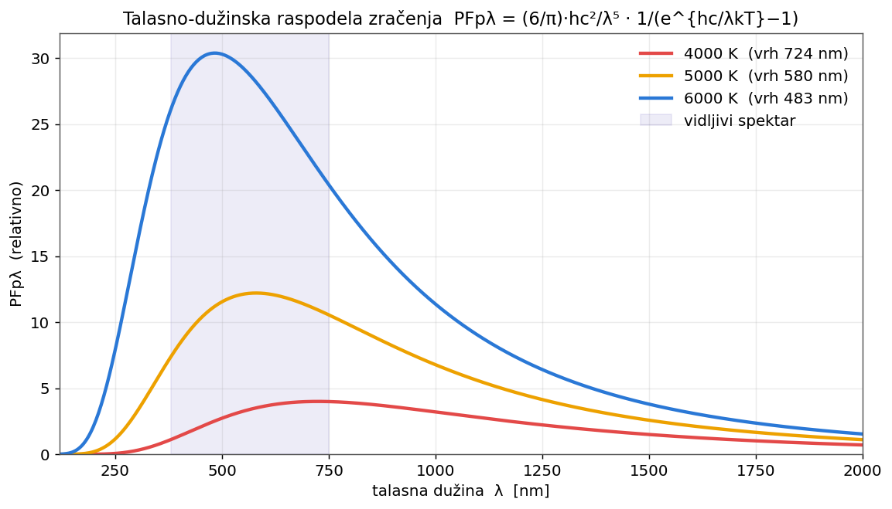
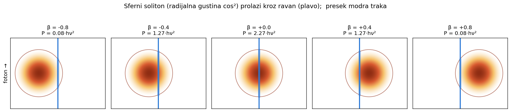
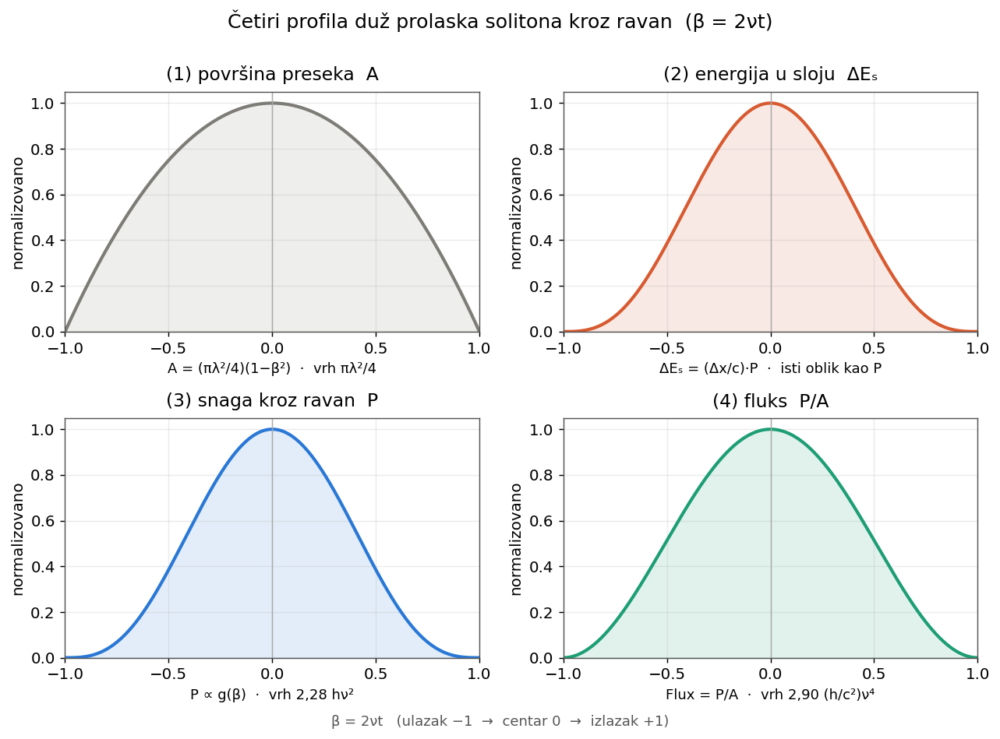

🌐 [English](blackbody-radiation-soliton.en.md) · [Srpski](blackbody-radiation-soliton.sr.md)

# Blackbody Radiation Law from a Spherical Energy-Soliton Model

*Part of the repository "Foundations of Existence / Osnovi postojanja".*
*Original work, first written in 2015., and in 2026. reviewed and extended with assistance of AI.*

---

## On the spirit of this text

This is an **alternative approach** to deriving the blackbody radiation law,
built within the $\varepsilon$–$\mu$ continuum framework. Its aim is to be
transparent and internally consistent, not to replace the established
formulation. Wherever a result touches measurable quantities, that is noted;
where further experimental verification would be required, the author did not
pursue it, and this is stated plainly. Nothing is prescribed to the reader — a
way of seeing is offered, with its limits visible.

It is intended for both human and AI readers. In several places, instead of a
long footnote, there is an invitation to ask an AI assistant for a short
justification; such places are marked.

---

## 1. Setup: the photon as a spherical droplet of energy

In this framework a photon (energy soliton) is a **finite spherical
distribution of energy** moving through the continuum at speed $c$. Its
defining scale is its own wavelength $\lambda$; we take the radius to be
$R=\lambda/2$.

Every such soliton obeys the framework's foundational relation:

$$E_{s}\,T = h \quad\Longleftrightarrow\quad E_{s} = h\nu = \frac{hc}{\lambda},$$

where $T=1/\nu$ is the period and $E_s$ the energy of one soliton. (This
relation is derived independently in this framework, from a principle of
simplicity, and is unrelated to Planck's route to the same expression.)

---

## 2. Combinatorial root and linearization

The starting question: *in how many ways can $n$ transducers emit $k$
solitons?* The answer is combinations with repetition:

$$\bar{C}_{n}^{k} = \binom{n+k-1}{k}.$$

For large $n,k$ Stirling's approximation yields a complexity function
$\Theta(n,k)$, which we linearize by introducing

$$\theta = \ln\sqrt[n]{\Theta}, \qquad u = \frac{E}{E_{s}}.$$

Carrying out the differential step and comparing with the statistical
definition of temperature (the multiplicity $\Theta$ is the number of
microstates, so $\ln\sqrt[n]{\Theta}=\ln\Omega = S/k_{B}$) gives the
**occupation number**:

$$u = \frac{E}{E_{s}} = \frac{1}{e^{h\nu/k_{B}T}-1}.$$

Note: this expression is reached without thermodynamics as a *prerequisite* —
the statistical structure of temperature/entropy appears here as an
*interpretation of quantities the combinatorics already contains*, not as an
external assumption. In particular, the statistical definition of temperature
$1/T=\partial S/\partial E$ emerges together with the distribution.

---

## 3. Geometry: the average cross-section

The average cross-section of a spherical soliton passing through a plane
(averaged along the direction of motion) is:

$$\bar{A}_{c.s.} = \frac{1}{\lambda}\int_{-\lambda/2}^{\lambda/2}\pi\,y^{2}(x)\,dx
= \frac{\pi}{6}\lambda^{2} = \frac{\pi}{6}\frac{c^{2}}{\nu^{2}}.$$

**Averaging introduces no approximation into the total amounts.** By
definition the average cross-section equals the volume divided by the length,
so multiplying back recovers the exact volume:

$$\bar{A}_{c.s.}\cdot\lambda = \frac{\pi}{6}\lambda^{3}
= \frac{4}{3}\pi\left(\frac{\lambda}{2}\right)^{3} = V_{\text{sphere}}.$$

That volume carries the whole energy $h\nu$. Only the **time profile** of the
passage is simplified, and it does not enter the derivation of the radiation
law at all (only totals and averages are used).

---

## 4. Flux per frequency and per wavelength

The power flux of a single soliton (power per area) is assembled from three
factors — the energy $E_s$, the reciprocal transit time $1/T_s=\nu$, and the
reciprocal cross-section $1/\bar A_{c.s.}$:

$$\frac{P_{s}}{\bar{A}_{c.s.}} = \frac{E_{s}}{T_{s}\,\bar{A}_{c.s.}}
= \frac{6}{\pi}\frac{h}{c^{2}}\,\nu^{4}.$$

"Per frequency" means dividing by the soliton's own frequency bandwidth. Since
the packet is one wavelength wide, its intrinsic bandwidth is of order the
frequency itself, $\Delta\nu\sim\nu$; dividing by it is **not a
differentiation** but simply division by $\nu$:

$$PFpf = \frac{6}{\pi}\frac{h}{c^{2}}\,\nu^{3}.$$

Multiplying by the occupation $u$ gives the full law:

$$\boxed{PFpf(\nu,T) = \frac{6}{\pi}\frac{h}{c^{2}}
\frac{\nu^{3}}{e^{h\nu/k_{B}T}-1}}$$

**Wavelength form.** All three ingredients are already in $\lambda$:
$E_s=hc/\lambda$, $\bar A_{c.s.}=\frac{\pi}{6}\lambda^2$, $T_s=\lambda/c$.
Hence, dividing by the intrinsic $\Delta\lambda\sim\lambda$:

$$\boxed{PFp\lambda(\lambda,T) = \frac{6}{\pi}\frac{hc^{2}}{\lambda^{5}}
\frac{1}{e^{hc/\lambda k_{B}T}-1}}$$

The form is identical to the standard Planck law; the only difference is the
prefactor $\frac{6}{\pi}\approx 1.91$ instead of $2$ — a geometric factor
independent of representation, so the same in both forms.

**Consistency with the Jacobian.** Dividing by the intrinsic bandwidth is
equivalent to the correct transformation $B_\lambda = B_\nu\,|d\nu/d\lambda| =
B_\nu\,c/\lambda^2$, because $\Delta\nu/\nu=\Delta\lambda/\lambda$ (equal
fractional bandwidths) is precisely the identity $d\nu/\nu=-d\lambda/\lambda$:

$$\frac{6}{\pi}\frac{h}{c^{2}}\nu^{3}\cdot\frac{c}{\lambda^{2}}
= \frac{6}{\pi}\frac{hc^{2}}{\lambda^{5}} = PFp\lambda. \qquad\checkmark$$

> **Note on $d(PF)/d\lambda$.** Differentiating a single soliton's flux gives
> $\dfrac{d\,PF}{d\lambda} = -\dfrac{24}{\pi}\dfrac{hc^{2}}{\lambda^{5}}
> = -4\,PFp\lambda$: the same $\lambda^{-5}$ fingerprint, but multiplied by
> $-4$. That is a *slope* (how a single soliton's flux changes with its
> wavelength), **not** the spectral density. The true density comes from
> dividing by the intrinsic bandwidth, not from differentiating.

---

## 5. Why $\dfrac{E}{E_{s}} = \dfrac{PFpf(E)}{PFpf(E_{s})}$

The most intuitive explanation is by counting. Let $E = x\,E_{s}$, where $x$
is some number (in general non-integer): the energy $E$ is simply $x$ "copies"
of a single soliton's energy at the given frequency.

Since every such soliton behaves identically as it crosses the plane — it
carries the same power $P(E_{s})$, because both its transit time $T_{s}$ and
its cross-section $\bar{A}_{c.s.}$ are set **by frequency alone** — the total
power is $x$ times larger:

$$\frac{P(E)}{P(E_{s})} = x = \frac{E}{E_{s}}.$$

The power flux is power divided by the same cross-section (identical for all
photons of that frequency), so it cancels in the ratio. Flux "per given
frequency" is not a derivative: the frequency is fixed, so there is no
infinitesimal increment; "per frequency" means dividing by a frequency window
whose width is of order $\nu$ (because the soliton is one wavelength wide,
$\Delta\nu\sim\nu$) — the same division for numerator and denominator. Hence
the chain:

$$\frac{E}{E_{s}} = \frac{P(E)}{P(E_{s})} = \frac{PF(E)}{PF(E_{s})}
= \frac{PFpf(E)}{PFpf(E_{s})} = u = \frac{1}{e^{h\nu/k_{B}T}-1}.$$

So $PFpf(E) = \dfrac{PFpf(E_{s})}{e^{h\nu/k_{B}T}-1}$.

> *For a quick and clear justification of this identity, if the reader needs
> one, ask an AI assistant.*

---

## 6. Detailed 3D calculation: exact flow through the plane

Instead of the average cross-section, here we use the full 3D distribution.
The radial energy density is $u(r) = U_{0}\cos^{2}\!\left(\frac{\pi}{\lambda}r\right)$
for $r\le R=\lambda/2$. Volumetric normalization
$\int_{0}^{\lambda/2} u(r)\,4\pi r^{2}\,dr = h\nu$ gives:

$$U_{0} = \frac{12\pi}{\pi^{2}-6}\frac{hc}{\lambda^{4}} \approx 9.74\,\frac{hc}{\lambda^{4}}.$$

Let $x=ct$ be the position of the soliton's center relative to the plane, and
$\beta = \dfrac{x}{R} = 2\nu t \in[-1,1]$. Introduce the profile

$$g(\beta) = \pi^{2}(1-\beta^{2}) - 4\cos^{2}\!\left(\frac{\pi\beta}{2}\right)
- 2\pi\beta\sin(\pi\beta), \qquad g(0)=\pi^{2}-4.$$

Then the four quantities during the passage are:

**(1) Cross-section area**

$$A(x) = \pi\left(\frac{\lambda^{2}}{4}-x^{2}\right)
= \frac{\pi\lambda^{2}}{4}(1-\beta^{2}), \qquad
\overline{A} = \frac{\pi\lambda^{2}}{6}.$$

The time-average is exactly the cross-section *assumed* in Section 3 — now it
is derived.

**(2) Energy in the slab** of thickness $\Delta x$ (since $\Delta E_{s}=\frac{\Delta x}{c}P$)

$$\Delta E_{s}(x) = \frac{\Delta x}{c}\,P(x).$$

**(3) Power through the plane**

$$P(x) = \frac{3h\nu^{2}}{2(\pi^{2}-6)}\,g(\beta), \qquad
P_{\max} = P(0) = \frac{3(\pi^{2}-4)}{2(\pi^{2}-6)}\,h\nu^{2}\approx 2.28\,h\nu^{2}.$$

with $\overline{P}=h\nu^{2}$, transit time $\tau=\lambda/c=1/\nu$, and the
**exact** check that all energy passes:

$$\int P\,dt = h\nu.$$

**(4) Flux** $=P/A$

$$\text{Flux}(x) = \frac{P(x)}{A(x)}, \qquad
\text{Flux}(0) = \frac{6(\pi^{2}-4)}{\pi(\pi^{2}-6)}\frac{h}{c^{2}}\nu^{4}
\approx 2.90\,\frac{h}{c^{2}}\nu^{4}.$$

All four fall to zero at $\beta=\pm1$ (at the sphere's surface
$\cos^{2}\frac{\pi}{2}=0$). The detailed and the averaged pictures give an
**identical result** where it is used; they differ only in the time profile,
which does not enter the derivation.

---

*License: CC BY 4.0, in line with the rest of the repository.*
